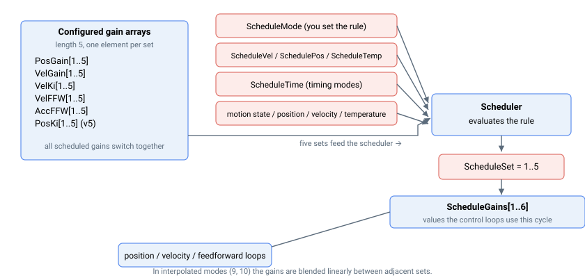

# ScheduleMode

选择增益调度算法——即决定五个整定增益组中哪一组在每个时刻有效的规则。

## 概述

增益调度使控制器能够根据所选条件（运动状态、速度、位置、电机温度、时间、外部输入或 CNC 运动段），在最多五个预定义增益组之间自动切换位置环、速度环和前馈增益。`ScheduleMode` 选择使用哪个条件。可调度的增益为：

- [PosGain](../03-position-control/PosGain.md) — 位置环比例增益
- [VelGain](../04-velocity-control/VelGain.md) — 速度环比例增益
- [VelKi](../04-velocity-control/VelKi.md) — 速度环积分增益
- [VelFFW](../05-feedforwards/VelFFW.md) — 速度前馈增益
- [AccFFW](../05-feedforwards/AccFFW.md) — 加速度前馈增益
- [PosKi](../03-position-control/PosKi.md) — 位置环积分增益（仅限 central-i v5）

每个关键字均为长度为 5 的数组——每个增益组对应一个值。激活的增益组编号由 [ScheduleSet](ScheduleSet.md) 报告，当前实际使用的增益值由 [ScheduleGains](ScheduleGains.md) 报告。当 `ScheduleMode = 0`（无调度）时，控制器始终使用增益组 1，即每个增益数组的第一个元素。

## 工作原理

每个调度周期，控制器评估 `ScheduleMode` 选定的规则，并将结果增益组编号写入 [ScheduleSet](ScheduleSet.md)。所有调度增益随即一起切换到该组；其值发布在 [ScheduleGains](ScheduleGains.md) 中并由控制环使用。调度仅在轴正常运行时评估。



### 模式值表

| 值 | 模式 | 增益组由...选定 | 配置关键字 |
|---|---|---|---|
| 0 | 无 | 始终为增益组 1 | — |
| 1 | 手动 / 数字量输入 | 通过通信写入 [ScheduleSet](ScheduleSet.md)，或由数字量输入在增益组 1（输入低电平）和增益组 2（输入高电平）之间切换 | [ScheduleSet](ScheduleSet.md)（手动），或分配了控制组切换功能的数字量输入 |
| 2 | 按时间最优整定 | 运动中为增益组 1；运动结束后 `ScheduleTime` 时间内为增益组 2；之后为增益组 3 | [ScheduleTime](ScheduleTime.md) |
| 3 | 按到位状态最优整定 | 运动中为增益组 1；等待到达目标时（到位计时）为增益组 2；到位后为增益组 3 | 到位设置 |
| 4 | 按速度范围 | 根据速度落入哪个速度分段选择增益组 | [ScheduleVel](ScheduleVel.md) |
| 5 | 按位置范围 | 根据位置落入哪个位置分段选择增益组 | [SchedulePos](SchedulePos.md) |
| 6 | 按静止安静状态 | 运动中及运动结束后 `ScheduleTime` 内为增益组 2；静止超过 `ScheduleTime` 后为增益组 1（安静） | [ScheduleTime](ScheduleTime.md) |
| 7 | 按 PD 脉冲 | 脉冲方向速度非零时为增益组 2；脉冲持续缺失超过 `ScheduleTime` 后为增益组 1 | [ScheduleTime](ScheduleTime.md) |
| 8 | 按温度范围 | 根据适用的电机温度分段选择增益组 | [ScheduleTemp](ScheduleTemp.md) |
| 9 | 按速度范围（插值） | 增益在当前速度两侧的增益组之间连续线性插值 | [ScheduleVel](ScheduleVel.md) |
| 10 | 按位置范围（插值） | 增益在当前位置两侧的增益组之间连续线性插值 | [SchedulePos](SchedulePos.md) |
| 11 | CNC 运动（通道 A） | 按 CNC 运动段设置：非 CNC/阻塞、直线、非直线（拐角/圆弧）以及拐角后的整定窗口 | [ScheduleTime](ScheduleTime.md) |
| 12 | CNC 运动（通道 B） | 与模式 11 相同，用于第二 CNC 通道（仅在较高轴数平台上可用） | [ScheduleTime](ScheduleTime.md) |

### 各模式说明

- **手动 / 数字量输入（1）：** 未分配输入时，[ScheduleSet](ScheduleSet.md) 由用户直接写入。当数字量输入被分配为该轴的控制组切换功能时，输入电平选择增益组：低电平 → 增益组 1，高电平 → 增益组 2。
- **基于时间的模式（2、6、7、11/12）：** 这些模式使用相对于 [ScheduleTime](ScheduleTime.md)（单位毫秒）测量的计时器，在触发条件清除后延迟切换回稳态增益组。
- **范围模式（4、5、8）：** 分段边界为阈值数组 [ScheduleVel](ScheduleVel.md)、[SchedulePos](SchedulePos.md) 和 [ScheduleTemp](ScheduleTemp.md)。增益组 1 适用于低于第一个阈值的情况，增益组 2 适用于低于第二个阈值的情况，以此类推，增益组 5 适用于高于第四个阈值的情况。详见相关关键字的确切比较说明。
- **插值模式（9、10）：** 不再在增益组之间阶跃切换，而是将每个调度增益在当前测量速度/位置两侧的两个增益组之间线性混合，使增益随测量量平滑变化。这要求四个阈值严格递增；若不满足，调度将被禁用，使用增益组 1，[ScheduleSet](ScheduleSet.md) 报告 `-1` 以指示错误。

## 示例

```text
AScheduleMode=4         ; schedule gains by velocity band
AScheduleMode=8         ; schedule gains by motor temperature band
AScheduleMode=0         ; disable scheduling (always use gain set 1)
AScheduleMode           ; read the active scheduling mode
```

### 示例详解：按时间最优整定

使用场景：运动期间保持刚性增益组，运动结束后切换至较低带宽增益组，以避免运动后噪声放大。

```text
APosGain[1]=400; APosGain[2]=400; APosGain[3]=250                   ; high during motion, lower once settled
AVelGain[1]=1200; AVelGain[2]=1200; AVelGain[3]=900
AScheduleTime=80                                                    ; 80 ms dwell after motion stops
AScheduleMode=2                                                     ; optimal settling by time
```

行为：轴运动时始终使用增益组 1；运动停止时，先在 `ScheduleTime`（80 ms）内保持增益组 2 作为过渡；之后控制器切换至增益组 3 用于静止阶段。

## 另请参阅

- [ScheduleSet](ScheduleSet.md) — 激活的增益组编号
- [ScheduleGains](ScheduleGains.md) — 当前使用的增益值
- [SchedulePos](SchedulePos.md) / [ScheduleVel](ScheduleVel.md) / [ScheduleTemp](ScheduleTemp.md) — 范围模式的分段阈值
- [ScheduleTime](ScheduleTime.md) — 基于时间的模式使用的计时
- [ScheduleGntry](ScheduleGntry.md) — 调度与龙门控制状态的配对
- [PosGain](../03-position-control/PosGain.md) / [VelGain](../04-velocity-control/VelGain.md) / [VelKi](../04-velocity-control/VelKi.md) / [VelFFW](../05-feedforwards/VelFFW.md) / [AccFFW](../05-feedforwards/AccFFW.md) / [PosKi](../03-position-control/PosKi.md) — 增益数组，本模式从中选取元素
