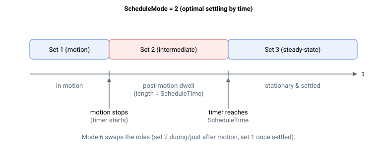

# ScheduleTime

基于时间的增益调度模式所用的保持时间，单位为毫秒，用于延迟切换回稳态增益组。

## 概述

`ScheduleTime` 设置增益调度模式中的延迟保持时间间隔。这些模式在触发条件消除后，根据定时器切换增益组。该参数适用于 [ScheduleMode](ScheduleMode.md) 值 `2`、`6`、`7`、`11` 和 `12`。值的单位为毫秒。

## 工作原理

在各基于时间的模式中，控制器运行一个定时器：触发条件有效时定时器复位，条件消除后定时器开始累计。当前增益组保持在中间值，直到定时器达到 `ScheduleTime`，随后控制器切换到稳态增益组：



- **按时间最优整定（2）：** 运动中使用增益组 1；运动停止后保持增益组 2 持续 `ScheduleTime`，之后切换到增益组 3。
- **静止保持（6）：** 运动中及运动停止后 `ScheduleTime` 内使用增益组 2，持续静止时间超过 `ScheduleTime` 后切换到增益组 1。
- **按 PD 脉冲（7）：** 脉冲方向速度非零时使用增益组 2；脉冲连续缺失时间超过 `ScheduleTime` 后恢复增益组 1。
- **CNC 运动（11、12）：** 非线性（转角/圆弧）段之后紧接线性段时，保持中间整定增益组持续 `ScheduleTime`，然后恢复线性段增益组。

## 示例

```text
AScheduleTime=50             ; 50 ms hold-off for the time-based schedule modes
AScheduleMode[1]=2           ; optimal settling by time, using ScheduleTime
```

### 计算示例：50 ms 整定窗口

当 `ScheduleMode = 2`、`ScheduleTime = 50` 时，运动结束时的时序如下：

- `t = 0`（运动停止）：定时器启动；当前增益组从增益组 1 跳变到增益组 2。
- `t = 0` 至 `t = 50 ms`：增益组 2 保持有效（中间整定增益）。
- `t = 50 ms` 之后：定时器达到 `ScheduleTime`；当前增益组切换到增益组 3，并保持到下次运动开始。

若新运动在 50 ms 到期前启动，定时器复位，当前增益组立即返回增益组 1。

## 另请参阅

- [ScheduleMode](ScheduleMode.md) — 模式 2、6、7、11 和 12 使用此时间参数
- [ScheduleSet](ScheduleSet.md) — 当前选中的增益组
- [InTargetStat](../../10-motion/05-motion-status/InTargetStat.md) — 整定模式所用的到位/运动中状态
- [PDVel](../../10-motion/06-motion-mode-pulse-and-direction-pd/PDVel.md) — 模式 7 所用的脉冲方向速度
