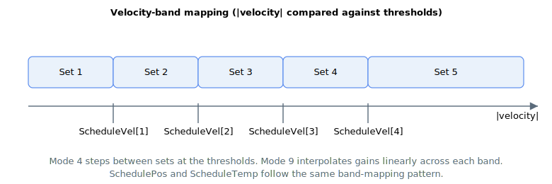

# ScheduleVel

Velocity thresholds that divide the speed range into bands for velocity-based gain scheduling.

## Overview

`ScheduleVel` holds the velocity band edges used when [ScheduleMode](ScheduleMode.md) is `4` (stepped, by velocity range) or `9` (interpolated, by velocity range). The values are in user velocity units and must increase monotonically with array index. The comparison uses the magnitude of the velocity, so the bands apply in both directions of motion.

## How it works

The controller compares the absolute axis velocity against the thresholds and picks a gain set:

- Set 1 if |velocity| ≤ `ScheduleVel[1]`
- Set 2 if `ScheduleVel[1]` < |velocity| ≤ `ScheduleVel[2]`
- Set 3 if `ScheduleVel[2]` < |velocity| ≤ `ScheduleVel[3]`
- Set 4 if `ScheduleVel[3]` < |velocity| ≤ `ScheduleVel[4]`
- Set 5 if |velocity| > `ScheduleVel[4]`



(Element `ScheduleVel[5]` is part of the array but is not used as an upper edge — anything above the fourth threshold maps to set 5.)

In the stepped mode (`ScheduleMode = 4`), the gains step to the selected set. In the interpolated mode (`ScheduleMode = 9`), the gains are blended linearly across each band rather than stepping; this requires the first four thresholds to be strictly increasing, otherwise scheduling is disabled, set 1 is used, and [ScheduleSet](ScheduleSet.md) reports `-1`.

When the axis is under gantry-paired scheduling, the gantry velocity is compared against these thresholds instead of the axis velocity (see [ScheduleGntry](ScheduleGntry.md)).

## Examples

```text
AScheduleVel[1]=10000; AScheduleVel[2]=50000; AScheduleVel[3]=200000; AScheduleVel[4]=800000
AScheduleMode[1]=4            ; select velocity-band scheduling
```

### Worked example: three bands in use

With the thresholds above and the axis moving in the negative direction at `-120000` user units/s:

- |velocity| = 120000
- 50000 (`ScheduleVel[2]`) &lt; 120000 ≤ 200000 (`ScheduleVel[3]`), so set 3 is selected.

The same magnitudes apply for positive motion. If the user only needs three bands they can place the unused thresholds well outside the working speed range so they never bind.

In interpolated mode (`ScheduleMode = 9`), at the same |velocity| = 120000 the active gain is a linear blend between set 3 (the base, anchored at `ScheduleVel[2] = 50000`) and set 4 (anchored at `ScheduleVel[3] = 200000`), with the blend fraction (120000 − 50000) / (200000 − 50000) = 0.467 toward set 4.

## See also

- [ScheduleMode](ScheduleMode.md) — modes 4 and 9 use these thresholds
- [ScheduleSet](ScheduleSet.md) — band currently selected
- [SchedulePos](SchedulePos.md) / [ScheduleTemp](ScheduleTemp.md) — analogous thresholds for the other range modes
