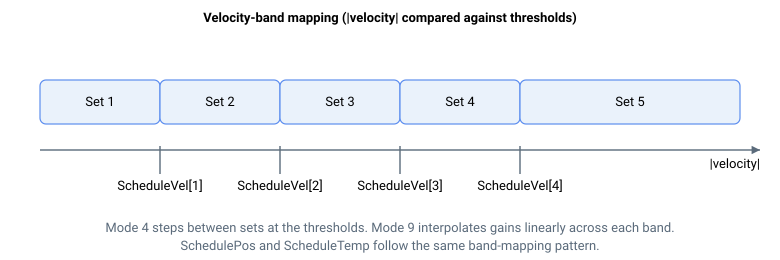

# ScheduleVel

将速度范围划分为若干区间，用于基于速度的增益调度的速度阈值。

## 概述

当 [ScheduleMode](ScheduleMode.md) 为 `4`（按速度区间阶跃）或 `9`（按速度区间插值）时，`ScheduleVel` 保存速度区间边界值。值的单位为用户速度单位，且必须随数组索引单调递增。比较使用速度的绝对值，因此区间对两个运动方向均有效。

## 工作原理

控制器将轴速度的绝对值与各阈值进行比较，并选择对应的增益组：

- |velocity| ≤ `ScheduleVel[1]` 时，选择增益组 1
- `ScheduleVel[1]` < |velocity| ≤ `ScheduleVel[2]` 时，选择增益组 2
- `ScheduleVel[2]` < |velocity| ≤ `ScheduleVel[3]` 时，选择增益组 3
- `ScheduleVel[3]` < |velocity| ≤ `ScheduleVel[4]` 时，选择增益组 4
- |velocity| > `ScheduleVel[4]` 时，选择增益组 5



（`ScheduleVel[5]` 是数组的组成部分，但不用作上边界——超过第四个阈值的速度均映射到增益组 5。）

在阶跃模式（`ScheduleMode = 4`）下，增益阶跃切换到所选增益组。在插值模式（`ScheduleMode = 9`）下，增益在各区间内线性混合，而非阶跃；此模式要求前四个阈值严格递增，否则调度被禁用，使用增益组 1，[ScheduleSet](ScheduleSet.md) 报告 `-1`。

当轴处于龙门配对调度时，将使用龙门速度而非轴速度与这些阈值进行比较（参见 [ScheduleGntry](ScheduleGntry.md)）。

## 示例

```text
AScheduleVel[1]=10000; AScheduleVel[2]=50000; AScheduleVel[3]=200000; AScheduleVel[4]=800000
AScheduleMode[1]=4            ; select velocity-band scheduling
```

### 计算示例：使用三个区间

以上述阈值为例，轴以 `-120000` 用户单位/秒的速度负向运动时：

- |velocity| = 120000
- 50000（`ScheduleVel[2]`）&lt; 120000 ≤ 200000（`ScheduleVel[3]`），选择增益组 3。

正向运动时适用相同的绝对值判断。若用户只需三个区间，可将未使用的阈值设置在工作速度范围之外，使其永不触发。

在插值模式（`ScheduleMode = 9`）下，当 |velocity| = 120000 时，当前增益为增益组 3（基准，锚定在 `ScheduleVel[2] = 50000`）与增益组 4（锚定在 `ScheduleVel[3] = 200000`）的线性混合，混合比例为 (120000 − 50000) / (200000 − 50000) = 0.467，趋向增益组 4。

## 参见

- [ScheduleMode](ScheduleMode.md) — 模式 4 和 9 使用这些阈值
- [ScheduleSet](ScheduleSet.md) — 当前选中的区间
- [SchedulePos](SchedulePos.md) / [ScheduleTemp](ScheduleTemp.md) — 其他区间模式的类似阈值
