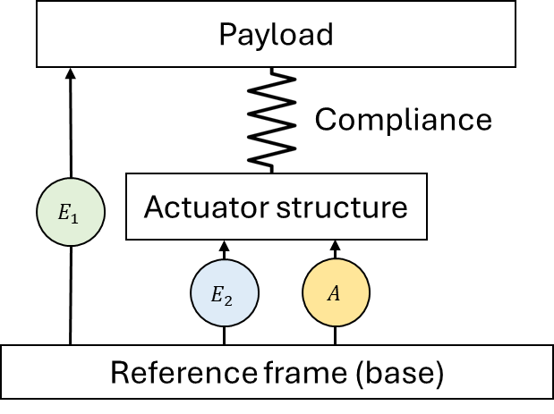
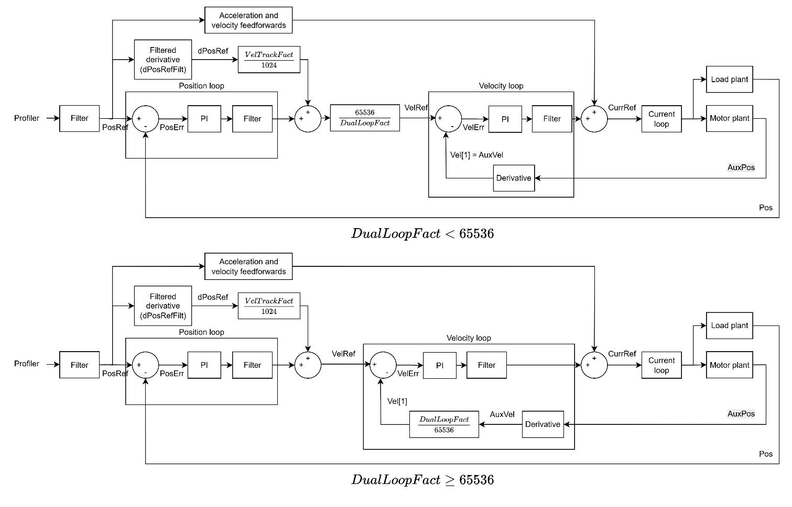

# Dual-loop control

In case of non-collocated control (indirect drive, interferometer payload control, etc.), the special property of PIV control allows for dual-loop control, where position and velocity feedback can be from difference sources.

Non-collocated system is normally characterised by situation where actuator/motor is separated from the load by a compliant structure. Usage of dual-loop control will eliminate effect of backlash, ensuring tight position control of payload. For dual-loop control, 2 feedback are needed:

1.  Load feedback (measuring load’s motion relative to base) (E1)

2.  Motor feedback (measuring motor’s motion relative to base) (E2)

In dual-loop control, load feedback should always be connected to the main feedback port, while motor feedback should always be connected to auxiliary feedback port.

The figure below shows the general control structure under dual-loop control.

Position loop will take in the load/main feedback, while velocity loop will take in the motor/auxiliary feedback.

Position and velocity feedback may have different resolutions. To ensure all velocity loop’s inputs (reference and feedback) have the matching unit, scaling factor is needed (DualLoopFact). Depending on the DualLoopFact, the control structure will change, so that VelRef and Vel\[1\] always be in feedback unit with finer resolution.

Under dual-loop mode, user can also force the position loop to source from the motor/auxiliary feedback but scaled to the unit of load/main feedback. This is called “pseudo dual-loop” because effectively, only one feedback source is used. The related keyword for this feature is DualEncSwapOn.

The figure below shows the control structure under pseudo dual-loop control.

It is also possible to selectively use pseudo dual-loop or true dual-loop at a defined position range (in terms of motor feedback). The related keyword for this is DualEncMode and DualEncRange.

The table below shows the summary on how to achieve the desired control structure.

| DualLoopOn | DualEncSwapOn | DualEncMode | Type of control |
|---|---|---|---|
| 0 | - | - | Default control. |
| 1 | 0 | - | Dual-loop control. |
| 1 | 1 | 0 | Pseudo dual-loop control. |
| 1 | 1 | 1 | Dual-loop control if within the position range of DualEncRange. Pseudo dual-loop control if outside of the position range. |

The following is the comparison of keywords/properties under different control structures.

| Properties | Default control | Dual-loop control | Pseudo dual-loop control |
|---|---|---|---|
| Primary feedback (Pos) | From main encoder  **Unit: Main encoder count** | From main encoder  **Unit: Main encoder count** | From auxiliary encoder  **Unit: Main encoder count** |
| Auxiliary feedback (AuxPos) | - | From auxiliary encoder  **Unit: Auxiliary encoder count** | From auxiliary encoder  **Unit: Auxiliary encoder count** |
| Velocity (Vel[1]) | Derivative of Pos  **Unit: Main encoder count / s** | If DualLoopFact ≥ 65536,  Derivative of AuxPos * (DualLoopFact / 65536)  **Unit: Main encoder count / s**  If DualLoopFact < 65536,  Derivative of AuxPos  **Unit: Auxiliary encoder count / s** | If DualLoopFact ≥ 65536,  Derivative of AuxPos * (DualLoopFact / 65536)  **Unit: Main encoder count / s**  If DualLoopFact < 65536,  Derivative of AuxPos  **Unit: Auxiliary encoder count / s** |
| Velocity (Vel[2]) | Derivative of Pos  **Unit: Main encoder count / s** | Derivative of Pos  **Unit: Main encoder count / s** | Derivative of Pos  **Unit: Main encoder count / s** |
| Velocity (Vel[3]) | Moving average of Vel[2]  **Unit: Main encoder count / s** | Moving average of Vel[2]  **Unit: Main encoder count / s** | Moving average of Vel[2]  **Unit: Main encoder count / s** |
| Auxiliary velocity (AuxVel) | - | Derivative of AuxPos  **Unit: Auxiliary encoder count / s** | Derivative of AuxPos  **Unit: Auxiliary encoder count / s** |
| Commutation | Based on Pos | Based on AuxPos | Based on AuxPos |

For more information, on gantry with dual-loop control, please refer to [Gantry control – Dual-loop control](../../../02-keywords/11-control-tuning/02-dual-loop-control/00-overview.md).

The table below shows the summary of dual loop control keywords.

| No. | Keywords | Summary |
|----|----|----|
| 1 | [DualEncMode](../../../02-keywords/11-control-tuning/02-dual-loop-control/DualEncMode.md) | Switch for range-limited dual-loop/pseudo dual-loop control |
| 2 | [DualEncRange](../../../02-keywords/11-control-tuning/02-dual-loop-control/DualEncRange.md) | Position range for range-limited dual loop/pseudo dual-loop control |
| 3 | [DualEncSwapOn](../../../02-keywords/11-control-tuning/02-dual-loop-control/DualEncSwapOn.md) | Switch for pseudo dual-loop control |
| 4 | [DualLoopFact](../../../02-keywords/11-control-tuning/02-dual-loop-control/DualLoopFact.md) | Scaling factor to convert from load feedback unit to motor feedback unit |
| 5 | [DualLoopOn](../../../02-keywords/11-control-tuning/02-dual-loop-control/DualLoopOn.md) | Dual-loop mode selection |
| 6 | [DualLoopStat](../../../02-keywords/11-control-tuning/02-dual-loop-control/DualLoopStat.md) | Status of dual-loop/pseudo dual-loop control |

**Note:**

Dual-loop control is protected by DualStuckTime and DualStuckVel to ensure load and motor feedback do not have excessive velocity delta for extended period of time. See Protections – Motion – Dual loop stuck protection for more details.
