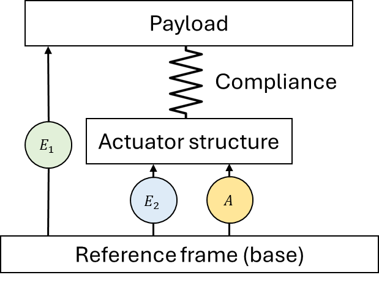
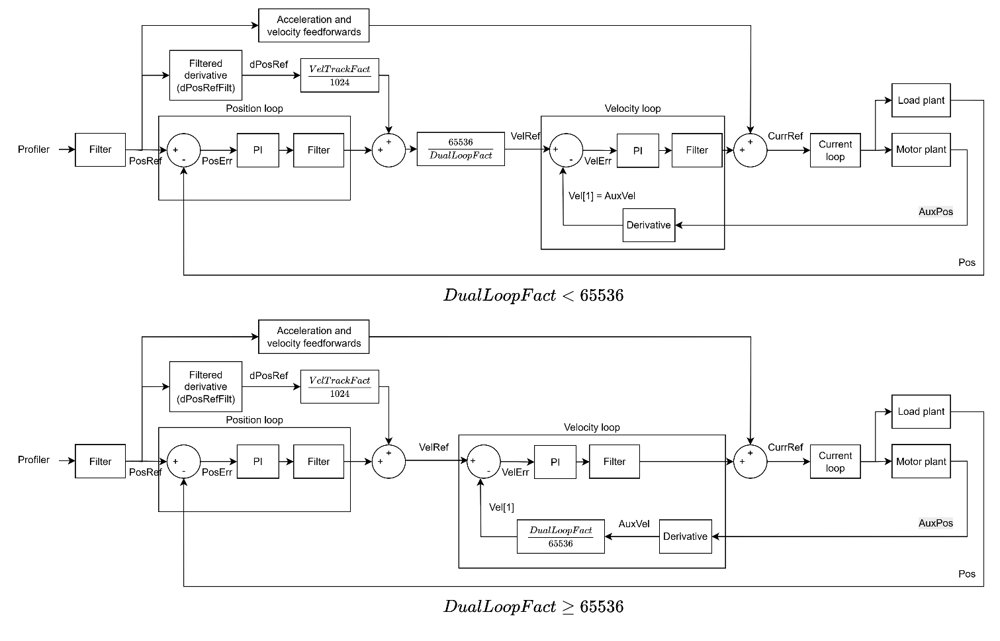
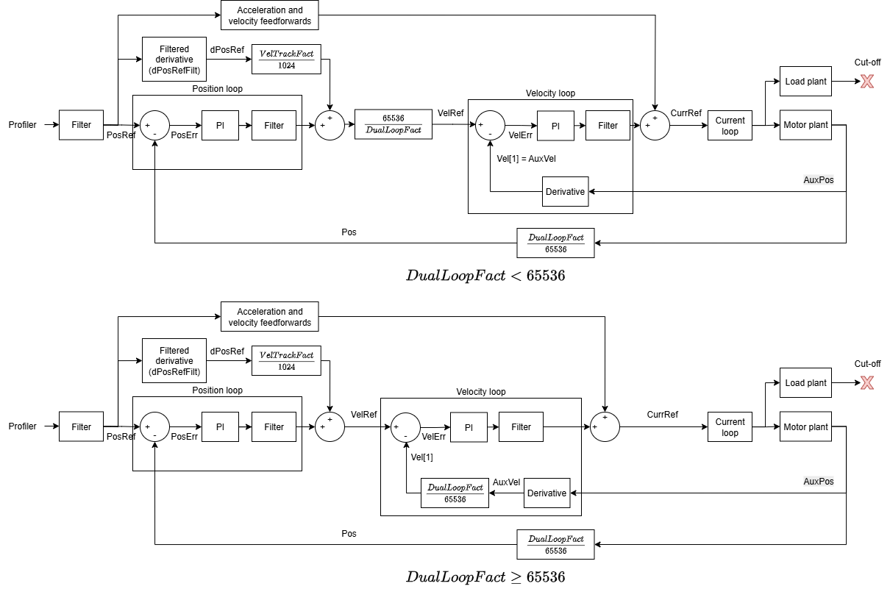

# 双环控制

在非同位控制的情况下（间接驱动、干涉仪载荷控制等），PIV 控制的特殊性质允许实现双环控制，即位置反馈和速度反馈可来自不同的源。

非同位控制系统通常表现为：执行机构/电机通过柔性结构与负载分离。使用双环控制可消除反向间隙的影响，实现对载荷的精确位置控制。双环控制需要两路反馈：

1.  负载反馈（测量负载相对于基座的运动）（E1）

2.  电机反馈（测量电机相对于基座的运动）（E2）

在双环控制中，负载反馈应始终连接到主反馈端口，电机反馈应始终连接到辅助反馈端口。

下图为双环控制下的通用控制结构。

位置环采用负载/主反馈，速度环采用电机/辅助反馈。

位置反馈和速度反馈的分辨率可能不同。为确保速度环的所有输入（参考值和反馈值）具有匹配的单位，需要缩放因子（DualLoopFact）。根据 DualLoopFact 的不同，控制结构会随之改变，使得 VelRef 和 Vel\[1\] 始终以分辨率更高的反馈单位表示。在级联结构中，位置环以负载/主反馈闭合并输出速度参考值；该参考值通过指令侧缩放进行单位匹配，而来自电机/辅助编码器的速度反馈通过反馈侧缩放进行单位匹配，从而使速度环始终以相同的编码器单位比较参考值与反馈值（各 `DualLoopFact` 对应的精确增益详见 [DualLoopFact](../../../02-keywords/11-control-tuning/02-dual-loop-control/DualLoopFact.md)）。

在双环模式下，用户也可以强制位置环从电机/辅助反馈取值，但将其缩放到负载/主反馈的单位。这称为"伪双环"，因为实际上只使用了一个反馈源。该功能的相关关键字为 DualEncSwapOn。

下图为伪双环控制下的控制结构。

也可以在定义的位置范围内（以电机反馈为基准）选择性地使用伪双环或真双环。相关关键字为 DualEncMode 和 DualEncRange。

下表汇总了实现所需控制结构的方法。

| DualLoopOn | DualEncSwapOn | DualEncMode | 控制类型 |
|---|---|---|---|
| 0 | - | - | 默认控制。 |
| 1 | 0 | - | 双环控制（速度反馈来自辅助/电机编码器）。 |
| 1 | 1 | 0 | 伪双环控制。 |
| 1 | 1 | 1 | 在 DualEncRange 位置范围内使用双环控制，范围外使用伪双环控制。 |
| 2 | - | - | 速度反馈来自模拟测速机输入的双环控制。 |

下表为不同控制结构下关键字/属性的对比。

| 属性 | 默认控制 | 双环控制 | 伪双环控制 |
|---|---|---|---|
| 主反馈（Pos） | 来自主编码器  **单位：主编码器计数** | 来自主编码器  **单位：主编码器计数** | 来自辅助编码器  **单位：主编码器计数** |
| 辅助反馈（AuxPos） | - | 来自辅助编码器  **单位：辅助编码器计数** | 来自辅助编码器  **单位：辅助编码器计数** |
| 速度（Vel[1]） | Pos 的导数  **单位：主编码器计数 / s** | 若 DualLoopFact ≥ 65536， AuxPos 的导数 * (DualLoopFact / 65536)  **单位：主编码器计数 / s**  若 DualLoopFact < 65536， AuxPos 的导数  **单位：辅助编码器计数 / s** | 若 DualLoopFact ≥ 65536， AuxPos 的导数 * (DualLoopFact / 65536)  **单位：主编码器计数 / s**  若 DualLoopFact < 65536， AuxPos 的导数  **单位：辅助编码器计数 / s** |
| 速度（Vel[2]） | Pos 的导数  **单位：主编码器计数 / s** | Pos 的导数  **单位：主编码器计数 / s** | Pos 的导数  **单位：主编码器计数 / s** |
| 速度（Vel[3]） | Vel[2] 的滑动平均  **单位：主编码器计数 / s** | Vel[2] 的滑动平均  **单位：主编码器计数 / s** | Vel[2] 的滑动平均  **单位：主编码器计数 / s** |
| 辅助速度（AuxVel） | - | AuxPos 的导数  **单位：辅助编码器计数 / s** | AuxPos 的导数  **单位：辅助编码器计数 / s** |
| 换相 | 基于 Pos | 基于 AuxPos | 基于 AuxPos |

有关龙门与双环控制的更多信息，请参阅 [龙门控制 – 双环控制](../../../02-keywords/12-gantry-control/04-dual-loop-gantry-control/00-overview.md)。

下表汇总了双环控制相关关键字。

| 序号 | 关键字 | 说明 |
|----|----|----|
| 1 | [DualEncMode](../../../02-keywords/11-control-tuning/02-dual-loop-control/DualEncMode.md) | 范围限定双环/伪双环控制的切换开关 |
| 2 | [DualEncRange](../../../02-keywords/11-control-tuning/02-dual-loop-control/DualEncRange.md) | 范围限定双环/伪双环控制的位置范围 |
| 3 | [DualEncSwapOn](../../../02-keywords/11-control-tuning/02-dual-loop-control/DualEncSwapOn.md) | 伪双环控制切换开关 |
| 4 | [DualLoopFact](../../../02-keywords/11-control-tuning/02-dual-loop-control/DualLoopFact.md) | 从负载反馈单位转换到电机反馈单位的缩放因子 |
| 5 | [DualLoopOn](../../../02-keywords/11-control-tuning/02-dual-loop-control/DualLoopOn.md) | 双环模式选择 |
| 6 | [DualLoopStat](../../../02-keywords/11-control-tuning/02-dual-loop-control/DualLoopStat.md) | 双环/伪双环控制的状态 |

**注意：**

双环控制受 [DualStuckTime](../../../02-keywords/06-protections/03-motion/dual-loop-stuck-protection/DualStuckTime.md) 和 [DualStuckVel](../../../02-keywords/06-protections/03-motion/dual-loop-stuck-protection/DualStuckVel.md) 的保护，确保负载与电机反馈之间的速度差不会在较长时间内过大。详情请参阅 [DualStuckTime](../../../02-keywords/06-protections/03-motion/dual-loop-stuck-protection/DualStuckTime.md) 和 [DualStuckVel](../../../02-keywords/06-protections/03-motion/dual-loop-stuck-protection/DualStuckVel.md)。
