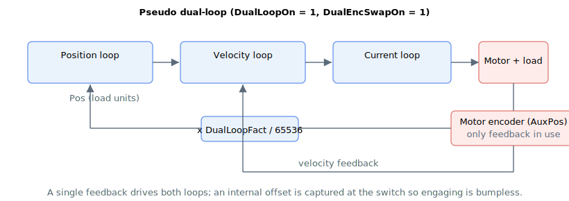

# DualEncSwapOn

Switch for pseudo dual-loop control.

## Overview

`DualEncSwapOn` enables pseudo dual-loop control. It is only used when [DualLoopOn](DualLoopOn.md) = 1.

In pseudo dual-loop control, both the position and the velocity loop use the motor (auxiliary) feedback — effectively a single feedback source. The position loop, which normally closes on the load (main) feedback, is instead sourced from the auxiliary encoder scaled into load units. This lets the axis fall back to motor-only feedback (for example outside a region where the load feedback is valid), while reusing the same dual-loop scaling.

| `DualEncSwapOn` | Behaviour (when `DualLoopOn = 1`) |
|---|---|
| 0 | True dual-loop: position loop on load feedback, velocity loop on motor feedback. |
| 1 | Pseudo dual-loop: both loops on the motor feedback; position feedback is the auxiliary encoder scaled to load units. |

`DualEncSwapOn` cannot be changed while the axis is in motion or the motor is on.

## How it works



Under pseudo dual-loop, the position feedback [Pos](../../../02-keywords/10-motion/01-kinematics-status/Pos.md) is formed from the auxiliary feedback [AuxPos](../../../02-keywords/10-motion/01-kinematics-status/AuxPos.md) scaled by the dual-loop factor:

$$
\text{Pos} = \text{AuxPos} \cdot \frac{\text{DualLoopFact}}{65536}
$$

so the position loop sees the motor motion expressed in load units. A position offset is captured at the moment of switching so that engaging or leaving pseudo dual-loop does not produce a position step:

$$
\text{offset} = \text{Pos} - \text{AuxPos} \cdot \frac{\text{DualLoopFact}}{65536}
$$

The offset is captured once when the structure changes and then held (it is not recomputed each cycle), so the reported [Pos](../../../02-keywords/10-motion/01-kinematics-status/Pos.md) stays continuous across every engage and disengage.

If [Pos](../../../02-keywords/10-motion/01-kinematics-status/Pos.md) is set (written) while `DualLoopOn = 1` and `DualEncSwapOn = 1`, the auxiliary feedback [AuxPos](../../../02-keywords/10-motion/01-kinematics-status/AuxPos.md) is re-seeded to the new value and the swap offset is cleared, so the new position takes effect cleanly.

With `DualEncSwapOn = 1` and [DualEncMode](DualEncMode.md) = 1, the controller switches between pseudo dual-loop and true dual-loop depending on whether the motor feedback lies inside the [DualEncRange](DualEncRange.md) window. The active structure is reported by [DualLoopStat](DualLoopStat.md).

## Examples

```text
ADualEncSwapOn=1     ; use pseudo dual-loop (motor feedback for both loops)
ADualLoopStat        ; read the active structure (1 = pseudo dual-loop)
```

## See also

- [DualLoopOn](DualLoopOn.md) — enable dual-loop control (required = 1)
- [DualLoopFact](DualLoopFact.md) — factor used to scale the auxiliary feedback into load units
- [DualEncMode](DualEncMode.md) / [DualEncRange](DualEncRange.md) — range-limited switching between pseudo and true dual-loop
- [DualLoopStat](DualLoopStat.md) — active dual-loop status
