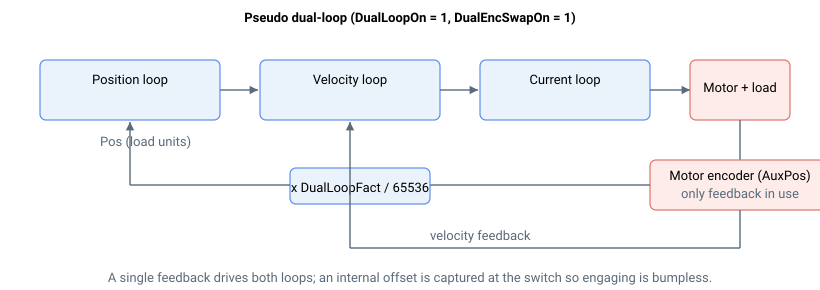

# DualEncSwapOn

伪双环控制开关。

## 概述

`DualEncSwapOn` 启用伪双环控制。仅在 [DualLoopOn](DualLoopOn.md) = 1 时使用。

在伪双环控制中，位置环和速度环均使用电机（辅助）反馈——实际上只有单一反馈源。位置环通常闭合于负载（主）反馈，但在伪双环模式下，位置环改为使用辅助编码器换算至负载单位后的值。这使得轴可以退回到纯电机反馈（例如在负载反馈无效的区域之外），同时复用相同的双环缩放系数。

| `DualEncSwapOn` | 行为（当 `DualLoopOn = 1` 时） |
|---|---|
| 0 | 真双环：位置环使用负载反馈，速度环使用电机反馈。 |
| 1 | 伪双环：两个环均使用电机反馈；位置反馈为辅助编码器换算至负载单位后的值。 |

`DualEncSwapOn` 在轴运动中或电机使能时不可更改。

## 工作原理



在伪双环模式下，位置反馈 [Pos](../../../02-keywords/10-motion/01-kinematics-status/Pos.md) 由辅助反馈 [AuxPos](../../../02-keywords/10-motion/01-kinematics-status/AuxPos.md) 乘以双环系数得出：

$$
\text{Pos} = \text{AuxPos} \cdot \frac{\text{DualLoopFact}}{65536}
$$

由此，位置环所见的电机运动以负载单位表示。切换时会捕获一个位置偏置，使得进入或退出伪双环时不产生位置阶跃：

$$
\text{offset} = \text{Pos} - \text{AuxPos} \cdot \frac{\text{DualLoopFact}}{65536}
$$

该偏置仅在结构变化时捕获一次并保持（不会每个周期重新计算），因此每次进入和退出时，所报告的 [Pos](../../../02-keywords/10-motion/01-kinematics-status/Pos.md) 均保持连续。

若在 `DualLoopOn = 1` 且 `DualEncSwapOn = 1` 时对 [Pos](../../../02-keywords/10-motion/01-kinematics-status/Pos.md) 进行设置（写入），则辅助反馈 [AuxPos](../../../02-keywords/10-motion/01-kinematics-status/AuxPos.md) 将重新初始化为新值，且交换偏置被清零，从而使新位置生效。

当 `DualEncSwapOn = 1` 且 [DualEncMode](DualEncMode.md) = 1 时，控制器根据电机反馈是否在 [DualEncRange](DualEncRange.md) 窗口内，在伪双环与真双环之间切换。当前激活的结构由 [DualLoopStat](DualLoopStat.md) 报告。

## 示例

```text
ADualEncSwapOn=1     ; use pseudo dual-loop (motor feedback for both loops)
ADualLoopStat        ; read the active structure (1 = pseudo dual-loop)
```

## 另请参阅

- [DualLoopOn](DualLoopOn.md) — 启用双环控制（要求 = 1）
- [DualLoopFact](DualLoopFact.md) — 将辅助反馈换算至负载单位的系数
- [DualEncMode](DualEncMode.md) / [DualEncRange](DualEncRange.md) — 在伪双环与真双环之间进行范围限制切换
- [DualLoopStat](DualLoopStat.md) — 当前激活的双环状态
