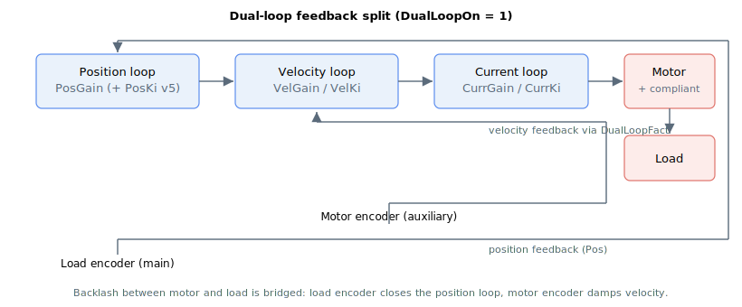

# DualLoopOn

Enables and configures dual-loop control.

## Overview

`DualLoopOn` enables dual-loop control, in which the position loop and the velocity loop take their feedback from different sources. The position loop closes on the load feedback (main encoder, [Pos](../../../02-keywords/10-motion/01-kinematics-status/Pos.md)) while the velocity loop closes on the motor feedback (auxiliary encoder, [AuxPos](../../../02-keywords/10-motion/01-kinematics-status/AuxPos.md), or an analog tachometer). This is used for non-collocated systems where a compliant transmission separates the motor from the load, so the controller can hold the load position tightly while damping the motor velocity.

| `DualLoopOn` | Description |
|---|---|
| 0 | Dual-loop disabled (default control). Both loops use the main encoder. |
| 1 | Dual-loop enabled. Position feedback from [Pos](../../../02-keywords/10-motion/01-kinematics-status/Pos.md) (main/load encoder); velocity feedback derived from [AuxPos](../../../02-keywords/10-motion/01-kinematics-status/AuxPos.md) (auxiliary/motor encoder). |
| 2 | Dual-loop enabled. Position feedback from [Pos](../../../02-keywords/10-motion/01-kinematics-status/Pos.md); velocity feedback from an analog tachometer input (`AInMode[Index] = 9`). |

`DualLoopOn` cannot be changed while the axis is in motion or the motor is on.

## How it works

When dual-loop is enabled, the load feedback should be connected to the main feedback port and the motor feedback to the auxiliary feedback port. The position and velocity feedback may have different resolutions, so the velocity-loop signals are unit-matched using the scaling factor [DualLoopFact](DualLoopFact.md).



With `DualLoopOn = 1`, the velocity feedback is taken from the auxiliary-encoder velocity and scaled to the unit chosen by `DualLoopFact`; commutation is derived from the auxiliary (motor) encoder rather than the main encoder. With `DualLoopOn = 2`, the velocity feedback is the filtered analog tachometer signal instead.

The active result is reported by [DualLoopStat](DualLoopStat.md). The pseudo dual-loop variant ([DualEncSwapOn](DualEncSwapOn.md)) and the range-limited variant ([DualEncMode](DualEncMode.md) / [DualEncRange](DualEncRange.md)) further modify which feedback the position loop uses.

## Examples

```text
ADualLoopOn=1        ; enable dual-loop (auxiliary-encoder velocity feedback)
ADualLoopStat        ; read the active dual-loop status
```

### Walk-through: enable dual-loop and verify the active structure

The configured value of `DualLoopOn` and the structure that is actually running can differ once pseudo dual-loop and range-limited switching are added. [DualLoopStat](DualLoopStat.md) is the run-time confirmation.

1. **Wire the feedback correctly** before enabling: load encoder to the main feedback port, motor encoder to the auxiliary feedback port. With the motor off and the axis stationary:

   ```text
   ADualLoopOn=1                     ; enable dual-loop, auxiliary-encoder velocity feedback
   ADualLoopFact=65536               ; set load:motor scaling (65536 = ratio of 1)
   ```

2. **Read the active structure** to confirm dual-loop is in effect (expect `2` for full dual-loop, `1` for pseudo dual-loop, `0` for default):

   ```text
   ADualLoopStat                     ; expect 2 if pseudo dual-loop is off
   ```

3. **Set the dual-loop stuck-protection thresholds** so the controller traps the case where load and motor feedback diverge for too long (compliant transmission slipping, broken coupling). The two keywords work together: [DualStuckTime](../../06-protections/03-motion/dual-loop-stuck-protection/DualStuckTime.md) sets how long the divergence must persist, [DualStuckVel](../../06-protections/03-motion/dual-loop-stuck-protection/DualStuckVel.md) sets the velocity-difference threshold.

4. **Power the motor and command a small move.** Observe [Pos](../../../02-keywords/10-motion/01-kinematics-status/Pos.md) (load feedback) and [AuxPos](../../../02-keywords/10-motion/01-kinematics-status/AuxPos.md) (motor feedback) tracking together. A persistent gap that exceeds the stuck-protection thresholds will fault the axis.

## See also

- [DualLoopFact](DualLoopFact.md) — load-to-motor unit scaling factor
- [DualLoopStat](DualLoopStat.md) — active dual-loop status (run-time confirmation)
- [DualEncSwapOn](DualEncSwapOn.md) — pseudo dual-loop switch
- [DualEncMode](DualEncMode.md) / [DualEncRange](DualEncRange.md) — range-limited dual-loop
- [Pos](../../../02-keywords/10-motion/01-kinematics-status/Pos.md) / [AuxPos](../../../02-keywords/10-motion/01-kinematics-status/AuxPos.md) — load and motor feedback
- [DualStuckTime](../../06-protections/03-motion/dual-loop-stuck-protection/DualStuckTime.md) / [DualStuckVel](../../06-protections/03-motion/dual-loop-stuck-protection/DualStuckVel.md) — divergence protection
