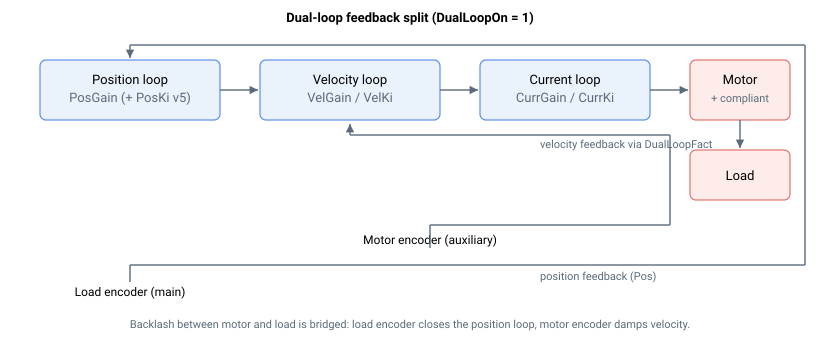

# DualLoopOn

启用并配置双环控制。

## 概述

`DualLoopOn` 启用双环控制——位置环和速度环从不同来源获取反馈。位置环闭合于负载反馈（主编码器，[Pos](../../../02-keywords/10-motion/01-kinematics-status/Pos.md)），速度环闭合于电机反馈（辅助编码器，[AuxPos](../../../02-keywords/10-motion/01-kinematics-status/AuxPos.md)，或模拟测速机）。该模式适用于非同位控制系统——电机与负载之间通过柔性传动连接，从而使控制器既能紧密保持负载位置，又能阻尼电机速度。

| `DualLoopOn` | 说明 |
|---|---|
| 0 | 双环禁用（默认控制）。两个环均使用主编码器。 |
| 1 | 双环启用。位置反馈来自 [Pos](../../../02-keywords/10-motion/01-kinematics-status/Pos.md)（主/负载编码器）；速度反馈由 [AuxPos](../../../02-keywords/10-motion/01-kinematics-status/AuxPos.md)（辅助/电机编码器）推导得出。 |
| 2 | 双环启用。位置反馈来自 [Pos](../../../02-keywords/10-motion/01-kinematics-status/Pos.md)；速度反馈来自模拟测速机输入（`AInMode[Index] = 9`）。 |

`DualLoopOn` 在轴运动中或电机使能时不可更改。

## 工作原理

启用双环时，负载反馈应连接至主反馈端口，电机反馈连接至辅助反馈端口。位置反馈与速度反馈的分辨率可能不同，因此速度环信号通过缩放系数 [DualLoopFact](DualLoopFact.md) 进行单位匹配。



当 `DualLoopOn = 1` 时，速度反馈取自辅助编码器速度，并缩放至 `DualLoopFact` 所选单位；换相由辅助（电机）编码器推导，而非主编码器。当 `DualLoopOn = 2` 时，速度反馈改为经过滤波的模拟测速机信号。

当前激活的结果由 [DualLoopStat](DualLoopStat.md) 报告。伪双环变体（[DualEncSwapOn](DualEncSwapOn.md)）和范围限制变体（[DualEncMode](DualEncMode.md) / [DualEncRange](DualEncRange.md)）进一步修改位置环所使用的反馈。

## 示例

```text
ADualLoopOn=1        ; enable dual-loop (auxiliary-encoder velocity feedback)
ADualLoopStat        ; read the active dual-loop status
```

### 操作步骤：启用双环并验证当前结构

`DualLoopOn` 的配置值与实际运行的结构，在加入伪双环和范围限制切换后可能不同。[DualLoopStat](DualLoopStat.md) 是运行时的确认手段。

1. **启用前正确接线**：负载编码器接主反馈端口，电机编码器接辅助反馈端口。在电机关闭且轴静止时：

   ```text
   ADualLoopOn=1                     ; enable dual-loop, auxiliary-encoder velocity feedback
   ADualLoopFact=65536               ; set load:motor scaling (65536 = ratio of 1)
   ```

2. **读取当前结构**以确认双环已生效。以 `DualLoopOn = 1` 为例，期望读到 `2`（全双环）或 `1`（伪双环开启）。`0` 表示默认控制结构——或 `DualLoopOn = 2`（模拟测速机速度反馈，同样读回 `0`）：

   ```text
   ADualLoopStat                     ; expect 2 if pseudo dual-loop is off
   ```

3. **设置双环堵转保护阈值**，使控制器能捕获负载与电机反馈长时间发散的情况（柔性传动打滑、联轴器断裂）。两个关键字配合使用：[DualStuckTime](../../06-protections/03-motion/dual-loop-stuck-protection/DualStuckTime.md) 设置发散持续时间，[DualStuckVel](../../06-protections/03-motion/dual-loop-stuck-protection/DualStuckVel.md) 设置速度差阈值。

4. **给电机上电并指令一个小位移。** 观察 [Pos](../../../02-keywords/10-motion/01-kinematics-status/Pos.md)（负载反馈）与 [AuxPos](../../../02-keywords/10-motion/01-kinematics-status/AuxPos.md)（电机反馈）的同步跟随。若持续偏差超过堵转保护阈值，轴将发生故障。

## 另请参阅

- [DualLoopFact](DualLoopFact.md) — 负载与电机单位缩放系数
- [DualLoopStat](DualLoopStat.md) — 当前激活的双环状态（运行时确认）
- [DualEncSwapOn](DualEncSwapOn.md) — 伪双环开关
- [DualEncMode](DualEncMode.md) / [DualEncRange](DualEncRange.md) — 范围限制双环
- [Pos](../../../02-keywords/10-motion/01-kinematics-status/Pos.md) / [AuxPos](../../../02-keywords/10-motion/01-kinematics-status/AuxPos.md) — 负载与电机反馈
- [DualStuckTime](../../06-protections/03-motion/dual-loop-stuck-protection/DualStuckTime.md) / [DualStuckVel](../../06-protections/03-motion/dual-loop-stuck-protection/DualStuckVel.md) — 发散保护
