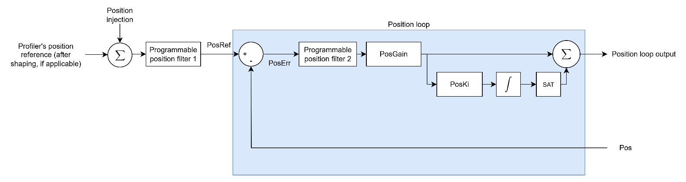

# Position control

The following block diagram shows the typical position control structure (including all the internal scaling).

Position error (PosErr) is calculated as position reference (PosRef) minus position feedback (Pos). PosErr is passed through a customisable filter, before going through the position controller, to form position loop output. On v4 (standalone or central-i) this controller is proportional only. On central-i v5 an integral term can be added with [PosKi](../../../02-keywords/11-control-tuning/03-position-control/PosKi.md), making it a PI controller.

Position loop output will then enter velocity loop as one of the command references.

The table below shows the summary of position control keywords.

| No. | Keywords | Summary |
|----|----|----|
| 1 | [PosGain](../../../02-keywords/11-control-tuning/03-position-control/PosGain.md) | Position loop proportional gain |
| 2 | [PosKi](../../../02-keywords/11-control-tuning/03-position-control/PosKi.md) | Position loop integral gain (central-i v5 only) |
| 3 | [PosFiltOn](../../../02-keywords/11-control-tuning/03-position-control/PosFiltOn.md) | Position loop filter switches |
| 4 | [PosFiltDef](../../../02-keywords/11-control-tuning/03-position-control/PosFiltDef.md) | Position loop filter definition parameters |
