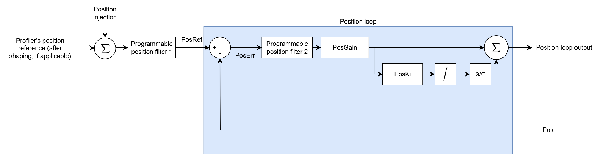

# 位置控制

以下方框图展示了典型的位置控制结构（包含所有内部缩放）。

位置误差（PosErr）由位置参考（PosRef）减去位置反馈（Pos）得出。PosErr 先经过可定制滤波器，再通过位置控制器，形成位置环输出。在 v4（独立或 Central-i）上，该控制器仅为比例控制。在 Central-i v5 上，可通过 [PosKi](../../../02-keywords/11-control-tuning/03-position-control/PosKi.md) 添加积分项，构成 PI 控制器。

位置环输出随后作为指令参考之一进入速度环。

下表为位置控制关键字汇总。

| 序号 | 关键字 | 说明 |
|----|----|----|
| 1 | [PosGain](../../../02-keywords/11-control-tuning/03-position-control/PosGain.md) | 位置环比例增益 |
| 2 | [PosKi](../../../02-keywords/11-control-tuning/03-position-control/PosKi.md) | 位置环积分增益（仅 Central-i v5） |
| 3 | [PosFiltOn](../../../02-keywords/11-control-tuning/03-position-control/PosFiltOn.md) | 位置环滤波器开关 |
| 4 | [PosFiltDef](../../../02-keywords/11-control-tuning/03-position-control/PosFiltDef.md) | 位置环滤波器定义参数 |
