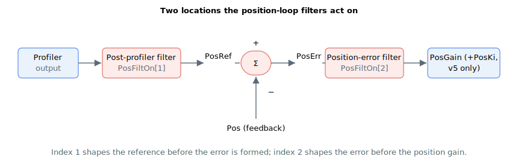

# PosFiltOn

Enables or bypasses the two position-loop filters.

## Overview

`PosFiltOn` enables the position-loop filters that are defined by [PosFiltDef](PosFiltDef.md). Each array element enables one filter location:

| Index | Filter | Acts on |
|---|---|---|
| 1 | Post-profiler filter | The profiler output. When enabled it changes the final position reference [PosRef](../../10-motion/01-kinematics-status/PosRef.md) before the position error is formed. |
| 2 | Position-error filter | The position error [PosErr](../../10-motion/01-kinematics-status/PosErr.md) at the input of the position controller, before it is multiplied by [PosGain](PosGain.md). It is generally used in dual-loop systems. |

`PosFiltOn[Index] = 1` enables the corresponding filter; `PosFiltOn[Index] = 0` bypasses it (the signal passes through unchanged). The range is `0` to `1`, default `0` (both filters bypassed).



## How it works

Each enabled filter applies the second-order (biquad) response built from its [PosFiltDef](PosFiltDef.md) parameters:

- **Index 1 (post-profiler):** filters the profiler output, shaping the reference fed to the position loop; the result becomes the final [PosRef](../../10-motion/01-kinematics-status/PosRef.md).
- **Index 2 (position-error):** filters [PosErr](../../10-motion/01-kinematics-status/PosErr.md) so that the filtered error is what [PosGain](PosGain.md) (and, on v5, [PosKi](PosKi.md)) multiplies when forming [VelRef](../../10-motion/01-kinematics-status/VelRef.md).

After changing `PosFiltOn` or [PosFiltDef](PosFiltDef.md), run [CalcFilters](../01-general-keywords/CalcFilters.md) so the controller recomputes the internal filter coefficients.

## Examples

```text
APosFiltOn[2]=1     ; enable the position-error filter
APosFiltOn[1]=0     ; bypass the post-profiler filter
APosFiltOn[2]       ; read the position-error filter enable state
```

## Changes between versions

In **v4** `PosFiltOn` can only be changed with the motor off and out of motion. In **v5 (central-i)** it may also be changed while the motor is on and in motion.

## See also

- [PosFiltDef](PosFiltDef.md) — defines each position filter's type and parameters
- [CalcFilters](../01-general-keywords/CalcFilters.md) — recomputes filter coefficients after changes
- [PosErr](../../10-motion/01-kinematics-status/PosErr.md) — signal filtered at index 2
- [PosRef](../../10-motion/01-kinematics-status/PosRef.md) — reference shaped at index 1
- [VelFiltOn](../04-velocity-control/VelFiltOn.md) — velocity-loop filter enables
- Appendix: [Customisable filter (FiltDef)](../../../06-appendix/customisable-filter-filtdef.md)
