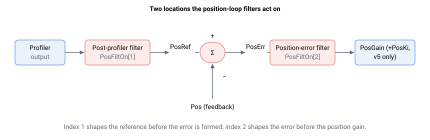

# PosFiltOn

启用或旁路两个位置环滤波器。

## 概述

`PosFiltOn` 启用由 [PosFiltDef](PosFiltDef.md) 定义的位置环滤波器。每个数组元素对应一个滤波器位置：

| 索引 | 滤波器 | 作用对象 |
|---|---|---|
| 1 | 规划器后滤波器 | 规划器输出。启用后，在形成位置误差之前改变最终位置参考 [PosRef](../../10-motion/01-kinematics-status/PosRef.md)。 |
| 2 | 位置误差滤波器 | 位置控制器输入处的位置误差 [PosErr](../../10-motion/01-kinematics-status/PosErr.md)，在被 [PosGain](PosGain.md) 乘之前。通常用于双环系统。 |

`PosFiltOn[Index] = 1` 启用对应滤波器；`PosFiltOn[Index] = 0` 旁路该滤波器（信号直通不变）。范围为 `0` 到 `1`，默认值 `0`（两个滤波器均旁路）。



## 工作原理

每个已启用的滤波器应用由其 [PosFiltDef](PosFiltDef.md) 参数构建的二阶（双二次）响应：

- **索引 1（规划器后）：** 对规划器输出进行滤波，对馈入位置环的参考值整形；结果成为最终的 [PosRef](../../10-motion/01-kinematics-status/PosRef.md)。
- **索引 2（位置误差）：** 对 [PosErr](../../10-motion/01-kinematics-status/PosErr.md) 进行滤波，使 [PosGain](PosGain.md)（以及在 v5 上的 [PosKi](PosKi.md)）在形成 [VelRef](../../10-motion/01-kinematics-status/VelRef.md) 时所乘的是经过滤波的误差。

更改 `PosFiltOn` 或 [PosFiltDef](PosFiltDef.md) 后，须运行 [CalcFilters](../01-general-keywords/CalcFilters.md)，使控制器重新计算内部滤波器系数。

## 示例

```text
APosFiltOn[2]=1     ; 启用位置误差滤波器
APosFiltOn[1]=0     ; 旁路规划器后滤波器
APosFiltOn[2]       ; 读取位置误差滤波器使能状态
```

## 版本差异

在 **v4** 中，仅支持 `PosFiltOn[1]`（规划器后滤波器）；位置误差滤波器 `PosFiltOn[2]` 为 **central-i v5 专属**。在 v4 上，`PosFiltOn` 只能在电机关闭且不在运动中时更改。在 **v5（central-i）** 中，两个索引均可用，且 `PosFiltOn` 也可在电机使能和运动中时更改。

## 另请参阅

- [PosFiltDef](PosFiltDef.md) — 定义每个位置滤波器的类型和参数
- [CalcFilters](../01-general-keywords/CalcFilters.md) — 更改后重新计算滤波器系数
- [PosErr](../../10-motion/01-kinematics-status/PosErr.md) — 索引 2 处被滤波的信号
- [PosRef](../../10-motion/01-kinematics-status/PosRef.md) — 索引 1 处被整形的参考值
- [VelFiltOn](../04-velocity-control/VelFiltOn.md) — 速度环滤波器使能
- 附录：[可定制滤波器（FiltDef）](../../../06-appendix/customisable-filter-filtdef.md)
