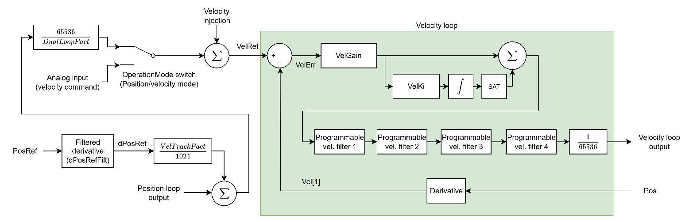

# Velocity control

The following block diagram shows the typical velocity control structure (including all the internal scaling).

The output of position loop (if present) will be summed with the scaled and filtered position derivative. The sum will pass through the dual loop scaling factor that compensates for the resolution differences between position and velocity feedback, if dual loop is used.

The scaled result, VelRef will subtract velocity feedback (Vel\[1\]), to produce velocity error (VelErr). VelErr will pass through PI controller, 4 customisable filters and output scaling to form velocity loop output.

The table below shows the summary of velocity control keywords.

| No. | Keywords     | Summary                                                  |
|-----|--------------|----------------------------------------------------------|
| 1   | [dPosRefFilt](../../../02-keywords/11-control-tuning/04-velocity-control/dPosRefFilt.md)  | Filter cutoff frequency of position reference derivative |
| 2   | [VelGain](../../../02-keywords/11-control-tuning/04-velocity-control/VelGain.md)      | Velocity loop proportional gain                          |
| 3   | [VelKi](../../../02-keywords/11-control-tuning/04-velocity-control/VelKi.md)        | Velocity loop integral gain                              |
| 4   | [VelFiltOn](../../../02-keywords/11-control-tuning/04-velocity-control/VelFiltOn.md)    | Velocity loop filter switches                            |
| 5   | [VelFiltDef](../../../02-keywords/11-control-tuning/04-velocity-control/VelFiltDef.md)   | Velocity loop filter definition parameters               |
| 6   | [VelTrackFact](../../../02-keywords/11-control-tuning/04-velocity-control/VelTrackFact.md) | Scaling factor of filtered position reference derivative |
