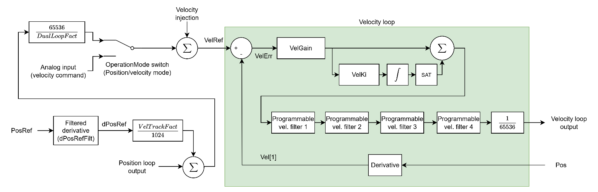

# 速度控制

下图展示了典型的速度控制结构（含所有内部缩放）。

位置环的输出（如有）将与经缩放和滤波的位置导数相加。如使用双环，该求和结果将通过双环缩放因子，以补偿位置反馈与速度反馈之间的分辨率差异。

缩放后的结果 VelRef 减去速度反馈（Vel\[1\]），产生速度误差（VelErr）。VelErr 经 PI 控制器、2 个可定制滤波器和输出缩放后形成速度环输出。

下表列出了速度控制关键字汇总。

| 编号 | 关键字 | 说明 |
|-----|--------------|----------------------------------------------------------|
| 1   | [dPosRefFilt](../../../02-keywords/11-control-tuning/04-velocity-control/dPosRefFilt.md)  | 位置参考导数的滤波器截止频率 |
| 2   | [VelGain](../../../02-keywords/11-control-tuning/04-velocity-control/VelGain.md)      | 速度环比例增益 |
| 3   | [VelKi](../../../02-keywords/11-control-tuning/04-velocity-control/VelKi.md)        | 速度环积分增益 |
| 4   | [VelFiltOn](../../../02-keywords/11-control-tuning/04-velocity-control/VelFiltOn.md)    | 速度环滤波器开关 |
| 5   | [VelFiltDef](../../../02-keywords/11-control-tuning/04-velocity-control/VelFiltDef.md)   | 速度环滤波器定义参数 |
| 6   | [VelTrackFact](../../../02-keywords/11-control-tuning/04-velocity-control/VelTrackFact.md) | 经滤波的位置参考导数的缩放因子 |
