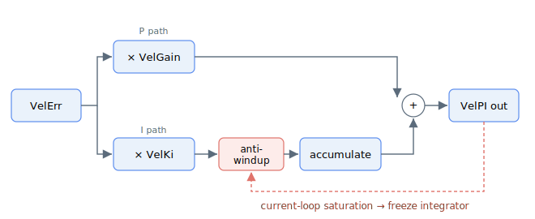

# VelKi

Integral gain of the velocity loop — accumulates the scaled velocity-controller output, with internal anti-windup.

## Overview

`VelKi` is the integral gain of the inner (velocity) loop in the PIV cascade. Together with [VelGain](VelGain.md) it makes the velocity controller a PI controller: `VelGain` provides the proportional term and `VelKi` accumulates that proportional term over time. The proportional term plus the integral form the velocity-PI output, which (after the velocity filters, plus the acceleration and velocity feed-forwards in position mode) forms the loop-side current reference (reported as [CurrRefCtrl](../../09-current-and-voltage/02-motor-variables/CurrRefCtrl.md) on central-i v5); after current compensation and injection this becomes the final motor current command [CurrRef](../../09-current-and-voltage/02-motor-variables/CurrRef.md).

`VelKi` is an array, so it can take part in gain scheduling. Without gain scheduling the first element `VelKi[1]` is used for control. See [ScheduleMode](../01-general-keywords/ScheduleMode.md).

## How it works

Each control cycle the velocity error [VelErr](../../10-motion/01-kinematics-status/VelErr.md) is multiplied by [VelGain](VelGain.md) to form the proportional term. `VelKi` then multiplies that proportional term and the result is added into a running velocity integral:

$$
\text{integral} \mathrel{+}= \big( \text{VelErr} \cdot \text{VelGain} \big) \cdot \text{VelKi} \cdot k_{i}
$$

$$
\text{VelPIOutput} = \big( \text{VelErr} \cdot \text{VelGain} + \text{integral} \big) \cdot k_{\text{scale}}
$$

where $k_{i}$ and $k_{\text{scale}}$ are fixed internal scalings.

- **What it multiplies:** the velocity-controller proportional output (`VelErr × VelGain`), before that product enters the integral accumulator.
- **Where it sums:** the accumulated integral is added to the proportional term to form the velocity-PI output that, with the feedforwards in position mode, forms the loop-side current reference (reported as [CurrRefCtrl](../../09-current-and-voltage/02-motor-variables/CurrRefCtrl.md) on central-i v5) and after compensation/injection the final command [CurrRef](../../09-current-and-voltage/02-motor-variables/CurrRef.md).
- **Anti-windup:** the integral saturation value is controlled internally. When the current command saturates (at a torque/current limit) and the error has the same sign as the output, integration is halted for that cycle so the integral does not wind up. The integral is also preloaded when switching operation modes so the current command does not jump.

### Range and default

| | v4 (standalone & central-i) | v5 (central-i) |
|---|---|---|
| Data type | 32-bit integer | 32-bit float |
| Range | 0 to 20000 | 0 to 20000 |
| Default | 0 | 0 |

Default `0` means no integral action — the velocity loop is purely proportional.



## Examples

```text
AVelKi[1]=80        ; set the velocity-loop integral gain (first scheduling element)
AVelKi[1]           ; read the velocity-loop integral gain
```

### Walk-through: confirm anti-windup is doing its job

When a move pushes the velocity-loop output into the current limit, the integrator should freeze instead of accumulating further. The [StatReg](../../07-status-and-faults/StatReg.md) saturation bits are the way to confirm that path is exercising correctly.

1. **Start from a clean integrator** (axis stationary, motor on):

   ```text
   AClearIntegral
   ```

2. **Command a fast move** that you expect to clip the current. Read the status word during the move:

   ```text
   AStatReg
   (AStatReg & 0x200000) >> 21   ; bit 21 - current saturation
   ```

   While bit 21 reads `1`, the velocity-PI output is being clamped at the peak-current limit and the anti-windup gate is set to `0`, so the integrator stops accumulating for those cycles.

3. **Watch saturation clear**. As the axis decelerates or the limit is removed, bit 21 returns to `0`, the gate reopens to `1`, and the integral resumes normal accumulation from the value it held during saturation - it has not wound up.

4. **Force a clean restart** after the test, before the next move that should start without any standing integral:

   ```text
   AClearIntegral                ; integrator back to zero (axis must be stationary)
   ```

The same sequence applies to the [ForceKi](../07-force-control/ForceKi.md) integrator in force operation mode, with bit 21 (current saturation) being replaced by the downstream loop limits described on that page.

## Changes between versions

In **v5 (central-i)** `VelKi` is a floating-point value; the proportional×error accumulation, internal anti-windup and mode-switch preloading are otherwise the same. **v5 is central-i only.**

## See also

- [VelGain](VelGain.md) — proportional gain whose output `VelKi` integrates
- [VelErr](../../10-motion/01-kinematics-status/VelErr.md) — velocity error at the input of the velocity loop
- [CurrRefCtrl](../../09-current-and-voltage/02-motor-variables/CurrRefCtrl.md) — loop-side current reference (velocity-PI output plus feedforwards), reported on central-i v5
- [CurrRef](../../09-current-and-voltage/02-motor-variables/CurrRef.md) — final motor current command after compensation/injection
- [PosKi](../03-position-control/PosKi.md) — integral gain of the outer (position) loop (v5)
- [ClearIntegral](../01-general-keywords/ClearIntegral.md) — clears the velocity-loop integrator
- [StatReg](../../07-status-and-faults/StatReg.md) — bit 21 (current saturation) reports when anti-windup is engaged
- [ScheduleMode](../01-general-keywords/ScheduleMode.md) — selects which array element is active
