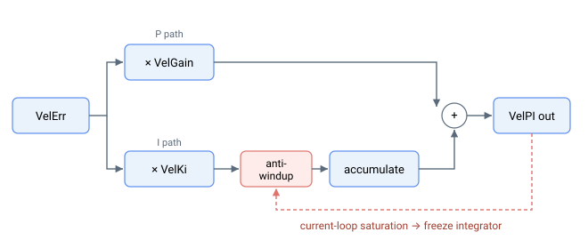

# VelKi

速度环积分增益——累加缩放后的速度控制器输出，带内部抗积分饱和。

## 概述

`VelKi` 是 PIV 级联中内环（速度环）的积分增益。它与 [VelGain](VelGain.md) 共同使速度控制器成为 PI 控制器：`VelGain` 提供比例项，`VelKi` 随时间累加该比例项。比例项加上积分项构成速度 PI 输出，（经速度滤波器，以及位置模式下的加速度和速度前馈后）构成环路侧电流参考（在 central-i v5 上报告为 [CurrRefCtrl](../../09-current-and-voltage/02-motor-variables/CurrRefCtrl.md)）；经电流补偿和注入后，最终形成电机电流指令 [CurrRef](../../09-current-and-voltage/02-motor-variables/CurrRef.md)。

`VelKi` 是数组，因此可参与增益调度。未启用增益调度时，第一个元素 `VelKi[1]` 用于控制。参见 [ScheduleMode](../01-general-keywords/ScheduleMode.md)。

## 工作原理

每个控制周期，速度误差 [VelErr](../../10-motion/01-kinematics-status/VelErr.md) 乘以 [VelGain](VelGain.md) 形成比例项。`VelKi` 再乘以该比例项，结果累加进速度积分：

$$
\text{integral} \mathrel{+}= \big( \text{VelErr} \cdot \text{VelGain} \big) \cdot \text{VelKi} \cdot k_{i}
$$

$$
\text{VelPIOutput} = \big( \text{VelErr} \cdot \text{VelGain} + \text{integral} \big) \cdot k_{\text{scale}}
$$

其中 $k_{i}$ 和 $k_{\text{scale}}$ 为固定内部缩放系数。

- **相乘对象：** 速度控制器比例输出（`VelErr × VelGain`），在该乘积进入积分累加器之前。
- **求和位置：** 累加积分与比例项相加，构成速度 PI 输出，在位置模式下叠加前馈后形成环路侧电流参考（在 central-i v5 上报告为 [CurrRefCtrl](../../09-current-and-voltage/02-motor-variables/CurrRefCtrl.md)），经补偿/注入后最终为指令 [CurrRef](../../09-current-and-voltage/02-motor-variables/CurrRef.md)。
- **抗积分饱和：** 积分饱和值由内部控制。当电流指令被限值钳位时，仅当速度误差与输出被钳位的限值方向相同（即误差仍在尝试将输出进一步推过边界）时，积分才停止。若误差已反向（将输出推回线性区），积分器立即恢复，因此永远不会在单侧钳位处累积。当电流环本身在电压限值处饱和时，积分器同样冻结：速度积分增量同时受速度环和电流环抗积分饱和条件的门控，因此电流指令钳位（电流饱和，[StatReg](../../07-status-and-faults/StatReg.md) 位 21）或 [MaxPWM](../../06-protections/02-current-and-voltage/MaxPWM.md) 处的相电压钳位（电压饱和，位 22）均会在该周期内停止积分。切换运行模式时积分器也会预载，以避免电流指令跳变。

### 范围与默认值

| | v4（standalone 及 central-i）| v5（central-i）|
|---|---|---|
| 数据类型 | 32 位整数 | 32 位浮点 |
| 范围 | 0 到 20000 | 0 到 20000 |
| 默认值 | 0 | 0 |

默认值 `0` 表示无积分作用——速度环为纯比例控制。



## 示例

```text
AVelKi[1]=80        ; set the velocity-loop integral gain (first scheduling element)
AVelKi[1]           ; read the velocity-loop integral gain
```

### 操作步骤：确认抗积分饱和正常工作

当运动将速度环输出推入电流限值时，积分器应冻结而非继续累积。[StatReg](../../07-status-and-faults/StatReg.md) 饱和位是确认该路径正常工作的方法。

1. **从干净的积分器开始**（轴静止，电机使能）：

   ```text
   AClearIntegral
   ```

2. **指令一次预期会钳位电流的快速运动**。在运动过程中读取状态字：

   ```text
   AStatReg
   (AStatReg & 0x200000) >> 21   ; bit 21 - current saturation
   ```

   当位 21 读为 `1` 时，速度 PI 输出被钳位在峰值电流限值，抗积分饱和门设为 `0`，积分器在这些周期内停止累积。

3. **观察饱和解除**。随着轴减速或限值解除，位 21 返回 `0`，门重新打开为 `1`，积分从饱和期间保持的值恢复正常累积——没有发生积分饱和。位 22（电压饱和）与位 21 出于同样原因保持速度积分器：速度积分增量同时受电流环抗积分饱和的门控，因此 [MaxPWM](../../06-protections/02-current-and-voltage/MaxPWM.md) 处持续的相电压钳位与电流钳位一样使积分器冻结。

4. **测试结束后强制复位**，以便下次运动在无积分残余的状态下启动：

   ```text
   AClearIntegral                ; integrator back to zero (axis must be stationary)
   ```

同样的步骤适用于力运行模式下的 [ForceKi](../07-force-control/ForceKi.md) 积分器，其中位 21（电流饱和）由该页面所述的下游环路限值替代。

## 版本变更

在 **v5（central-i）**中，`VelKi` 为浮点值；比例×误差累加、内部抗积分饱和及模式切换预载与之前相同。**v5 仅适用于 central-i。**

## 另请参见

- [VelGain](VelGain.md) — `VelKi` 积分所用的比例增益
- [VelErr](../../10-motion/01-kinematics-status/VelErr.md) — 速度环输入端的速度误差
- [CurrRefCtrl](../../09-current-and-voltage/02-motor-variables/CurrRefCtrl.md) — 环路侧电流参考（速度 PI 输出加前馈），在 central-i v5 上报告
- [CurrRef](../../09-current-and-voltage/02-motor-variables/CurrRef.md) — 补偿/注入后的最终电机电流指令
- [PosKi](../03-position-control/PosKi.md) — 外层（位置）环的积分增益（v5）
- [ClearIntegral](../01-general-keywords/ClearIntegral.md) — 清除速度环积分器
- [StatReg](../../07-status-and-faults/StatReg.md) — 位 21（电流饱和）报告抗积分饱和是否激活
- [ScheduleMode](../01-general-keywords/ScheduleMode.md) — 选择当前激活的数组元素
