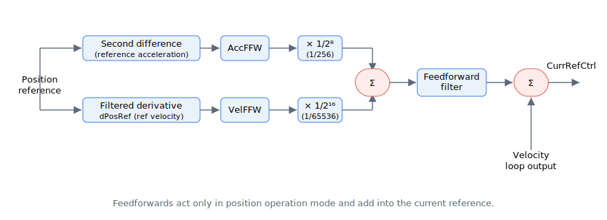

# Feedforwards

The following block diagram shows the typical feedforward control structure (including all the internal scaling).

Feedforward is the control effort that acts in advance, according to the motion profile to reduce position error during motion. This is different from reactive feedback control that forms control effort only when there is error.

Acceleration and velocity feedforwards will act on their counterparts, mass (inertia) and damping respectively. The summation of both feedforwards will pass through a programmable filter, before summing with velocity loop output to form loop’s current reference (CurrRefCtrl) for current control loop.

Acceleration and velocity feedforwards are applicable only when position operation mode (OperationMode = 3) is used. Velocity loop output, feedforward effort and current compensation from [TorqCompMode](../../../02-keywords/09-current-and-voltage/03-current-compensation/TorqCompMode.md) will add up to form [CurrRefCtrl](../../../02-keywords/09-current-and-voltage/02-motor-variables/CurrRefCtrl.md).

The following is the summary of feedforward keywords.

| No. | Keywords               | Summary                                  |
|-----|------------------------|------------------------------------------|
| 1   | [AccFFW](../../../02-keywords/11-control-tuning/05-feedforwards/AccFFW.md)      | Acceleration feedforward gain            |
| 2   | [FFFiltOn](../../../02-keywords/11-control-tuning/05-feedforwards/FFFiltOn.md) | Feedforward filter switch                |
| 3   | [FFFiltDef](../../../02-keywords/11-control-tuning/05-feedforwards/FFFiltDef.md)   | Feedforward filter definition parameters |
| 4   | [VelFFW](../../../02-keywords/11-control-tuning/05-feedforwards/VelFFW.md)      | Velocity feedforward gain                |

## Voltage feedforward (central-i v5)

A separate, model-based feedforward acts inside the current/voltage loop rather than on the position profile. From the motor's electrical model it estimates the terminal voltage needed to drive the commanded current and adds it ahead of the current PI controllers, improving current tracking at high speed and during fast current changes. These keywords are available from central-i v5.

| No. | Keywords | Summary |
|-----|----------|---------|
| 5   | [VoltageFFWOn](../../../02-keywords/11-control-tuning/05-feedforwards/VoltageFFWOn.md)   | Master enable for voltage feedforward |
| 6   | [RmFFWLevel](../../../02-keywords/11-control-tuning/05-feedforwards/RmFFWLevel.md)       | Level of the resistive (R·i) term |
| 7   | [LmFFWLevel](../../../02-keywords/11-control-tuning/05-feedforwards/LmFFWLevel.md)       | Level of the inductive (L·di/dt) term |
| 8   | [BEMFConst](../../../02-keywords/11-control-tuning/05-feedforwards/BEMFConst.md)         | Motor back-EMF constant |
| 9   | [BEMFFFWLevel](../../../02-keywords/11-control-tuning/05-feedforwards/BEMFFFWLevel.md)   | Level of the back-EMF term |
| 10  | [VqFFW](../../../02-keywords/11-control-tuning/05-feedforwards/VqFFW.md)                 | Q-axis voltage feedforward output (read-only) |
| 11  | [VdFFW](../../../02-keywords/11-control-tuning/05-feedforwards/VdFFW.md)                 | D-axis voltage feedforward output (read-only) |
