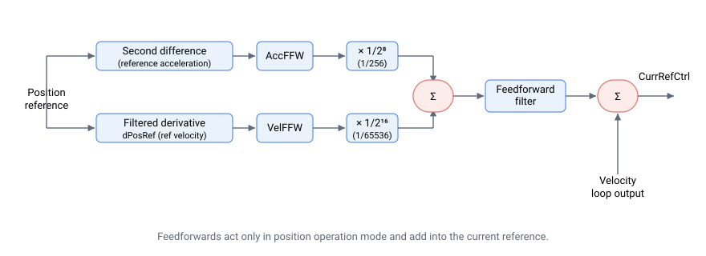

# 前馈

以下框图展示了典型的前馈控制结构（含所有内部缩放）。

前馈是根据运动曲线提前作用的控制量，用于减少运动过程中的位置误差。这与反馈控制不同——反馈控制仅在存在误差时才产生控制量。

加速度前馈和速度前馈分别作用于各自对应的物理量，即质量（惯量）和阻尼。两个前馈之和经可编程滤波器后，与速度环输出求和，构成电流控制环的电流参考（CurrRefCtrl）。

加速度前馈和速度前馈仅在位置运行模式（OperationMode = 3）下有效。速度环输出、前馈量及来自 [TorqCompMode](../../../02-keywords/09-current-and-voltage/03-current-compensation/TorqCompMode.md) 的电流补偿相加，构成 [CurrRefCtrl](../../../02-keywords/09-current-and-voltage/02-motor-variables/CurrRefCtrl.md)。

以下是前馈关键字汇总。

| 序号 | 关键字               | 说明                                  |
|-----|------------------------|------------------------------------------|
| 1   | [AccFFW](../../../02-keywords/11-control-tuning/05-feedforwards/AccFFW.md)      | 加速度前馈增益            |
| 2   | [FFFiltOn](../../../02-keywords/11-control-tuning/05-feedforwards/FFFiltOn.md) | 前馈滤波器开关                |
| 3   | [FFFiltDef](../../../02-keywords/11-control-tuning/05-feedforwards/FFFiltDef.md)   | 前馈滤波器定义参数 |
| 4   | [VelFFW](../../../02-keywords/11-control-tuning/05-feedforwards/VelFFW.md)      | 速度前馈增益                |

## 电压前馈（central-i v5）

一种单独的基于模型的前馈作用于电流/电压环内部，而非位置曲线。它根据电机电气模型估算驱动指令电流所需的端电压，并将其叠加在电流 PI 控制器之前，从而在高速和快速电流变化期间改善电流跟踪。这些关键字从 central-i v5 起可用。

| 序号 | 关键字 | 说明 |
|-----|----------|---------|
| 5   | [VoltageFFWOn](../../../02-keywords/11-control-tuning/05-feedforwards/VoltageFFWOn.md)   | 电压前馈主使能 |
| 6   | [RmFFWLevel](../../../02-keywords/11-control-tuning/05-feedforwards/RmFFWLevel.md)       | 阻性（R·i）项的级别 |
| 7   | [LmFFWLevel](../../../02-keywords/11-control-tuning/05-feedforwards/LmFFWLevel.md)       | 感性（L·di/dt）项的级别 |
| 8   | [BEMFConst](../../../02-keywords/11-control-tuning/05-feedforwards/BEMFConst.md)         | 电机反电动势常数 |
| 9   | [BEMFFFWLevel](../../../02-keywords/11-control-tuning/05-feedforwards/BEMFFFWLevel.md)   | 反电动势项的级别 |
| 10  | [VqFFW](../../../02-keywords/11-control-tuning/05-feedforwards/VqFFW.md)                 | q 轴电压前馈输出（只读）|
| 11  | [VdFFW](../../../02-keywords/11-control-tuning/05-feedforwards/VdFFW.md)                 | d 轴电压前馈输出（只读）|
