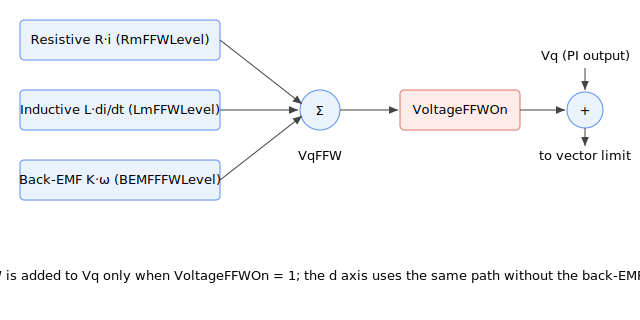

# VqFFW

Read-only quadrature-axis voltage feedforward output added to the q-axis voltage command.

> Available from central-i v5.

## Overview

`VqFFW` is the quadrature-axis (q-axis) voltage feedforward output. It is the model-based voltage the controller estimates is needed on the q axis to drive the commanded q-axis current, computed every control cycle from the motor's electrical model. When voltage feedforward is enabled by [VoltageFFWOn](VoltageFFWOn.md), `VqFFW` is added to the q-axis current PI output [Vq](../../../02-keywords/09-current-and-voltage/02-motor-variables/Vq.md) before the voltage vector is limited and transformed to phase voltages. It is the q-axis counterpart of [VdFFW](VdFFW.md).

`VqFFW` is read-only and reported in the same internal PWM-percent units as [Vq](../../../02-keywords/09-current-and-voltage/02-motor-variables/Vq.md). It is computed whether or not feedforward is enabled, so it can be observed to see how large the feedforward contribution would be; only its addition into the loop is gated by [VoltageFFWOn](VoltageFFWOn.md).



## How it works

Each control cycle `VqFFW` is the sum of the motor-model voltage terms evaluated on the q-axis current reference [IqRef](../../../02-keywords/09-current-and-voltage/02-motor-variables/IqRef.md):

$$
\text{VqFFW} = R_{\text{ffw}}\,i_{q,\text{ref}} + L_{\text{ffw}}\,f_s\,(i_{q,\text{ref}} - i_{q,\text{ref,prev}}) + K_{\text{ffw}}\,\omega + X_{\text{ffw}}\,i_{d,\text{ref}}\,\omega
$$

where the terms are, in order:

| Term | Physical role | Set by |
|------|---------------|--------|
| $R_{\text{ffw}}\,i_{q,\text{ref}}$ | Resistive drop: voltage to push the commanded current through the winding resistance | [Rm](../../../02-keywords/09-current-and-voltage/04-motor-measurement/Rm.md) scaled by [RmFFWLevel](RmFFWLevel.md) |
| $L_{\text{ffw}}\,f_s\,(i_{q,\text{ref}} - i_{q,\text{ref,prev}})$ | Inductive term (L·di/dt): voltage to change the current at the commanded rate, using the change in reference current over one control period ($f_s$ is the control sample rate) | [Lm](../../../02-keywords/09-current-and-voltage/04-motor-measurement/Lm.md) scaled by [LmFFWLevel](LmFFWLevel.md) |
| $K_{\text{ffw}}\,\omega$ | Back-EMF: the speed-proportional voltage the moving motor generates, using the actual motor speed $\omega$ ([Vel](../../../02-keywords/10-motion/01-kinematics-status/Vel.md)) | [BEMFConst](BEMFConst.md) scaled by [BEMFFFWLevel](BEMFFFWLevel.md) |
| $X_{\text{ffw}}\,i_{d,\text{ref}}\,\omega$ | Cross-coupling: the speed-dependent coupling from the d-axis current into the q axis | Derived from [Lm](../../../02-keywords/09-current-and-voltage/04-motor-measurement/Lm.md) (per-phase inductance), the bus voltage and the electrical cycle together with motor speed. **Not** scaled by [LmFFWLevel](LmFFWLevel.md), unlike the L·di/dt inductive term. |

If [VoltageFFWOn](VoltageFFWOn.md) is non-zero, `VqFFW` is then added to the q-axis PI output [Vq](../../../02-keywords/09-current-and-voltage/02-motor-variables/Vq.md). The resulting q-axis and d-axis voltages are limited together as a vector against the maximum PWM magnitude and transformed to the phase voltages (see [Vq](../../../02-keywords/09-current-and-voltage/02-motor-variables/Vq.md) for the saturation and inverse-Park detail). For brush motors the same q-axis feedforward is added on the single phase voltage command.

`VqFFW` is reset to 0 when the current loop is reset. All three level scalings ([RmFFWLevel](RmFFWLevel.md), [LmFFWLevel](LmFFWLevel.md), [BEMFFFWLevel](BEMFFFWLevel.md)) default to 0, so with default level settings the resistive, inductive and back-EMF terms are all zero. The fourth (d-q cross-coupling) term is governed by [Lm](../../../02-keywords/09-current-and-voltage/04-motor-measurement/Lm.md) and motor speed rather than by a level, but it is multiplied by the d-axis reference current, which this controller holds at zero, so this term contributes nothing. `VqFFW` therefore reads 0 under default level settings.

## Examples

```text
AVqFFW               ; read the q-axis voltage feedforward output
```

## See also

- [VdFFW](VdFFW.md) — direct-axis voltage feedforward output
- [VoltageFFWOn](VoltageFFWOn.md) — master enable that gates whether VqFFW is applied
- [Vq](../../../02-keywords/09-current-and-voltage/02-motor-variables/Vq.md) — q-axis PI output that VqFFW is added to
- [IqRef](../../../02-keywords/09-current-and-voltage/02-motor-variables/IqRef.md) — q-axis current reference the resistive and inductive terms use
- [RmFFWLevel](RmFFWLevel.md) / [LmFFWLevel](LmFFWLevel.md) / [BEMFFFWLevel](BEMFFFWLevel.md) — level scalings of the three terms
