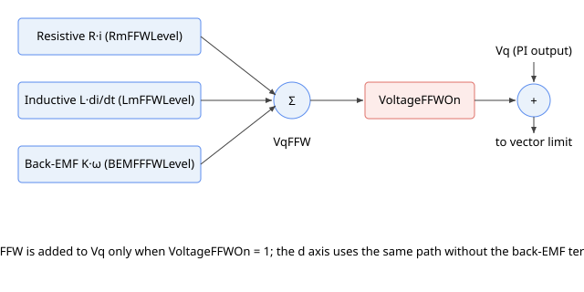

# VqFFW

只读交轴电压前馈输出，叠加至 q 轴电压指令。

> 从 central-i v5 起可用。

## 概述

`VqFFW` 是交轴（q 轴）电压前馈输出。它是控制器根据电机电气模型估算出的、每个控制周期驱动指令 q 轴电流所需的基于模型的 q 轴电压。当 [VoltageFFWOn](VoltageFFWOn.md) 使能电压前馈时，`VqFFW` 在电压矢量限幅并变换为相电压之前，被叠加至 q 轴电流 PI 输出 [Vq](../../../02-keywords/09-current-and-voltage/02-motor-variables/Vq.md)。它是 [VdFFW](VdFFW.md) 的 q 轴对应量。

`VqFFW` 为只读，以与 [Vq](../../../02-keywords/09-current-and-voltage/02-motor-variables/Vq.md) 相同的内部 PWM 百分比单位报告。无论是否使能前馈，均会计算该值，因此可通过读取该值观察前馈贡献量的大小；其叠加至控制环的操作由 [VoltageFFWOn](VoltageFFWOn.md) 控制。



## 工作原理

每个控制周期，`VqFFW` 是在 q 轴电流参考 [IqRef](../../../02-keywords/09-current-and-voltage/02-motor-variables/IqRef.md) 上求值的电机模型电压项之和：

$$
\text{VqFFW} = R_{\text{ffw}}\,i_{q,\text{ref}} + L_{\text{ffw}}\,f_s\,(i_{q,\text{ref}} - i_{q,\text{ref,prev}}) + K_{\text{ffw}}\,\omega + X_{\text{ffw}}\,i_{d,\text{ref}}\,\omega
$$

各项依次为：

| 项 | 物理作用 | 由以下参数设定 |
|------|---------------|--------|
| $R_{\text{ffw}}\,i_{q,\text{ref}}$ | 阻性压降：将指令电流推过绕组电阻所需的电压 | [Rm](../../../02-keywords/09-current-and-voltage/04-motor-measurement/Rm.md) 乘以 [RmFFWLevel](RmFFWLevel.md) |
| $L_{\text{ffw}}\,f_s\,(i_{q,\text{ref}} - i_{q,\text{ref,prev}})$ | 感性项（L·di/dt）：以指令速率改变电流所需的电压，使用一个控制周期内参考电流的变化量（$f_s$ 为控制采样频率） | [Lm](../../../02-keywords/09-current-and-voltage/04-motor-measurement/Lm.md) 乘以 [LmFFWLevel](LmFFWLevel.md) |
| $K_{\text{ffw}}\,\omega$ | 反电动势：运动电机产生的速度比例电压，使用实际电机转速 $\omega$（[Vel](../../../02-keywords/10-motion/01-kinematics-status/Vel.md)） | [BEMFConst](BEMFConst.md) 乘以 [BEMFFFWLevel](BEMFFFWLevel.md) |
| $X_{\text{ffw}}\,i_{d,\text{ref}}\,\omega$ | 交叉耦合：d 轴电流耦合至 q 轴的速度相关分量 | 由 [Lm](../../../02-keywords/09-current-and-voltage/04-motor-measurement/Lm.md)（每相电感）、母线电压和电气周期结合电机转速推导得出。与 L·di/dt 感性项不同，**不**受 [LmFFWLevel](LmFFWLevel.md) 缩放。 |

若 [VoltageFFWOn](VoltageFFWOn.md) 非零，`VqFFW` 将叠加至 q 轴 PI 输出 [Vq](../../../02-keywords/09-current-and-voltage/02-motor-variables/Vq.md)。所得 q 轴和 d 轴电压作为矢量联合限幅至最大 PWM 幅值，再变换为相电压（饱和及逆 Park 变换详情见 [Vq](../../../02-keywords/09-current-and-voltage/02-motor-variables/Vq.md)）。对于有刷电机，同样的 q 轴前馈以相同方式叠加至单相电压指令。

电流环复位时，`VqFFW` 被清零。三个电平缩放（[RmFFWLevel](RmFFWLevel.md)、[LmFFWLevel](LmFFWLevel.md)、[BEMFFFWLevel](BEMFFFWLevel.md)）均默认为 0，因此使用默认电平设置时，阻性项、感性项和反电动势项均为零。第四项（d-q 交叉耦合）由 [Lm](../../../02-keywords/09-current-and-voltage/04-motor-measurement/Lm.md) 和电机转速决定，而非由电平决定，但它乘以 d 轴参考电流，而该控制器将其保持为零，因此该项贡献量为零。在默认电平设置下，`VqFFW` 读取为 0。

## 示例

```text
AVqFFW               ; read the q-axis voltage feedforward output
```

## 另请参阅

- [VdFFW](VdFFW.md) — 直轴电压前馈输出
- [VoltageFFWOn](VoltageFFWOn.md) — 控制 VqFFW 是否被应用的主使能开关
- [Vq](../../../02-keywords/09-current-and-voltage/02-motor-variables/Vq.md) — VqFFW 叠加至的 q 轴 PI 输出
- [IqRef](../../../02-keywords/09-current-and-voltage/02-motor-variables/IqRef.md) — 阻性项和感性项使用的 q 轴电流参考
- [RmFFWLevel](RmFFWLevel.md) / [LmFFWLevel](LmFFWLevel.md) / [BEMFFFWLevel](BEMFFFWLevel.md) — 三个项的电平缩放
