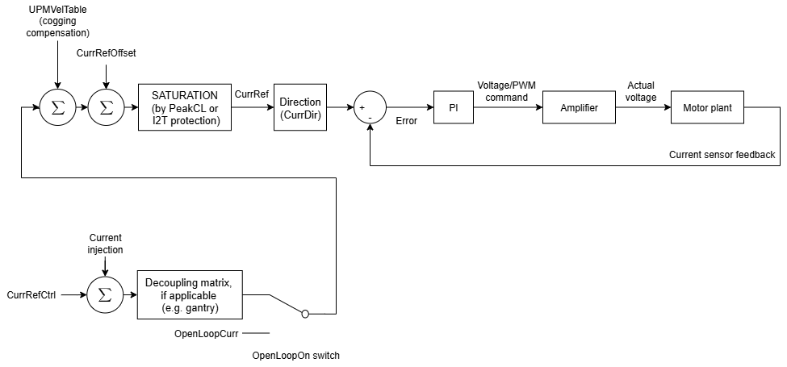
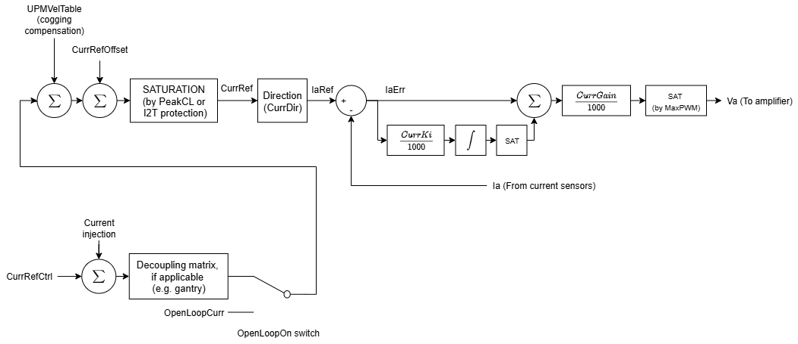
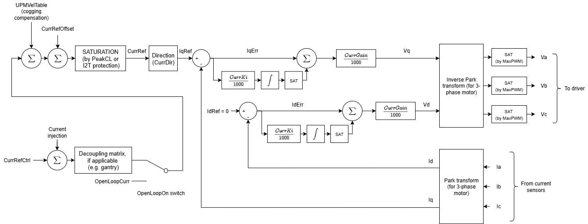
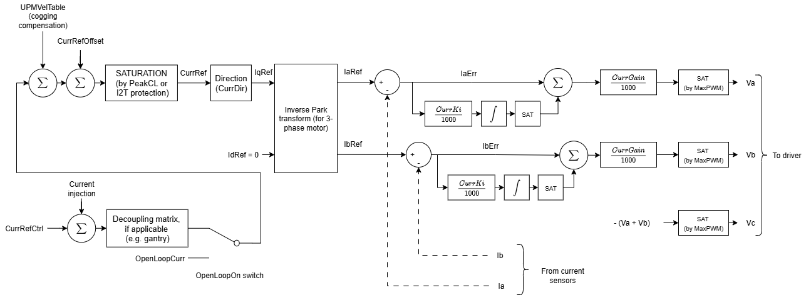

# Current control

The current loop is the innermost loop of the control cascade. It drives the actual motor current to follow the current reference generated by the outer loops (position, velocity, force, etc.), so that the desired force (or torque) is produced. The current loop operates at a higher bandwidth than the outer loops.

The figure below shows the typical, generalised block diagram of current loop control.

For **voice coil or brushed motor**, the controller only has to control 1 phase current (phase A). The figure below shows the typical current control in for such single-phase motor.

For **stepper motor**, current loop is similar to voice coil motor, except the controller has to control 2 separate phase currents (phase A and B). Phase A and B will have the same current loop structure as above.

For **3-phase brushless motor**, the controller has to control 3 current values, with amplifier acting as a power inverter. Ultimately by means of Kirchoff’s current law ($I_{a} + I_{b} + I_{c} = 0$), the controller only needs to control 2 current values ($I_{a}$, $I_{b}$) with the third value inferred from the former 2 (same for voltage).

User can also operate in dq0 space by Park transform, controlling direct and quadrature current values. Selection on which 3-phase current control mode to use is done by [ControlMode](../../../02-keywords/09-current-and-voltage/02-motor-variables/ControlMode.md) keyword.

The following block diagram shows both dq0 and abc domain current controls.

1.  dq0-domain control (vector control, default method)

2.  abc-domain control (individual phase current control)

For more information on the current and voltage terms, please refer to [Current and voltage – Motor variables](../../../02-keywords/09-current-and-voltage/02-motor-variables/00-overview.md).

The following is the summary of current control keywords.

| No. | Keywords | Summary |
|----|----|----|
| 1 | [CurrGain](../../../02-keywords/11-control-tuning/06-current-control/CurrGain.md) | Current loop proportional gain |
| 2 | [CurrKi](../../../02-keywords/11-control-tuning/06-current-control/CurrKi.md) | Current loop integral gain |
