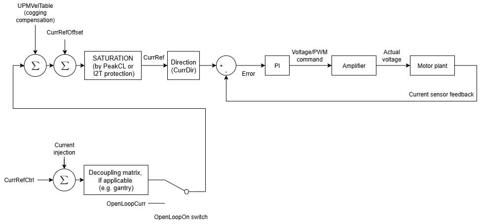
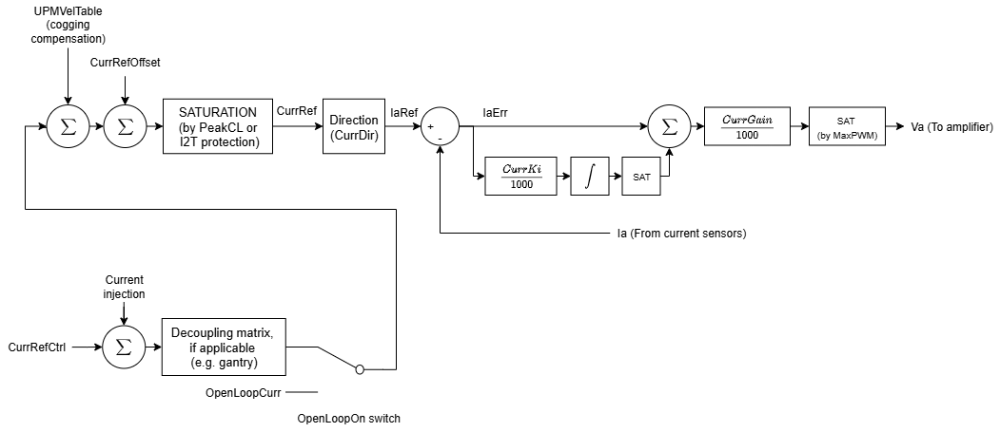
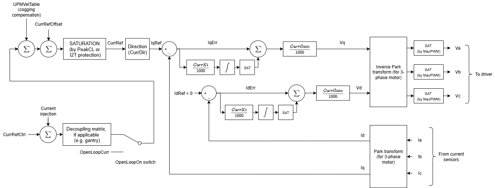
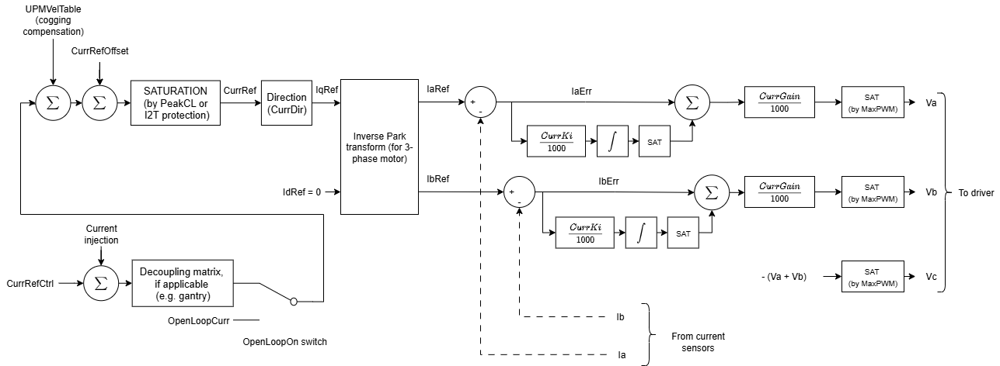

# 电流控制

电流环是控制级联的最内层环路。它驱动实际电机电流跟踪由外层环路（位置环、速度环、力环等）生成的电流参考，从而产生所需的力（或力矩）。电流环的带宽高于外层环路。

下图为电流环控制的典型通用框图。

对于**音圈或有刷电机**，控制器仅需控制 1 路相电流（A 相）。下图为此类单相电机的典型电流控制结构。

对于**步进电机**，电流环与音圈电机类似，但控制器需控制 2 路独立的相电流（A 相和 B 相）。A 相和 B 相采用与上述相同的电流环结构。

对于**三相无刷电机**，控制器需控制 3 个电流值，驱动器作为功率逆变器。最终根据基尔霍夫电流定律（$I_{a} + I_{b} + I_{c} = 0$），控制器只需控制 2 个电流值（$I_{a}$、$I_{b}$），第三个值由前两者推算（电压同理）。

用户也可通过 Park 变换在 dq0 空间中运行，控制直轴和交轴电流值。三相电流控制模式的选择由 [ControlMode](../../../02-keywords/09-current-and-voltage/02-motor-variables/ControlMode.md) 关键字完成。

下方框图展示了 dq0 域和 abc 域两种电流控制方式。

1.  dq0 域控制（矢量控制，默认方式）

2.  abc 域控制（独立相电流控制）

有关电流和电压项的更多信息，请参阅[电流与电压——电机变量](../../../02-keywords/09-current-and-voltage/02-motor-variables/00-overview.md)。

以下为电流控制关键字汇总。

| 序号 | 关键字 | 说明 |
|----|----|----|
| 1 | [CurrGain](../../../02-keywords/11-control-tuning/06-current-control/CurrGain.md) | 电流环比例增益 |
| 2 | [CurrKi](../../../02-keywords/11-control-tuning/06-current-control/CurrKi.md) | 电流环积分增益 |
