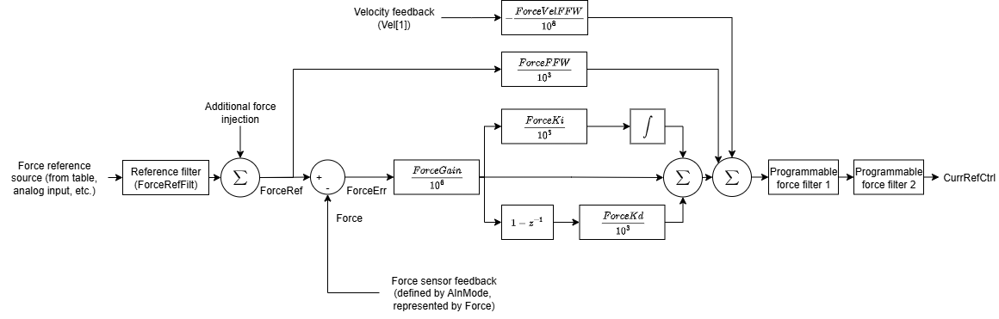
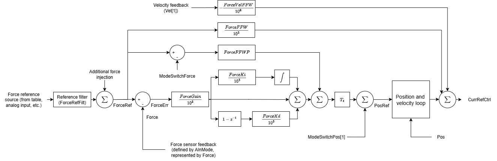

# Force control

This section describes the force control structure, tuning gains and filters. For more information on force operation mode (command, switching and status), please refer to [Axis operation – Force operation mode](../../../02-keywords/08-axis-operation/04-force-operation-mode/00-overview.md).

Once the axis is in force operation mode ([OperationMode](../../../02-keywords/08-axis-operation/01-general-keywords/OperationMode.md) = 4), there are 2 types of force control structures selectable by [ForcePIVOn](../../../02-keywords/11-control-tuning/07-force-control/ForcePIVOn.md) keyword.

1.  Standard force control (ForcePIVOn = 0)

Standard force control starts force command going through a first-order low-pass filter, defined by [ForceRefFilt](../../../02-keywords/11-control-tuning/07-force-control/ForceRefFilt.md). The filtered result sums with force injection (if applicable) to form [ForceRef](../../../02-keywords/08-axis-operation/04-force-operation-mode/ForceRef.md). Force control loop is entered with force error ([ForceErr](../../../02-keywords/08-axis-operation/04-force-operation-mode/ForceErr.md)) passing through PID controller. PID controller’s output is added with force feedforward and velocity compensation. The sum finally goes through 2 customisable filters to form the current reference (subject to additional compensation terms in [current control](../../../02-keywords/11-control-tuning/06-current-control/00-overview.md)).

2.  Force control loop over position and velocity loops (ForcePIVOn = 1)

For force control over position and velocity loop (force-over-PIV), the force loop is located outside (outermost loop) the position and velocity loops. Similar to standard force control, ForceRef is the sum of filtered force command and force injection (if applicable).

ModeSwitchForce is an internal parameter recording the ForceRef value at the instance when force operation mode is entered. It is used in position-wise force feedforward.

PID controller is applied onto the ForceErr, before summing with position-wise force feedforward. After the sum is scaled by controller’s sampling time, it is added to ModeSwitchPos\[1\], which is the position reference at the instance when position operation mode is exited (when force operation mode is entered). The result is position reference (PosRef).

Standard position and velocity control then applies. Finally, the velocity loop output is summed with current-wise force feedforward and velocity compensation to form force-over-PIV current reference. This current reference is passed to [current control](../../../02-keywords/11-control-tuning/06-current-control/00-overview.md) (subject to additional compensation terms).

The comparisons between standard force control and force-over-PIV control are as follows.

| Key properties | Standard force control | Force-over-PIV control |
|----|----|----|
| Force control loop properties | Located over current loop, producing current reference as setpoint. | Located over position and velocity loop, as the outermost loop producing position reference as setpoint. |
| Gain scaling for ForceGain | 1E-6 | 1E-3 |
| With current-wise feedforward | Yes ([ForceFFW](../../../02-keywords/11-control-tuning/07-force-control/ForceFFW.md)) | Yes ([ForceFFW](../../../02-keywords/11-control-tuning/07-force-control/ForceFFW.md)) |
| With position-wise feedforward | No | Yes ([ForceFFWP](../../../02-keywords/11-control-tuning/07-force-control/ForceFFWP.md)) |
| With velocity compensation | Yes ([ForceVelFFW](../../../02-keywords/11-control-tuning/07-force-control/-spanclass=-mark--ForceVelFFW--span-.md)) | Yes ([ForceVelFFW](../../../02-keywords/11-control-tuning/07-force-control/-spanclass=-mark--ForceVelFFW--span-.md)) |
| With force output filters | Yes ([ForceFiltOn](../../../02-keywords/11-control-tuning/07-force-control/ForceFiltOn.md), [ForceFiltDef](../../../02-keywords/11-control-tuning/07-force-control/ForceFiltDef.md)) | No |
