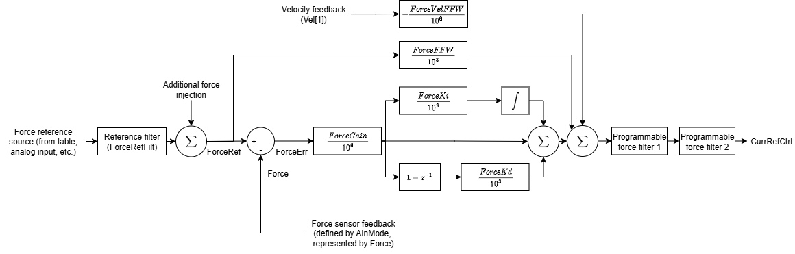
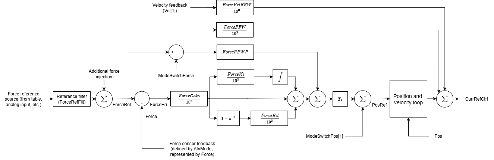

# 力控制

本节介绍力控制结构、整定增益及滤波器。有关力运行模式（指令、切换及状态）的更多信息，请参阅[轴运行——力运行模式](../../../02-keywords/08-axis-operation/04-force-operation-mode/00-overview.md)。

轴进入力运行模式（[OperationMode](../../../02-keywords/08-axis-operation/01-general-keywords/OperationMode.md) = 4）后，可通过 [ForcePIVOn](../../../02-keywords/11-control-tuning/07-force-control/ForcePIVOn.md) 关键字选择以下两种力控制结构之一。

1.  标准力控制（ForcePIVOn = 0）

标准力控制首先将力指令通过由 [ForceRefFilt](../../../02-keywords/11-control-tuning/07-force-control/ForceRefFilt.md) 定义的一阶低通滤波器，滤波结果与力注入（如适用）相加，形成 [ForceRef](../../../02-keywords/08-axis-operation/04-force-operation-mode/ForceRef.md)。进入力控制环后，力误差（[ForceErr](../../../02-keywords/08-axis-operation/04-force-operation-mode/ForceErr.md)）经 PID 调节器处理，其输出与力前馈及速度补偿相加，最终经两个可定制滤波器后形成电流参考值（还需叠加[电流控制](../../../02-keywords/11-control-tuning/06-current-control/00-overview.md)中的附加补偿项）。

2.  基于位置环和速度环的力控制（ForcePIVOn = 1）

对于基于位置环和速度环的力控制（force-over-PIV），力环位于位置环和速度环的外侧（最外环）。与标准力控制相同，ForceRef 为经滤波的力指令与力注入（如适用）之和。

ModeSwitchForce 是一个内部参数，记录进入力运行模式时刻的 ForceRef 值，用于位置维度的力前馈。

PID 调节器作用于 ForceErr，随后与位置维度的力前馈相加。该和值乘以控制器采样时间后，加至 ModeSwitchPos\[1\]（即退出位置运行模式时的位置参考值，即进入力运行模式时刻的值），得到位置参考值（PosRef）。

之后执行标准的位置和速度控制。最终，速度环输出与电流维度力前馈及速度补偿相加，形成 force-over-PIV 的电流参考值。该电流参考值传入[电流控制](../../../02-keywords/11-control-tuning/06-current-control/00-overview.md)（还需叠加附加补偿项）。

标准力控制与 force-over-PIV 控制的对比如下表所示。

| 关键属性 | 标准力控制 | Force-over-PIV 控制 |
|----|----|----|
| 力控制环特性 | 位于电流环外侧，以电流参考值作为设定点输出。 | 位于位置环和速度环外侧，作为最外环，以位置参考值作为设定点输出。 |
| ForceGain 的增益缩放 | 1E-6 | 1E-3 |
| 含电流维度前馈 | 是（[ForceFFW](../../../02-keywords/11-control-tuning/07-force-control/ForceFFW.md)） | 是（[ForceFFW](../../../02-keywords/11-control-tuning/07-force-control/ForceFFW.md)） |
| 含位置维度前馈 | 否 | 是（[ForceFFWP](../../../02-keywords/11-control-tuning/07-force-control/ForceFFWP.md)） |
| 含速度补偿 | 是（[ForceVelFFW](../../../02-keywords/11-control-tuning/07-force-control/ForceVelFFW.md)） | 是（[ForceVelFFW](../../../02-keywords/11-control-tuning/07-force-control/ForceVelFFW.md)） |
| 含力输出滤波器 | 是（[ForceFiltOn](../../../02-keywords/11-control-tuning/07-force-control/ForceFiltOn.md)、[ForceFiltDef](../../../02-keywords/11-control-tuning/07-force-control/ForceFiltDef.md)） | 否 |
