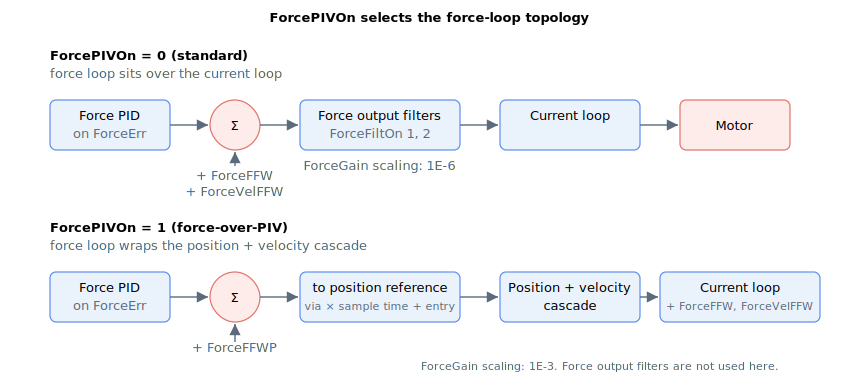

# ForcePIVOn

Selects the force-control structure.

## Overview

`ForcePIVOn` selects which of two force-control structures is used in force operation mode:

| Value | Force-control structure |
|-------|-------------------------|
| 0     | Standard force control  |
| 1     | Force-over-PIV control  |

The default is `0`. This keyword is stored in flash and can only be changed with the motor off and out of motion.

## How it works



**Standard force control (`ForcePIVOn = 0`).** The force loop is the inner loop above the current loop. The force PID acts on the force error [ForceErr](../../08-axis-operation/04-force-operation-mode/ForceErr.md), and the PID output plus the feedforward terms ([ForceFFW](ForceFFW.md) and the velocity compensation [ForceVelFFW](ForceVelFFW.md)) passes through the force output filters ([ForceFiltOn](ForceFiltOn.md) / [ForceFiltDef](ForceFiltDef.md)) to form the current reference directly. In this structure [ForceGain](ForceGain.md) is scaled by 1E-6.

**Force-over-PIV control (`ForcePIVOn = 1`).** The force loop is wrapped around the position/velocity cascade as the outermost loop. The force PID output plus the position-wise feedforward ([ForceFFWP](ForceFFWP.md)) is scaled by the controller sampling time and added to the entry position to form a position reference (saturated at the software position limits), which drives the inner position and velocity loops. The velocity-loop output is then summed with the current-wise feedforward ([ForceFFW](ForceFFW.md)) and velocity compensation ([ForceVelFFW](ForceVelFFW.md)) to form the current reference. In this structure [ForceGain](ForceGain.md) is scaled by 1E-3, and the force output filters ([ForceFiltOn](ForceFiltOn.md) / [ForceFiltDef](ForceFiltDef.md)) are not used.

`ForcePIVOn` therefore changes both the meaning of the force-loop scaling and which feedforward/filter keywords are active. See [Force control](00-overview.md) for the full structure diagrams.

## Examples

```text
AForcePIVOn[1]=0        ; standard force control
AForcePIVOn[1]=1        ; force-over-PIV control
AForcePIVOn[1]          ; read the active force-control structure
```

## See also

- [ForceGain](ForceGain.md) — proportional gain (scaling depends on this keyword)
- [ForceFFWP](ForceFFWP.md) — position-wise feedforward (force-over-PIV only)
- [ForceFiltOn](ForceFiltOn.md) / [ForceFiltDef](ForceFiltDef.md) — force output filters (standard mode only)
- [Force control](00-overview.md) — force-loop structure overview
