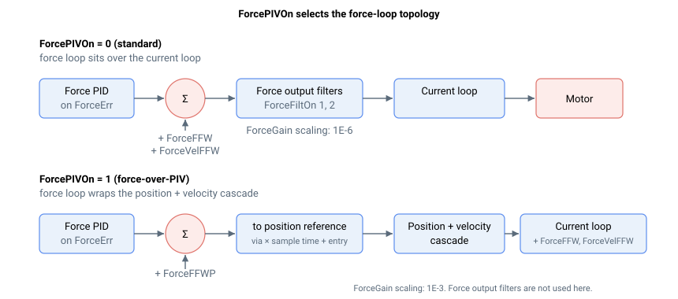

# ForcePIVOn

选择力控制结构。

## 概述

`ForcePIVOn` 选择力运行模式下使用的两种力控制结构之一：

| 值 | 力控制结构         |
|----|--------------------|
| 0  | 标准力控制         |
| 1  | 力叠加 PIV 控制    |

默认值为 `0`。该关键字保存至闪存，只能在电机关闭且轴静止时修改。

## 工作原理



**标准力控制（`ForcePIVOn = 0`）。** 力环是电流环之上的内环。力 PID 作用于力误差 [ForceErr](../../08-axis-operation/04-force-operation-mode/ForceErr.md)，PID 输出加上前馈项（[ForceFFW](ForceFFW.md) 和速度补偿 [ForceVelFFW](ForceVelFFW.md)）经过力输出滤波器（[ForceFiltOn](ForceFiltOn.md) / [ForceFiltDef](ForceFiltDef.md)）直接形成电流参考。此结构下 [ForceGain](ForceGain.md) 的缩放系数为 1E-6。

**力叠加 PIV 控制（`ForcePIVOn = 1`）。** 力环作为最外层环，包裹在位置/速度级联之外。力 PID 输出加上位置式前馈（[ForceFFWP](ForceFFWP.md)），乘以控制器采样时间后叠加到进入位置，形成位置参考（在软件位置限位处饱和），驱动内部位置和速度环。速度环输出再与电流式前馈（[ForceFFW](ForceFFW.md)）和速度补偿（[ForceVelFFW](ForceVelFFW.md)）相加，形成电流参考。此结构下 [ForceGain](ForceGain.md) 的缩放系数为 1E-3，力输出滤波器（[ForceFiltOn](ForceFiltOn.md) / [ForceFiltDef](ForceFiltDef.md)）不起作用。

因此，`ForcePIVOn` 同时改变力环缩放的含义以及哪些前馈/滤波器关键字有效。完整结构图请参见 [Force control](00-overview.md)。

### 环路数学

两种结构以不同方式形成电流参考。在标准力控制（`ForcePIVOn = 0`）下，力 PID 输出（作用于 [ForceErr](../../08-axis-operation/04-force-operation-mode/ForceErr.md)）加上前馈项，经过两个力输出滤波器 $\text{Filt}_1$ 和 $\text{Filt}_2$（[ForceFiltOn](ForceFiltOn.md)）：

$$
\text{CurrRef} = \text{Filt}_2\!\big(\text{Filt}_1\!\big( (P+I+D) + \text{ForceRef}\cdot\text{ForceFFW}\cdot 0.001 - \text{Vel}\cdot\text{ForceVelFFW}\cdot 0.00000001 \big)\big)
$$

在力叠加 PIV 控制（`ForcePIVOn = 1`）下，力 PID 不直接馈入电流参考，而是整形 `PosRef`；仅电流式前馈和速度补偿在电流参考求和点处叠加到速度环输出上：

$$
\text{CurrRef} = \text{(velocity-loop output)} + \text{ForceRef}\cdot\text{ForceFFW}\cdot 0.001 - \text{Vel}\cdot\text{ForceVelFFW}\cdot 0.00000001
$$

其中，$P+I+D$ 是对 `ForceErr` 的力 PID 输出，$\text{ForceRef}$ 是滤波后的参考值，$\text{Vel}$ 是速度反馈（索引 1）。前馈缩放系数分别对应 [ForceFFW](ForceFFW.md)（0.001）和 [ForceVelFFW](ForceVelFFW.md)（0.00000001）。

## 示例

```text
AForcePIVOn[1]=0        ; standard force control
AForcePIVOn[1]=1        ; force-over-PIV control
AForcePIVOn[1]          ; read the active force-control structure
```

## 另请参阅

- [ForceGain](ForceGain.md) — 比例增益（缩放系数取决于本关键字）
- [ForceFFWP](ForceFFWP.md) — 位置式前馈（仅适用于力叠加 PIV）
- [ForceFiltOn](ForceFiltOn.md) / [ForceFiltDef](ForceFiltDef.md) — 力输出滤波器（仅适用于标准模式）
- [Force control](00-overview.md) — 力环结构概述
