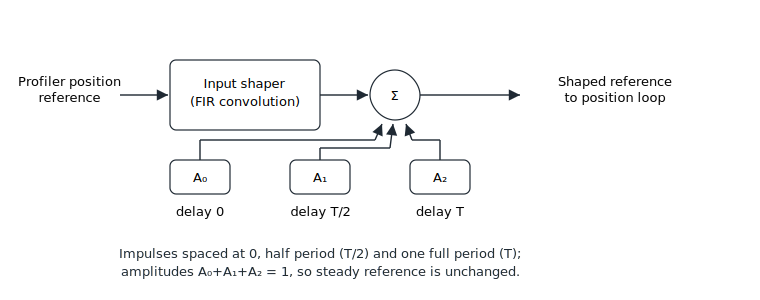

# Input-shaping

Input shaping shapes the motion profile so that the energy the command injects at one or two mechanical resonance frequencies is cancelled, suppressing residual vibration as the axis settles.

Input shaping is a finite-impulse-response (FIR) operation applied to the post-profiler position reference. For a single resonance the reference is convolved with three impulses, spaced at zero, half the resonance period and one full period; the impulse amplitudes are derived from the resonance's damping ratio. Because the amplitudes always sum to one, a steady reference passes through unchanged and only the dynamic transient is reshaped. When two resonance frequencies are defined, the two three-impulse sequences are convolved into a nine-impulse sequence.

Input shaping is enabled with [ShapingOn](ShapingOn.md). The resonance frequencies are set by [ShapingFreq](ShapingFreq.md) and their damping ratios by [ShapingDamp](ShapingDamp.md). It is applied only in position or velocity operation mode (not in current or force mode) and cannot be combined with modulo (continuous-rotation) mode on the main encoder.

The following is the summary of input-shaping keywords.

| No. | Keywords | Summary |
|----|----|----|
| 1 | [ShapingOn](ShapingOn.md) | Input-shaping enable switch |
| 2 | [ShapingFreq](ShapingFreq.md) | Resonance frequencies to suppress |
| 3 | [ShapingDamp](ShapingDamp.md) | Damping ratio of each resonance |
