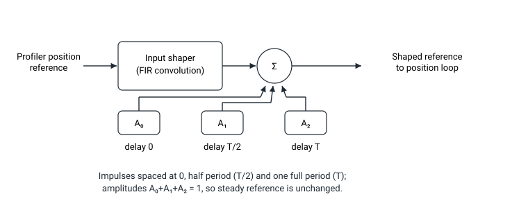

# 输入整形

输入整形对运动曲线进行整形，使指令在一个或两个机械谐振频率处注入的能量相互抵消，从而在轴稳定时抑制残余振动。

输入整形是一种对规划器后位置参考执行的有限脉冲响应（FIR）运算。针对单个谐振，参考信号与三个脉冲进行卷积，间距分别为零、半个谐振周期和一个完整周期；脉冲幅值由谐振的阻尼比确定。由于各幅值之和始终为 1，稳定的参考信号可原样通过，仅动态瞬态部分被整形。当定义了两个谐振频率时，两组三脉冲序列将卷积为一组九脉冲序列。

输入整形通过 [ShapingOn](ShapingOn.md) 启用。谐振频率由 [ShapingFreq](ShapingFreq.md) 设置，各谐振的阻尼比由 [ShapingDamp](ShapingDamp.md) 设置。输入整形仅在位置或速度运行模式下有效（不适用于电流或力控制模式），且不能与主编码器的取模（连续旋转）模式同时使用。

以下为输入整形关键字汇总。

| 序号 | 关键字 | 说明 |
|----|----|----|
| 1 | [ShapingOn](ShapingOn.md) | 输入整形使能开关 |
| 2 | [ShapingFreq](ShapingFreq.md) | 待抑制的谐振频率 |
| 3 | [ShapingDamp](ShapingDamp.md) | 各谐振的阻尼比 |
