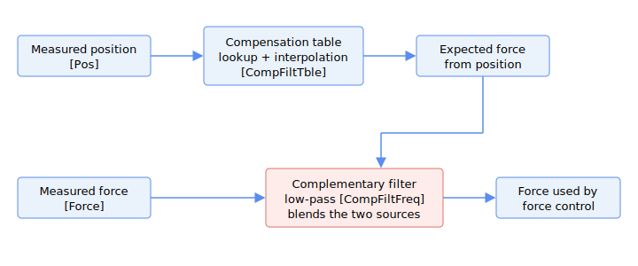

# Compensation-filter

The compensation filter improves the force signal used by force control by combining two independent estimates of force: the force measured directly by the analog force-feedback sensor, and an expected force predicted from the axis position through a stored compensation table. The two estimates are merged with a complementary filter so that the slow, steady-state baseline comes from the live measured sensor while the fast, position-dependent detail comes from the smooth table.

This is useful when the relationship between position and force is well characterised (for example a known spring-like contact), but the raw sensor signal is noisy. Because the high-frequency content of the sensor is suppressed, the smooth table supplies the fast, position-dependent detail, while the live sensor supplies the slow, steady-state baseline.

The pipeline works as follows. The current axis position is looked up in the compensation table to produce an expected force. The table is a one-dimensional array of force values sampled at evenly spaced positions; the lookup linearly interpolates between the two nearest table points. The difference between the measured force and the table-predicted force is passed through a first-order low-pass filter, and the filtered difference is added back to the table-predicted force to form the force value handed to force control. This is algebraically a low-pass of the measured sensor plus a high-pass of the table. As a result, near steady state the output follows the measured sensor (for example it tracks slow real force or sensor drift the table does not capture), while fast transient content is supplied by the smooth table rather than passing through unfiltered.

The compensation feature is available from v5 (central-i v5).

The compensation table is defined over a position domain. [CompTbleInit](CompTbleInit.md) sets the position of the first table point, [CompTbleGap](CompTbleGap.md) sets the position spacing between adjacent points, and [CompTbleEnd](CompTbleEnd.md) sets the last table index that is in use. [CompFiltTble](CompFiltTble.md) holds the expected-force value at each table point. Because different physical units can make contact at slightly different positions, [CompTbleCrrct](CompTbleCrrct.md) shifts the whole table by the difference between the contact position recorded when the table was created and the contact position of the present unit.

The filter itself is enabled by [CompFiltOn](CompFiltOn.md), and its low-pass cut-off is set by [CompFiltFreq](CompFiltFreq.md). When the axis position is outside the table domain, compensation is not applied and the measured force is used unchanged.

### Loop math

Each control cycle the steps are:

1. The axis position is first shifted by the per-unit contact-point correction (the difference between the two [CompTbleCrrct](CompTbleCrrct.md) entries) before any lookup.
2. The corrected position selects the two nearest table points and the expected force $F_t$ is obtained by linear interpolation between them, $F_t = y_0 + c\,(y_1 - y_0)$, where $c$ is the fractional position between the points.
3. The difference $d = F_m - F_t$ (measured minus table) is smoothed by the first-order low-pass set by [CompFiltFreq](CompFiltFreq.md), giving $d_{\text{filt}}$, and the output force is $d_{\text{filt}} + F_t$. This is algebraically a low-pass of the measured sensor plus a high-pass of the table.

If the corrected position falls before the first table point or past the last in-use index, the sample is treated as out of range: the measured force is used unchanged and the filter state is marked uninitialised, so the next in-range sample re-seeds $d_{\text{filt}}$ with the current difference rather than continuing from a stale value.

The following is the summary of compensation-filter keywords.

| No. | Keywords | Summary |
|----|----|----|
| 1 | [CompFiltOn](CompFiltOn.md) | Compensation filter enable switch |
| 2 | [CompFiltFreq](CompFiltFreq.md) | Low-pass cut-off frequency of the complementary filter |
| 3 | [CompFiltTble](CompFiltTble.md) | Expected force at each table point |
| 4 | [CompTbleInit](CompTbleInit.md) | Position of the first table point |
| 5 | [CompTbleEnd](CompTbleEnd.md) | Last table index in use |
| 6 | [CompTbleGap](CompTbleGap.md) | Position spacing between adjacent table points |
| 7 | [CompTbleCrrct](CompTbleCrrct.md) | Per-unit contact-point correction that shifts the table |
