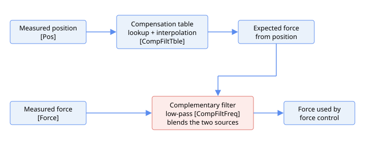

# 补偿滤波器

补偿滤波器通过合并两种独立的力估计值来改善力控制所用的力信号：一种是模拟力反馈传感器直接测量的力，另一种是通过存储的补偿表由轴位置预测的期望力。两种估计值通过互补滤波器合并，使慢速稳态基准来自实时测量传感器，而快速位置相关细节来自平滑的补偿表。

当位置与力之间的关系已有良好表征时（例如已知的弹簧式接触），但原始传感器信号较嘈杂时，此功能非常有用。由于传感器的高频内容被抑制，平滑的补偿表提供快速的位置相关细节，而实时传感器提供慢速的稳态基准。

流水线工作流程如下。当前轴位置在补偿表中查找，得出期望力。补偿表是一个一维力值数组，在均匀间隔的位置处采样；查找时在最近的两个表点之间进行线性插值。测量力与表预测力之差经过由 [CompFiltFreq](CompFiltFreq.md) 设置的一阶低通滤波器平滑，滤波后的差值再与表预测力相加，形成传递给力控制的力值。从代数角度看，这等效于对测量传感器进行低通滤波，同时对补偿表进行高通滤波。因此，在接近稳态时，输出跟随测量传感器（例如跟踪补偿表未能捕捉的缓慢真实力或传感器漂移），而快速瞬态内容则由平滑的补偿表提供，而非经未滤波路径直接通过。

补偿功能从 v5（Central-i v5）起可用。

补偿表在位置域上定义。[CompTbleInit](CompTbleInit.md) 设置第一个表点的位置，[CompTbleGap](CompTbleGap.md) 设置相邻点之间的位置间距，[CompTbleEnd](CompTbleEnd.md) 设置最后一个使用中的表索引。[CompFiltTble](CompFiltTble.md) 存储每个表点处的期望力值。由于不同物理单元可能在略有不同的位置接触，[CompTbleCrrct](CompTbleCrrct.md) 通过建表时记录的接触位置与当前单元接触位置之差来整体平移补偿表。

滤波器本身由 [CompFiltOn](CompFiltOn.md) 启用，其低通截止频率由 [CompFiltFreq](CompFiltFreq.md) 设置。当轴位置超出表域时，不施加补偿，直接使用测量力。

### 环路数学

每个控制周期的步骤如下：

1. 在任何查找之前，轴位置首先按单元接触点修正量（两个 [CompTbleCrrct](CompTbleCrrct.md) 条目之差）进行平移。
2. 修正后的位置选择最近的两个表点，期望力 $F_t$ 通过线性插值得出：$F_t = y_0 + c\,(y_1 - y_0)$，其中 $c$ 为位于两点之间的分数位置。
3. 差值 $d = F_m - F_t$（测量值减表值）经 [CompFiltFreq](CompFiltFreq.md) 设置的一阶低通滤波器平滑，得 $d_{\text{filt}}$，输出力为 $d_{\text{filt}} + F_t$。从代数角度看，这等效于对测量传感器低通滤波再对补偿表高通滤波。

若修正后位置落在第一个表点之前或最后一个使用中索引之后，则该采样视为超出范围：直接使用测量力，并将滤波器状态标记为未初始化，使下一个范围内采样以当前差值重新初始化 $d_{\text{filt}}$，而非从过时值继续。

以下为补偿滤波器关键字汇总。

| 序号 | 关键字 | 说明 |
|----|----|----|
| 1 | [CompFiltOn](CompFiltOn.md) | 补偿滤波器使能开关 |
| 2 | [CompFiltFreq](CompFiltFreq.md) | 互补滤波器的低通截止频率 |
| 3 | [CompFiltTble](CompFiltTble.md) | 每个表点处的期望力值 |
| 4 | [CompTbleInit](CompTbleInit.md) | 第一个表点的位置 |
| 5 | [CompTbleEnd](CompTbleEnd.md) | 最后一个使用中的表索引 |
| 6 | [CompTbleGap](CompTbleGap.md) | 相邻表点之间的位置间距 |
| 7 | [CompTbleCrrct](CompTbleCrrct.md) | 平移补偿表的单元接触点修正量 |
