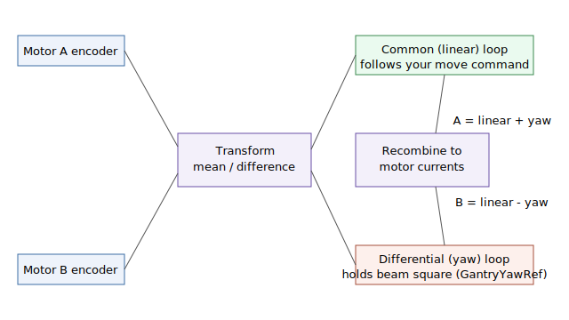

# GantryOn

Enables gantry MIMO control on the A axis, slaving the A and B axes together.

## Overview

`GantryOn` controls operation of the gantry mode. With `AGantryOn=0` the gantry mode is disabled and each axis can be moved and controlled independently. With `AGantryOn=1` the gantry mode is enabled and the control scheme is automatically changed to gantry MIMO (multi-input multi-output) control, so that the two parallel drive motors are coordinated as a single mechanism.

When gantry mode is on, motion of the gantry stage is commanded by moving the A axis. The gantry feedbacks reported by [GantryFdbk](../02-gantry-kinematic-feedback/GantryFdbk.md) and the initial offset captured in [GantryOffset](../02-gantry-kinematic-feedback/GantryOffset.md) are referenced to this mode, and the yaw correction set by [GantryYawRef](GantryYawRef.md) is applied while it is active.

`GantryOn` is set on the master (linear) axis, which is the even axis of each pair — A is the master and B the yaw axis; on a multi-axis controller C/E/G can likewise be masters with D/F/H as their yaw axes. `?GantryOn` on a yaw axis returns an error. The two axes of a pair must always be used together. `AGantryOn` is automatically cleared to `0` whenever either motor of the pair turns off, so gantry mode is normally enabled only after both motors have been turned on and phased. It is axis-scoped and not saved to flash.

## How it works

### Common-mode and differential-mode control

A gantry has two motors driving the two ends of one beam. Rather than control each motor independently, the controller transforms the two motor measurements into two virtual axes:

- **Common (linear) mode** — the *mean* of the two ends. This is what the stage actually translates, and it is what your A-axis motion commands move. Its feedback is the master value of [GantryFdbk](../02-gantry-kinematic-feedback/GantryFdbk.md).
- **Differential (yaw) mode** — the *difference* between the two ends. This is the skew/squareness of the beam, which you normally want to hold at zero (or at the offset commanded by [GantryYawRef](GantryYawRef.md)). Its feedback is the yaw-axis value of [GantryFdbk](../02-gantry-kinematic-feedback/GantryFdbk.md).

Each virtual axis has its own position and velocity loops (tuned with the `Gantry…` gain keywords). The two loop outputs are then recombined into per-motor current commands — the linear command pushes both motors the same way, while the yaw command pushes them in opposite directions:



This decoupling means a translation command does not induce yaw and a yaw correction does not induce translation. By default the split is symmetric (50/50); on central-i v5 it can be made position-dependent with the gantry decoupling map ([GantryMapType](GantryMapType.md)).

### Engagement and the offset

On the `0`→`1` transition the controller captures the current difference between the two ends as [GantryOffset](../02-gantry-kinematic-feedback/GantryOffset.md) and folds it into the feedbacks so the yaw feedback starts from a clean zero without forcing the beam square. The yaw axis's own reference is zeroed and the pair is brought into MIMO control smoothly. Leaving the controller could not start motion until this transition completes.

### Both motors must stay on

While gantry mode is active, if one motor of the pair turns off the controller deliberately turns off the other as well and records [ConFlt](../../07-status-and-faults/ConFlt.md) fault code **1061** (other gantry member axis got motor off) on the side that was forced down, because a single-sided gantry is not safe to drive. Both motors must also be phased (commutated) for the gantry to remain engaged.

## Examples

```text
AGantryOn=1         ; enable gantry MIMO control (A and B coordinated)
AGantryOn=0         ; disable gantry mode; axes controlled independently
AGantryOn          ; read whether gantry mode is active
```

## See also

- [GantryFdbk](../02-gantry-kinematic-feedback/GantryFdbk.md) — MIMO gantry control feedbacks
- [GantryOffset](../02-gantry-kinematic-feedback/GantryOffset.md) — initial A/B offset captured when gantry is switched on
- [GantryYawRef](GantryYawRef.md) — yaw correction reference applied in gantry mode
- [GantryMapType](GantryMapType.md) — position-dependent decoupling map (central-i v5)
- [GantryDLoopOn](GantryDLoopOn.md) — dual-loop gantry (linear loop on load feedback)
- [MotorOn](../../08-axis-operation/01-general-keywords/MotorOn.md) — both motors of the pair must be on to keep gantry mode active
- [ConFlt](../../07-status-and-faults/ConFlt.md) — reports the fault if one gantry motor turns off
