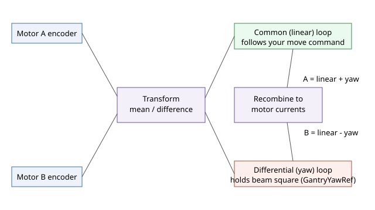

# GantryOn

在 A 轴上启用龙门多输入多输出（MIMO）控制，将 A 轴和 B 轴联动为从属关系。

## 概述

`GantryOn` 控制龙门模式的运行。`AGantryOn=0` 时，龙门模式禁用，每个轴可独立运动和控制。`AGantryOn=1` 时，龙门模式使能，控制方案自动切换为龙门 MIMO（多输入多输出）控制，两台并联驱动电机作为一个整体机构协调运行。

龙门模式开启时，龙门台的运动通过移动 A 轴来指令。[GantryFdbk](../02-gantry-kinematic-feedback/GantryFdbk.md) 报告的龙门反馈和 [GantryOffset](../02-gantry-kinematic-feedback/GantryOffset.md) 中捕获的初始偏置均以此模式为参考，[GantryYawRef](GantryYawRef.md) 设定的偏摆修正在模式激活时生效。

`GantryOn` 在主轴（线性轴）上设置，即**每对轴中的第一个轴**。在 v4（独立或 central-i）上仅支持 A–B 轴对，A 为主轴，B 为偏摆轴。在 central-i v5 上，A–B、C–D、E–F 和 G–H 均可作为龙门轴对，A、C、E、G 分别为主轴，B、D、F、H 为对应的偏摆轴。在偏摆轴上写入 `GantryOn`（如 `BGantryOn=1` 等）虽被参数表接受，但**无效果**——龙门引擎仅读取主轴上存储的值。轴对的两个轴必须始终配合使用。一旦轴对中任一电机关闭，主轴的 `GantryOn` 将自动被清零为 `0`，因此龙门模式通常仅在两台电机均已开启并完成换相后才使能。该参数为轴范围，不保存至闪存。

## 工作原理

### 共模和差模控制

龙门有两台电机驱动同一横梁的两端。控制器不是独立控制每台电机，而是将两台电机的测量值变换为两个虚拟轴：

- **共模（线性）模式** — 两端的*均值*。这是台的实际平移量，也是 A 轴运动指令所移动的量。其反馈为 [GantryFdbk](../02-gantry-kinematic-feedback/GantryFdbk.md) 的主轴值。
- **差模（偏摆）模式** — 两端的*差值*。这是横梁的偏斜/垂直度，通常希望保持为零（或 [GantryYawRef](GantryYawRef.md) 指令的偏置值）。其反馈为 [GantryFdbk](../02-gantry-kinematic-feedback/GantryFdbk.md) 的偏摆轴值。

每个虚拟轴都有各自的位置环和速度环（使用 `Gantry…` 增益关键字整定）。两个环的输出随后重新合成为各电机的电流指令——线性指令使两台电机同向运动，偏摆指令使两台电机反向运动：



这种解耦意味着平移指令不会引发偏摆，偏摆修正也不会引发平移。默认分配为对称（50/50）；在 central-i v5 上，可通过龙门解耦映射（[GantryMapType](GantryMapType.md)）实现位置相关的分配。

### 接合与偏置

在 `0`→`1` 跳变时，控制器将两端当前差值捕获为 [GantryOffset](../02-gantry-kinematic-feedback/GantryOffset.md) 并折叠进反馈，使偏摆反馈从干净的零值开始，而无需强制横梁对齐。偏摆轴自身的参考值和参考滤波器历史在同一周期内被复位为干净的零值，主轴和偏摆轴的速度（及位置）积分器被重新共享为共模/差模形式，使轴对无阶跃地进入 MIMO 控制。此后急动平滑短暂暂停，直到其历史缓冲区重新填满（参见下方的平滑暂停边界情况）。

### 两台电机必须保持使能

龙门模式激活时，若轴对中的一台电机关闭，控制器会故意关闭另一台，并在被强制关闭的一侧记录 [ConFlt](../../07-status-and-faults/ConFlt.md) 故障码 **1061**（另一龙门成员轴电机关闭），因为单侧龙门驱动不安全。两台电机还必须均已完成换相，龙门才能保持接合。

## 示例

```text
AGantryOn=1         ; 启用龙门 MIMO 控制（A 和 B 协调运行）
AGantryOn=0         ; 禁用龙门模式；各轴独立控制
AGantryOn          ; 读取龙门模式是否激活
```

### 边界情况

- **运动中写入** — 被拒绝（`NOMOTN`）。请先停止两个成员轴。
- **超出范围** — `0`–`1` 之外的值将被拒绝。
- **任一电机关闭** — 当任一成员电机关闭时，主轴的 `GantryOn` 自动强制为 `0`。如需重新接合，请重新开启两台电机，完成换相，然后再写入 `GantryOn = 1`。
- **接合中途成员跳闸** — 若接合的轴对中一台电机在周期中途关闭，固件将强制关闭另一台，并在被强制关闭的一侧记录 [ConFlt](../../07-status-and-faults/ConFlt.md) 故障码 1061（另一龙门成员轴电机关闭），然后清除轴对的龙门状态。
- **写入偏摆轴** — 参数表接受写入，但龙门引擎仅读取主轴存储；写入无功能效果。
- **轴对未换相** — 若任一电机的换相未完成，龙门将无法正常工作；请检查两个成员的 [StatReg](../../07-status-and-faults/StatReg.md) 位 0。
- **解耦映射**（[GantryMapType](GantryMapType.md) = 1，仅 v5）— 接合时固件将映射比率应用于反馈合成；接合时的短暂比率误差由龙门平滑就绪计数器平滑。
- **双环龙门**（[GantryDLoopOn](GantryDLoopOn.md) = 1，仅 v5）— 接合时固件还会相对负载反馈计算双环偏置，以避免线性位置跳变。
- **平滑暂停** — 每次 `0 → 1` 或 `1 → 0` 跳变后，控制器在轴对上暂时禁用急动平滑，直到平滑缓冲区以新参考填满；预期有短暂的跟踪抖动。旁路持续固定数量的控制周期，等于急动平滑历史长度：在 central-i 上为 8192 个周期（默认采样率 16384 samples/s 下约 0.5 s），独立产品上为 512 个周期（同一采样率下约 31 ms）。经过该数量的周期后平滑自动恢复。
- **保存** — 不可保存至闪存；每次复位后初始值为 `0`（用户必须在电机使能后手动启用）。
- **平台** — v4 仅支持 A–B；v5 central-i 支持 A–B、C–D、E–F、G–H。

## 另请参阅

- [GantryFdbk](../02-gantry-kinematic-feedback/GantryFdbk.md) — MIMO 龙门控制反馈
- [GantryOffset](../02-gantry-kinematic-feedback/GantryOffset.md) — 龙门开启时捕获的 A/B 初始偏置
- [GantryYawRef](GantryYawRef.md) — 龙门模式下应用的偏摆修正参考
- [GantryMapType](GantryMapType.md) — 位置相关解耦映射（central-i v5）
- [GantryDLoopOn](GantryDLoopOn.md) — 双环龙门（线性环基于负载反馈）
- [MotorOn](../../08-axis-operation/01-general-keywords/MotorOn.md) — 轴对的两台电机均须使能以保持龙门模式激活
- [ConFlt](../../07-status-and-faults/ConFlt.md) — 若一台龙门电机关闭则报告故障
