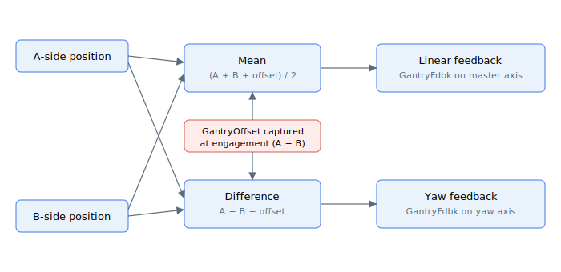

# Gantry kinematic feedback

Feedback variables for gantry control: the MIMO feedbacks, the captured initial offset, and the auxiliary-encoder readings used for yaw measurement.

The two side positions are combined into a linear (mean) feedback and a yaw (difference) feedback, with the initial offset captured at engagement folded in so the yaw feedback starts from a clean zero:

- [GantryFdbk](GantryFdbk.md) — mean and differential gantry feedbacks
- [GantryOffset](GantryOffset.md) — initial A/B offset captured when gantry mode is enabled
- [GantryFdbkSrc](GantryFdbkSrc.md) — selects the yaw feedback source
- [GantryAuxFdbk](GantryAuxFdbk.md) — auxiliary-encoder feedback
- [GantryAuxVel](GantryAuxVel.md) — auxiliary-encoder velocity
