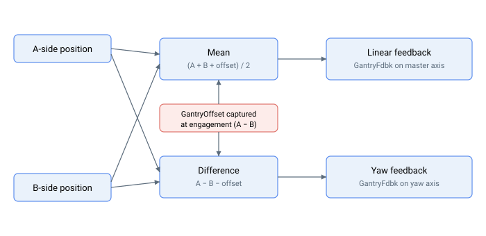

# 龙门运动学反馈

龙门控制的反馈变量：MIMO 反馈、捕获的初始偏置，以及用于偏摆测量的辅助编码器读数。

两侧位置合成为线性（均值）反馈和偏摆（差值）反馈，接合时捕获的初始偏置被折叠进去，使偏摆反馈从干净的零值开始：

- [GantryFdbk](GantryFdbk.md) — 龙门均值和差模反馈
- [GantryOffset](GantryOffset.md) — 龙门模式使能时捕获的 A/B 初始偏置
- [GantryFdbkSrc](GantryFdbkSrc.md) — 选择双环龙门模式下线性环使用的负载端反馈（central-i v5）
- [GantryAuxFdbk](GantryAuxFdbk.md) — 辅助编码器反馈（central-i v5）
- [GantryAuxVel](GantryAuxVel.md) — 辅助编码器速度（central-i v5）
