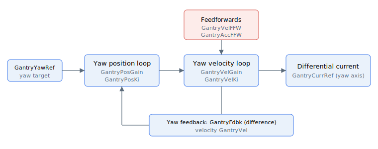

# Gantry tuning

Tuning gains for the gantry yaw correction controller, covering the position and velocity loops and their feedforward terms.

The yaw correction is a dedicated position/velocity controller with its own gains and feedforward terms, fed by the yaw (differential) feedback and producing the differential motor current:

- [GantryPosGain](GantryPosGain.md) — yaw position-loop proportional gain
- [GantryPosKi](GantryPosKi.md) — yaw position-loop integral gain (central-i v5)
- [GantryVelGain](GantryVelGain.md) / [GantryVelKi](GantryVelKi.md) — yaw velocity-loop proportional and integral gains
- [GantryAccFFW](GantryAccFFW.md) — acceleration feedforward gain
- [GantryVelFFW](GantryVelFFW.md) — velocity feedforward gain (central-i v5)
- [GantryVel](GantryVel.md) — read-only differential yaw velocity (central-i v5)
