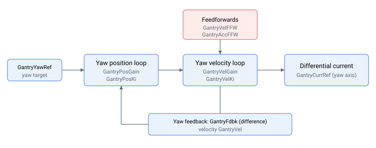

# 龙门整定

龙门偏摆校正控制器的整定增益，涵盖位置环、速度环及其前馈项。

偏摆校正是一个专用的位置/速度控制器，具有独立的增益和前馈项，以偏摆（差值）反馈为输入，产生差值电机电流：

- [GantryPosGain](GantryPosGain.md) — 偏摆位置环比例增益
- [GantryPosKi](GantryPosKi.md) — 偏摆位置环积分增益（central-i v5）
- [GantryVelGain](GantryVelGain.md) / [GantryVelKi](GantryVelKi.md) — 偏摆速度环比例增益与积分增益
- [GantryAccFFW](GantryAccFFW.md) — 加速度前馈增益
- [GantryVelFFW](GantryVelFFW.md) — 速度前馈增益（central-i v5）
- [GantryVel](GantryVel.md) — 只读差值偏摆速度（central-i v5）
