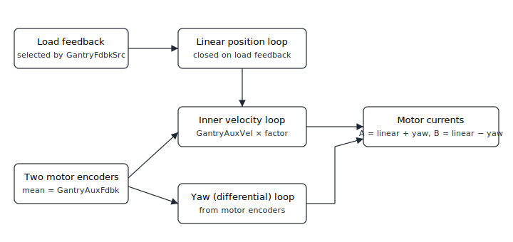

# Dual-loop gantry control

In dual-loop gantry control the controller closes the linear position loop on a separate load-side feedback rather than on the two main motor encoders. The load feedback is selected by the [GantryFdbkSrc](../02-gantry-kinematic-feedback/GantryFdbkSrc.md) pointer, while the two main motor encoders are kept for the inner velocity loop and the yaw (differential) loop.

In the table below the feedback selected by [GantryFdbkSrc](../02-gantry-kinematic-feedback/GantryFdbkSrc.md) is denoted "encoder C". The table compares how each feedback and velocity term is sourced under the three control structures.

| Feedback keywords | Default control | Dual-loop control | Pseudo dual-loop control |
|---|---|---|---|
| Gantry feedback (GantryFdbk)  If applicable | From 2 main encoders  Unit: Main encoder count | From encoder C  Unit: Encoder C count | From 2 main encoders  Unit: Encoder C count |
| Gantry auxiliary feedback (GantryAuxFdbk)  If applicable | - | From 2 main encoders  Unit: Main encoder count | From 2 main encoders  Unit: Main encoder count |
| Velocity (GantryVel) | Derivative of Pos  Unit: Main encoder count / s | If DualLoopFact ≥ 65536,  Derivative of GantryAuxFdbk * (DualLoopFact / 65536)  Unit: Encoder C count / s  If DualLoopFact < 65536,  Derivative of GantryAuxFdbk  Unit: Main encoder count / s | If DualLoopFact ≥ 65536,  Derivative of GantryAuxFdbk * (DualLoopFact / 65536)  Unit: Encoder C count / s  If DualLoopFact < 65536,  Derivative of GantryAuxFdbk  Unit: Main encoder count / s |
| Auxiliary velocity (GantryAuxVel) | - | Derivative of GantryAuxFdbk  Unit: Main encoder count / s | Derivative of GantryAuxFdbk  Unit: Main encoder count / s |
