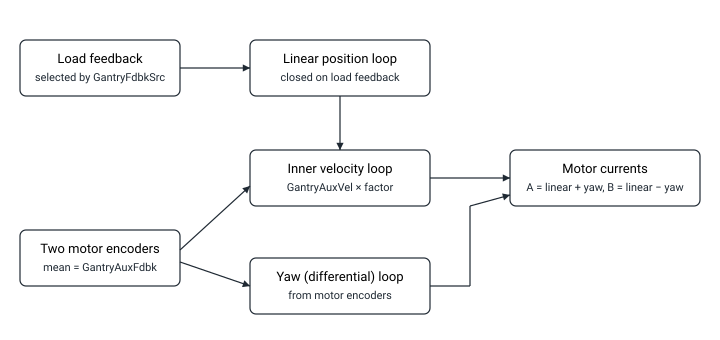

language: zh-CN
# 双环龙门控制

在双环龙门控制中，控制器通过独立的负载端反馈（而非两台主电机的编码器）来闭合线性位置环。负载反馈由 [GantryFdbkSrc](../02-gantry-kinematic-feedback/GantryFdbkSrc.md) 指针选择，两台主电机的编码器则用于内部速度环和偏摆（差模）环。

下表中，[GantryFdbkSrc](../02-gantry-kinematic-feedback/GantryFdbkSrc.md) 所选的反馈记为"编码器 C"。该表比较了三种控制结构下各反馈和速度项的来源。

| 反馈关键字 | 默认控制 | 双环控制 | 伪双环控制 |
|---|---|---|---|
| 龙门反馈（GantryFdbk） 如适用 | 来自 2 个主编码器 单位：主编码器计数 | 来自编码器 C 单位：编码器 C 计数 | 来自 2 个主编码器 单位：编码器 C 计数 |
| 龙门辅助反馈（GantryAuxFdbk） 如适用 | - | 来自 2 个主编码器 单位：主编码器计数 | 来自 2 个主编码器 单位：主编码器计数 |
| 速度（GantryVel） | Pos 的导数 单位：主编码器计数 / s | 若 DualLoopFact ≥ 65536， GantryAuxFdbk * (DualLoopFact / 65536) 的导数 单位：编码器 C 计数 / s 若 DualLoopFact < 65536， GantryAuxFdbk 的导数 单位：主编码器计数 / s | 若 DualLoopFact ≥ 65536， GantryAuxFdbk * (DualLoopFact / 65536) 的导数 单位：编码器 C 计数 / s 若 DualLoopFact < 65536， GantryAuxFdbk 的导数 单位：主编码器计数 / s |
| 辅助速度（GantryAuxVel） | - | GantryAuxFdbk 的导数 单位：主编码器计数 / s | GantryAuxFdbk 的导数 单位：主编码器计数 / s |
