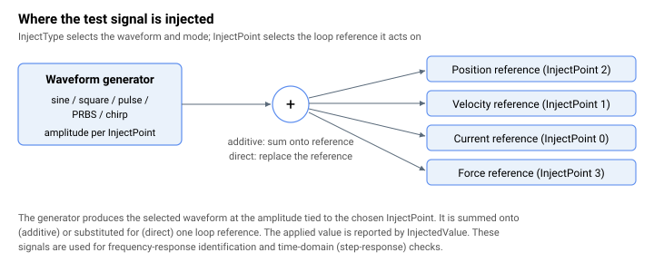

language: zh-CN
# 注入

Agito 控制器支持在 4 个不同位置（由 [InjectPoint](InjectPoint.md) 选择）注入常用波形（正弦波、方波、脉冲、扫频信号（chirp）及伪随机二进制序列（PRBS））。

| InjectPoint | 注入位置 | 在框图中的位置 | 幅值关键字 |
|:--:|:--:|:--:|:--:|
| 0 | 电流指令 | 参见[控制整定 – 电流控制](../11-control-tuning/06-current-control/00-overview.md) | [InjectCurrAmp](InjectCurrAmp.md)、[InjectCurrDC](InjectCurrDC.md) |
| 1 | 速度指令 | 参见[控制整定 – 速度控制](../11-control-tuning/04-velocity-control/00-overview.md) | [InjectVelAmp](InjectVelAmp.md) |
| 2 | 位置指令 | 参见[控制整定 – 位置控制](../11-control-tuning/03-position-control/00-overview.md) | [InjectPosAmp](InjectPosAmp.md) |
| 3 | 力指令 | 参见[控制整定 – 力控制](../06-protections/04-force-control/00-overview.md) | [InjectForceA](InjectForceA.md) |

根据所选波形（由 [InjectType](InjectType.md) 定义），用户需配置对应的波形专用关键字。

| 波形 | 波形专用关键字 |
|:--:|:--:|
| PRBS | [FastIdDownSam](FastIdDownSam.md)、[FastIdInit](FastIdInit.md) |
| 正弦波和方波 | [InjectFreq](InjectFreq.md) |
| 扫频信号（central-i v5） | [InjectChirpF](InjectChirpF.md) |
| 脉冲（仅限电流指令） | [InjectTimeOn](InjectTimeOn.md) |

这些注入功能通常用于系统辨识、时域整定（阶跃响应）和调试目的。
