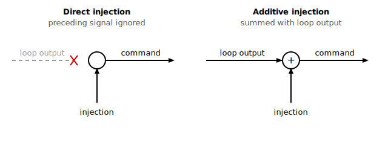

# InjectType

Selects the injection waveform shape and whether it is direct or additive.

## Overview

`InjectType` defines both the shape of the injected test waveform and its injection mode (direct or additive). It works together with [InjectPoint](InjectPoint.md), which selects where in the loop the waveform is applied. Depending on the waveform chosen, an additional waveform-specific keyword must be configured: [InjectFreq](InjectFreq.md) for sine/square, [InjectChirpF](InjectChirpF.md) for chirp, [InjectTimeOn](InjectTimeOn.md) for pulse, and [FastIdDownSam](FastIdDownSam.md) / [FastIdInit](FastIdInit.md) for PRBS. The injection amplitude always comes from the amplitude keyword tied to the selected `InjectPoint`.

## How it works

| Value | Waveforms | Injection mode |
|---|---|---|
| 0 | No injection | - |
| 1 | Sinusoid | Direct |
| 2 | Sinusoid | Additive |
| 3 | Square wave | Direct |
| 4 | Square wave | Additive |
| 5 | Pulse (reserved, only for current command injection) | Direct |
| 6 | Pseudorandom binary sequence (PRBS) | Direct |
| 7 | Pseudorandom binary sequence (PRBS) | Additive |
| 8 | Chirp | Direct |
| 9 | Chirp | Additive |

In every case the injected value the controller is currently applying can be read back through [InjectedValue](InjectedValue.md), and its sign convention and amplitude follow the keyword tied to the selected `InjectPoint`.


### Waveform descriptions

- **Sinusoid** — Amplitude is set by the amplitude keyword specific to the injection location ([InjectPoint](InjectPoint.md)); frequency is set by [InjectFreq](InjectFreq.md). A phase angle is advanced every controller cycle by an amount proportional to `InjectFreq`, wrapped at one full turn, and the sine value is read from an internal sine table with linear interpolation between table entries so the waveform stays smooth at any frequency. The phase starts from 0 when injection begins, so the waveform starts at zero crossing rising.
- **Square wave** — Amplitude is set by the amplitude keyword specific to the injection location; frequency is set by [InjectFreq](InjectFreq.md). The same phase angle is advanced each cycle; the output is the positive amplitude for the first half of each period and the negative amplitude for the second half. The waveform starts at the positive amplitude.
- **Pulse** — A single rectangular pulse of the configured amplitude held for the duration set by [InjectTimeOn](InjectTimeOn.md), after which the output returns to zero and stays there. The pulse is reserved for current-command injection (`InjectPoint = 0`) and is direct only.
- **PRBS** — A pseudorandom binary sequence whose output toggles between +amplitude and −amplitude. The sequence is read from a fixed, pre-defined table of 8192 bits (a maximal-length sequence; the table is held as 512 sixteen-bit words and consumed most-significant-bit first). When the end of the table is reached the index wraps and the sequence repeats. The rate at which a new bit is taken is the controller cycle rate divided down by [FastIdDownSam](FastIdDownSam.md); [FastIdInit](FastIdInit.md) restarts the sequence from its first bit. Injection amplitude is the keyword tied to the injection location.
- **Chirp** — A sinusoid whose frequency increases linearly from the initial to the final frequency set in the [InjectChirpF](InjectChirpF.md) array, then repeats from the start. It uses the same interpolated sine table as the sinusoid waveform, but instead of a fixed per-cycle phase step the phase step itself grows each cycle, giving a constantly rising frequency. The sweep length (chirp period) is derived from the final frequency:

$$Period\ of\ chirp\ \lbrack s\rbrack = \ 0.5*int\left( \max\left( \frac{1}{16 \bullet T_{s} \bullet f_{final}},1 \right) \right)\ \ $$

where $T_{s}$ is the controller cycle time and $f_{final}$ is the final frequency in Hz. The sweep is built so each sine in the sweep is represented by at least 16 samples. For example, a chirp that starts from 1 Hz and ends with 200 Hz has a chirp period of 2.5 s.

### Injection mode

Each waveform exists in a **direct** and an **additive** variant (the pulse is direct only):

| Mode | Effect on the targeted command |
|------|--------------------------------|
| Direct | The preceding signal at the injection point is ignored; the command becomes the injection value alone (for current injection, plus the [InjectCurrDC](InjectCurrDC.md) offset). |
| Additive | The injection value is summed onto the existing command coming from the upstream loop. |

At appropriate injection locations, direct injection is therefore akin to opening the loop at that point. When a direct waveform is selected, the controller also switches the relevant maximum following-error limits to their open-loop values for the duration of the injection, so that intentionally large open-loop excursions do not trip a following-error fault. Additive injection leaves the normal following-error limits in place.



## Examples

```text
AInjectType=2        ; additive sinusoid injection
AInjectType=6        ; direct PRBS injection
AInjectType=0        ; disable injection
AInjectType         ; query the current waveform/mode
```

## Changes between versions

In **v4** the available waveforms are values 0–7 (no injection, sine, square, pulse and PRBS). The **chirp** waveforms (values 8 and 9) and the [InjectChirpF](InjectChirpF.md) keyword are added in **v5 (central-i only)**, extending the range to 0–9. The sine, square, pulse and PRBS mechanisms are unchanged between versions.

## See also

- [InjectPoint](InjectPoint.md) — selects the injection location in the loop
- [InjectFreq](InjectFreq.md) — frequency for sine/square waveforms
- [InjectChirpF](InjectChirpF.md) — start/end frequencies for chirp
- [InjectTimeOn](InjectTimeOn.md) — pulse duration
- [FastIdDownSam](FastIdDownSam.md) — PRBS generation downsampling factor
- [FastIdInit](FastIdInit.md) — resets the PRBS sequence index
- [InjectedValue](InjectedValue.md) — reads back the present injection value
- [VelRef](../10-motion/01-kinematics-status/VelRef.md) — shows how injection substitutes for or adds to the velocity-loop reference
