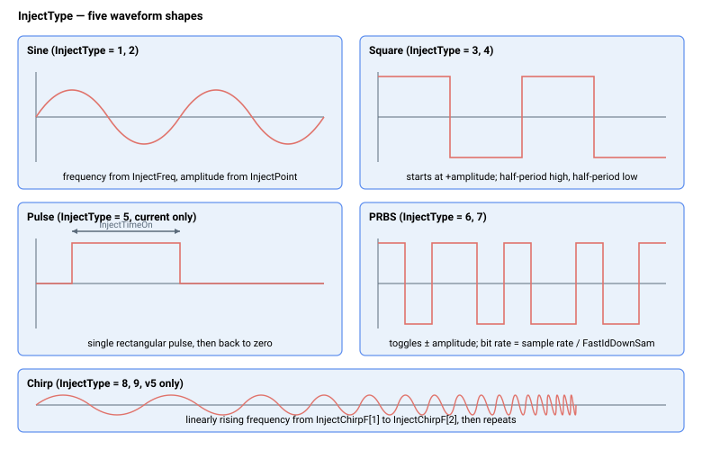
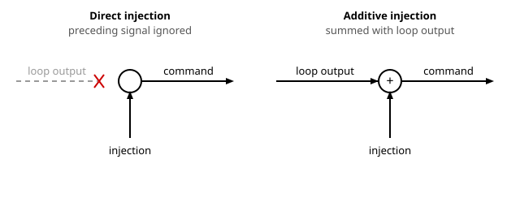

# InjectType

选择注入波形形状及直接注入或叠加注入模式。

## 概述

`InjectType` 定义注入测试波形的形状及其注入模式（直接或叠加）。它与 [InjectPoint](InjectPoint.md) 配合使用，后者选择波形在控制环中的应用位置。根据所选波形，还需配置额外的特定关键字：正弦/方波使用 [InjectFreq](InjectFreq.md)，扫频信号使用 [InjectChirpF](InjectChirpF.md)，脉冲使用 [InjectTimeOn](InjectTimeOn.md)，PRBS 使用 [FastIdDownSam](FastIdDownSam.md) / [FastIdInit](FastIdInit.md)。注入幅值始终来自与所选 `InjectPoint` 关联的幅值关键字。

## 工作原理

| 值 | 波形 | 注入模式 |
|---|---|---|
| 0 | 无注入 | - |
| 1 | 正弦波 | 直接 |
| 2 | 正弦波 | 叠加 |
| 3 | 方波 | 直接 |
| 4 | 方波 | 叠加 |
| 5 | 脉冲（保留，仅用于电流指令注入） | 直接 |
| 6 | 伪随机二进制序列（PRBS） | 直接 |
| 7 | 伪随机二进制序列（PRBS） | 叠加 |
| 8 | 扫频（Chirp） | 直接 |
| 9 | 扫频（Chirp） | 叠加 |

在任意情况下，控制器当前正在施加的注入值均可通过 [InjectedValue](InjectedValue.md) 读回，其符号约定和幅值遵循与所选 `InjectPoint` 关联的关键字。



### 波形说明

- **正弦波** — 幅值由与注入位置对应的幅值关键字（[InjectPoint](InjectPoint.md)）设定；频率由 [InjectFreq](InjectFreq.md) 设定。相位角每个控制器周期按与 `InjectFreq` 成比例的量递增，在一整圈处回绕，正弦值从内部正弦表中读取，并在表项之间进行线性插值，使波形在任意频率下保持平滑。注入开始时相位从 0 开始，因此波形从上升过零点开始。
- **方波** — 幅值由与注入位置对应的幅值关键字设定；频率由 [InjectFreq](InjectFreq.md) 设定。每个周期递增相同的相位角；在每个周期的前半段输出正幅值，后半段输出负幅值。波形从正幅值开始。
- **脉冲** — 单个矩形脉冲，以配置的幅值保持 [InjectTimeOn](InjectTimeOn.md) 设定的持续时间，之后输出返回零并保持。该脉冲仅用于电流指令注入（`InjectPoint = 0`），且仅支持直接模式。
- **PRBS** — 伪随机二进制序列（PRBS），输出在 +幅值 和 −幅值 之间切换。序列从一个固定的预定义 8192 位表（最大长度序列；表以 512 个十六位字存储，按最高有效位优先消耗）中读取。到达表末时索引回绕，序列重复。取新位的速率为控制器周期率除以 [FastIdDownSam](FastIdDownSam.md)；[FastIdInit](FastIdInit.md) 将序列从第一位重新开始。注入幅值为与注入位置关联的关键字。
- **扫频（Chirp）** — 频率从 [InjectChirpF](InjectChirpF.md) 数组设定的初始频率线性增加至最终频率的正弦波，然后从起点重复。它使用与正弦波相同的插值正弦表，但每个周期的相位步长本身逐周期增长，使频率持续上升，而非固定相位步长。扫频长度（chirp 周期）由最终频率推导：

$$\text{Period of chirp}\ [\text{s}] = 0.5 \cdot \text{int}\!\left( \max\!\left( \frac{1}{16 \cdot T_{s} \cdot f_{final}},\,1 \right) \right)$$

其中 $T_{s}$ 为控制器周期时间，$f_{final}$ 为最终频率（Hz）。扫频构建方式确保扫频中的每个正弦至少有 16 个采样点。例如，从 1 Hz 开始至 200 Hz 结束的 chirp 周期为 2.5 s。

### 注入模式

每种波形均有**直接**和**叠加**两种变体（脉冲仅支持直接模式）：

| 模式 | 对目标指令的影响 |
|------|--------------------------------|
| 直接 | 忽略注入点处的前级信号；指令仅为注入值（对于电流注入，再加上 [InjectCurrDC](InjectCurrDC.md) 偏置）。 |
| 叠加 | 注入值叠加到来自上游控制环的现有指令上。 |

在适当的注入位置，直接注入相当于在该点断开控制环。选择直接波形时，控制器在注入期间将相关最大跟随误差限值放宽至开环值，以防止有意的大幅开环偏移触发跟随误差故障。放宽的限值取决于注入点：

| 注入点 | 放宽至开环值的限值 |
|---|---|
| 电流指令（[InjectPoint](InjectPoint.md) = 0） | 位置、速度和力跟随误差限值 |
| 速度指令（[InjectPoint](InjectPoint.md) = 1） | 仅位置跟随误差限值 |
| 力指令（[InjectPoint](InjectPoint.md) = 3） | 位置和速度跟随误差限值（力限值保持正常） |
| 位置指令（[InjectPoint](InjectPoint.md) = 2） | 无 — 所有正常限值保持不变，因为位置参考仍在被指令 |

放宽的值取自开环限值关键字 [MaxPosErrOL](../06-protections/03-motion/general-maximum-limits/MaxPosErrOL.md)、[MaxVelErrOL](../06-protections/03-motion/general-maximum-limits/MaxVelErrOL.md) 和 [MaxForceErrOL](../06-protections/04-force-control/MaxForceErrOL.md)。每次写入 `InjectType` 或 [InjectPoint](InjectPoint.md)，以及修改位置或力跟随误差限值关键字 [MaxPosErr](../06-protections/03-motion/general-maximum-limits/MaxPosErr.md) / [MaxForceErr](../06-protections/04-force-control/MaxForceErr.md) 或其开环变体 [MaxPosErrOL](../06-protections/03-motion/general-maximum-limits/MaxPosErrOL.md) / [MaxForceErrOL](../06-protections/04-force-control/MaxForceErrOL.md)（或 [MaxVelErr](../06-protections/03-motion/general-maximum-limits/MaxVelErr.md)）时，均会重新计算放宽值；单独写入 [MaxVelErrOL](../06-protections/03-motion/general-maximum-limits/MaxVelErrOL.md) 不会重新触发。叠加注入始终保持正常的跟随误差限值不变。



## 示例

```text
AInjectType=2        ; additive sinusoid injection
AInjectType=6        ; direct PRBS injection
AInjectType=0        ; disable injection
AInjectType         ; query the current waveform/mode
```

## 版本变更

在 **v4** 中，可用波形值为 0–7（无注入、正弦、方波、脉冲和 PRBS）。**扫频（Chirp）**波形（值 8 和 9）及 [InjectChirpF](InjectChirpF.md) 关键字在 **v5（仅限 central-i）** 中新增，范围扩展至 0–9。正弦、方波、脉冲和 PRBS 机制在各版本之间保持不变。

## 另请参阅

- [InjectPoint](InjectPoint.md) — 选择控制环中的注入位置
- [InjectFreq](InjectFreq.md) — 正弦/方波波形的频率
- [InjectChirpF](InjectChirpF.md) — 扫频的起止频率
- [InjectTimeOn](InjectTimeOn.md) — 脉冲持续时间
- [FastIdDownSam](FastIdDownSam.md) — PRBS 生成降采样因子
- [FastIdInit](FastIdInit.md) — 重置 PRBS 序列索引
- [InjectedValue](InjectedValue.md) — 读回当前注入值
- [VelRef](../10-motion/01-kinematics-status/VelRef.md) — 说明注入如何替换或叠加速度环参考
