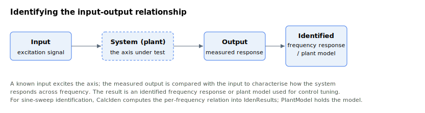

# Identification

Identification is the process of characterising the input-output relationship. It is used for frequency-domain control tuning for feedback and feedforward control. Generally, Agito only supports identification for linear-time invariant (LTI) system, namely with PRBS signal, chirp signal and sine sweep.

Most of the LTI identification algorithms are handled by PCSuite software, with the exception of sine sweep identification where part of the mathematical operation is done on firmware. This section describes the keywords related to sine sweep identification.
