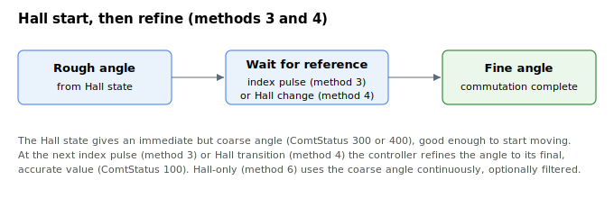

# ComtMode

Array of commutation settings that configure how the motor electrical angle is established.

## Overview

`ComtMode` is an array that stores the commutation settings for the axis. These settings select and configure the method used to find and maintain the motor electrical angle for a DC brushless motor, which is required so that the controller can correctly drive the phase currents during motion. The resulting angle is reported by [ComtAng](ComtAng.md), and the progress and outcome of the commutation process are reported by [ComtStatus](ComtStatus.md).

The *method* element (index `[1]`) selects how the angle is found; depending on the method, the angle may be derived from Hall sensors (see [HallsAngle](HallsAngle.md), [HallsValue](HallsValue.md), [HallOnlyFilt](HallOnlyFilt.md)), from the encoder readings, or from an absolute encoder. The *mode* element (index `[19]`) selects *when* the commutation process runs (power-on, motor-on, both, or manual only). Being an array, axis-scope, and flash-saved, `ComtMode` cannot be changed while the motor is on or in motion.

The resulting electrical angle is reported by [ComtAng](ComtAng.md), and progress/outcome is reported by [ComtStatus](ComtStatus.md). The commutation-complete bit of [StatReg](../07-status-and-faults/StatReg.md) (bit 0) gates normal motion: for the Hall-start switching methods (`ComtMode[1]=3` or `4`) it is set once a usable rough Hall angle is established ([ComtStatus](ComtStatus.md) `300`/`400`) and stays set through refinement to `100`; otherwise it is set when commutation finishes (`100`) or is not required (`200`). The bit stays cleared, blocking normal motion, only before any usable angle is available ([ComtStatus](ComtStatus.md) `0`/`1`) or when commutation has failed.

## How it works

### Array layout (1-indexed)

| Index | Setting | Values / meaning |
|---|---|---|
| `[1]` | Commutation **method** | `0` search "jump to zero"; `2` absolute encoder; `3` Hall + special-encoder switching (waits for index pulse for fine adjustment); `4` Hall + encoder switching (waits for a Hall transition for fine adjustment); `5` minimal-jumps search; `6` Hall-only |
| `[2]` | Voltage increment per step (search methods) | Output-voltage step added each iteration. Default `1` |
| `[3]` | Number of steps (search methods) | Step count over which the search voltage is ramped/applied |
| `[4]` | Absolute-encoder zero reference | Stored encoder position of electrical-angle zero (written by the controller when method `2` finishes; saved to flash) |
| `[5]` | **Repeat-commutation request** | Write `1282` to re-run commutation now; write `202` to re-run with a learn pass. The controller clears the request back to `0` after acting (only acts when the motor is off and the axis is in normal operation) |
| `[6]` | Smooth voltage rise | `0` off, `1` on — ramps the applied search voltage instead of stepping it (useful on vertical/gravity-loaded axes) |
| `[7]` | Initial voltage rise time | Time (ms) over which the initial search voltage is reached. Default `5` |
| `[8]`–`[17]` | Reserved | Not used (formerly an obsolete search method) |
| `[18]` | Commutation accuracy | Required accuracy, in percent. Default `10` |
| `[19]` | Commutation **mode** | `0` run after power-on (default); `1` manual only (never automatic — trigger via index `[5]`); `2` run when the motor is turned on; `3` run after power-on and on motor-on |
| `[20]`–`[24]` | Minimal-jumps search parameters | Voltage increment, step count, delta-position threshold, stop-time, and minimal range used by method `5` |

> [!note]
> Index `[5]=1282` is a *re-trigger now* command, not the automatic power-on setting. Automatic phasing after power-on is governed by the **mode** at index `[19]` (default `0` already runs commutation after power-on). The legacy phrasing "`ComtMode[5]=1282` to commutate after power-on" works only because writing `1282` forces an immediate re-commutation.

### Search-based methods

When a search-based commutation method is used (for example "jump to zero" or minimal-jumps search):

1. The position loop is closed temporarily and an additional user-defined, non-zero constant current/voltage command is applied. An additional control loop on the commutation offset is formed.
2. The motor moves only slightly until the correct commutation offset is found, after which the motor returns to its starting position.
3. On success the commutation-complete bit of [StatReg](../07-status-and-faults/StatReg.md) (bit 0) is set and [ComtStatus](ComtStatus.md) reads `100`; on failure `ComtStatus` reads a negative error code.

If `[6]` smoothing is enabled, the search voltage is ramped toward its final value (reaching it after the time at index `[7]`) rather than applied as a step, which prevents a gravity-loaded axis from dropping when commutation begins.

### Hall- and encoder-based methods

Methods `3`, `4` and `6` derive the angle from the Hall sensors via the [HallsValue](HallsValue.md) → [HallsAngle](HallsAngle.md) mapping. Methods `3` and `4` start from the Hall angle (a "rough" commutation, [ComtStatus](ComtStatus.md) `300`/`400`) and then refine it: method `3` waits for the encoder index pulse (electrical-angle zero) and method `4` waits for the next Hall transition. Method `6` (Hall-only) uses the Hall angle continuously, optionally smoothed by [HallOnlyFilt](HallOnlyFilt.md). Method `2` reads a previously stored absolute-encoder zero (index `[4]`) and needs no motion.



## Examples

```text
AComtMode[1]=6       ; select Hall-only commutation
AComtMode[19]=0      ; run commutation automatically after power-on (default)
AComtMode[5]=1282    ; re-run the commutation process now (motor must be off)
AComtMode[5]=202     ; re-run commutation now, with a learn pass
AComtMode[1]        ; query the configured commutation method
```

## Changes between versions

On central-i v5 the array is extended to 33 elements (vs. 25 on v4/standalone), adding parameters for the minimal-jumps search such as a final detent current, a maximum number of attempted jumps, and a minimum number of required successful jumps. The core method/mode behavior described above is unchanged.

## See also

- [ComtAng](ComtAng.md) — instantaneous commutation angle produced by the configured method
- [ComtStatus](ComtStatus.md) — reports the commutation process status
- [HallsAngle](HallsAngle.md) — electrical angle mapped to each Hall state
- [HallsValue](HallsValue.md) — current raw Hall sensor state
- [HallOnlyFilt](HallOnlyFilt.md) — filter for Hall-only commutation angle
- [StatReg](../07-status-and-faults/StatReg.md) — bit 0 reports commutation complete
