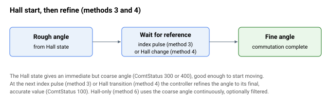

# ComtMode

Array of commutation settings that configure how the motor electrical angle is established.

## Overview

`ComtMode` is an array that stores the commutation settings for the axis. These settings select and configure the method used to find and maintain the motor electrical angle for a DC brushless motor, which is required so that the controller can correctly drive the phase currents during motion. The resulting angle is reported by [ComtAng](ComtAng.md), and the progress and outcome of the commutation process are reported by [ComtStatus](ComtStatus.md).

The *method* element (index `[1]`) selects how the angle is found; depending on the method, the angle may be derived from Hall sensors (see [HallsAngle](HallsAngle.md), [HallsValue](HallsValue.md), [HallOnlyFilt](HallOnlyFilt.md)), from the encoder readings, or from an absolute encoder. The *mode* element (index `[19]`) selects *when* the commutation process runs (power-on, motor-on, both, or manual only). Being an array, axis-scope, and flash-saved, `ComtMode` cannot be changed while the motor is on or in motion.

The resulting electrical angle is reported by [ComtAng](ComtAng.md), and progress/outcome is reported by [ComtStatus](ComtStatus.md). The commutation-complete bit of [StatReg](../07-status-and-faults/StatReg.md) (bit 0) gates normal motion: for the Hall-start switching methods (`ComtMode[1]=3` or `4`) it is set once a usable rough Hall angle is established ([ComtStatus](ComtStatus.md) `300`/`400`) and stays set through refinement to `100`; otherwise it is set when commutation finishes (`100`) or is not required (`200`). The bit stays cleared, blocking normal motion, only before any usable angle is available ([ComtStatus](ComtStatus.md) `0`/`1`) or when commutation has failed.

## How it works

### Array layout (1-indexed)

| Index | Setting | Values / meaning |
|---|---|---|
| `[1]` | Commutation **method** | `0` search "jump to zero"; `2` absolute encoder; `3` special-encoder switching, fixed built-in code→angle table, not [HallsAngle](HallsAngle.md) (waits for index pulse for fine adjustment); `4` Hall + encoder switching (waits for a Hall transition for fine adjustment); `5` minimal-jumps search; `6` Hall-only; `7` user-defined angle — the angle is taken directly from index `[33]`, with no search and no motion (central-i v5 only) |
| `[2]` | Voltage increment per step (search methods) | Output-voltage step added each iteration. Default `1` |
| `[3]` | Number of steps (search methods) | Step count over which the search voltage is ramped/applied |
| `[4]` | Absolute-encoder zero reference | Stored encoder position of electrical-angle zero (written by the controller when method `2` finishes; saved to flash) |
| `[5]` | **Repeat-commutation request** | Write `1282` to re-run commutation now; write `202` to re-run with a learn pass. The controller clears the request back to `0` after acting (only acts when the motor is off and the axis is in normal operation) |
| `[6]` | Smooth voltage rise | `0` off, `1` on — ramps the applied search voltage instead of stepping it (useful on vertical/gravity-loaded axes) |
| `[7]` | Initial voltage rise time | Time (ms) over which the initial search voltage is reached. Default `5` |
| `[8]`–`[17]` | Reserved | Not used (formerly an obsolete search method) |
| `[18]` | Commutation accuracy | Required accuracy, in percent. Default `10` |
| `[19]` | Commutation **mode** | `0` run after power-on (default); `1` manual only (never automatic — trigger via index `[5]`); `2` run when the motor is turned on; `3` run after power-on and on motor-on |
| `[20]`–`[24]` | Minimal-jumps search parameters | Voltage increment, step count, delta-position threshold, stop-time, and minimal range used by method `5` |
| `[25]`–`[26]` | Reserved | Not used — no firmware reads these elements |
| `[27]` | Phasing **domain** | `0` voltage domain (default) — the phasing drive is applied as phase voltages `Va`/`Vb`/`Vc`; `1` current domain — the phasing drive is applied as a current reference and the current loop drives the phases. Read by method `0` only. A value that is neither `0` nor `1` is coerced to `0` on write and on parameter restore. On an axis configured for an external amplifier, the voltage domain is refused ([ComtStatus](ComtStatus.md) `-17`). Central-i v5 only |
| `[28]` | Phasing current peak | Peak of the current command that each jump of method `0` ramps up to, in mA, when `[27]=1`. Not read in the voltage domain, where the peak is `[2] × [3]` instead. Not clamped, and has no non-zero default — left at `0` in the current domain, no phasing drive is produced. Central-i v5 only |
| `[29]` | Phasing **direction** | Initial direction of the commutation jumps of method `0`: `-1` or `+1`. Any negative value is normalized to `-1` and any other value to `+1`, on write and on parameter restore. Hard-stop learning and bidirectional phasing may reverse it during the process. Central-i v5 only |
| `[30]` | **Learn** options | Bit field selecting what a learn pass (`[5]=202`) learns, for method `0` — see [Learn options](#learn-options-30). `0` learns everything. Central-i v5 only |
| `[31]` | Maximum attempted jumps | Number of jumps method `0` may attempt before failing with [ComtStatus](ComtStatus.md) `-3`. Clamped to `3`–`144` on write and on parameter restore; note that a value below `3` is reset to `12` — one full electrical revolution of 30° steps — not to `3`. Central-i v5 only |
| `[32]` | Minimum required successful jumps | Number of consecutive in-window jumps method `0` requires to declare success. Clamped to `3`–`60` on write and on parameter restore. Central-i v5 only |
| `[33]` | **User-defined phasing angle** | Electrical angle in degrees used by method `7`. Normalized to 0–359 on write and on parameter restore. Central-i v5 only |

> [!note]
> Index `[5]=1282` is a *re-trigger now* command, not the automatic power-on setting. Automatic phasing after power-on is governed by the **mode** at index `[19]` (default `0` already runs commutation after power-on). The legacy phrasing "`ComtMode[5]=1282` to commutate after power-on" works only because writing `1282` forces an immediate re-commutation.

Most elements are read by one method only. The map below shows which:

![Which ComtMode elements each commutation method reads: [1], [5] and [19] apply to every method, while the search-drive elements and the v5 elements [27]–[32] are read only by method 0, [4] only by method 2, [20]–[24] only by method 5, [33] only by method 7, and methods 3, 4 and 6 read no tuning elements at all](comtmode-element-map.svg)

### Search-based methods

When a search-based commutation method is used (for example "jump to zero" or minimal-jumps search):

1. The position loop is closed temporarily and an additional user-defined, non-zero constant current/voltage command is applied. An additional control loop on the commutation offset is formed.
2. The motor moves only slightly until the correct commutation offset is found, after which the motor returns to its starting position.
3. On success the commutation-complete bit of [StatReg](../07-status-and-faults/StatReg.md) (bit 0) is set and [ComtStatus](ComtStatus.md) reads `100`; on failure `ComtStatus` reads a negative error code.

The search voltage and step count are configured by `[2]` (voltage increment per step) and `[3]` (number of steps), and the required accuracy by `[18]`. For the "jump to zero" method (`[1]=0`) the search is declared successful after **3 consecutive** jumps land inside the accepted size window; the count of consecutive in-window jumps is reported by [ComtStatus](ComtStatus.md)`[2]`. The search fails with [ComtStatus](ComtStatus.md) `-3` if the accumulated jumps exceed one full electrical revolution (360°, i.e. twelve 30° steps) without succeeding.

On central-i v5 both of those "jump to zero" limits become settable, through the extended elements (see [below](#changes-between-versions)): the search fails (also `-3`) when the number of jumps exceeds the **maximum attempted jumps** (`[31]`), or when the jumps still remaining can no longer reach the **minimum required successful jumps** (`[32]`); success requires the in-window jump count to reach that `[32]` minimum rather than the fixed 3 above. The minimal-jumps search (`[1]=5`) does not read `[31]` or `[32]` — it is bounded by its own parameters at `[20]`–`[24]`.

If `[6]` smoothing is enabled, the search voltage is ramped toward its final value (reaching it after the time at index `[7]`) rather than applied as a step, which prevents a gravity-loaded axis from dropping when commutation begins.

### Hall- and encoder-based methods

Methods `4` and `6` derive the rough angle from the Hall sensors via the [HallsValue](HallsValue.md) → [HallsAngle](HallsAngle.md) mapping. Method `3` is for special encoders that report a Hall-like code directly: it uses a **fixed, built-in** code → angle table (it does **not** read [HallsAngle](HallsAngle.md)), mapping the six legal codes to 90, 210, 150, 330, 30 and 270 electrical degrees respectively, accurate to within ±30°. Methods `3` and `4` start from this rough angle (a "rough" commutation, [ComtStatus](ComtStatus.md) `300`/`400`) and then refine it; method `6` (Hall-only) uses the Hall angle continuously, optionally smoothed by [HallOnlyFilt](HallOnlyFilt.md). Method `2` reads a previously stored absolute-encoder zero (index `[4]`) and needs no motion.

The refinement works as follows:

- **Method `4`** (status `400`, *waiting for a Hall change*): on the next Hall transition that is *adjacent* — where the [HallsAngle](HallsAngle.md) entries of the new and previous states differ by less than 90° (i.e. ignoring the wrap-around edge) — the offset is set to the **midpoint** of those two states' [HallsAngle](HallsAngle.md) entries, and [ComtStatus](ComtStatus.md) advances to `100` (finished).
- **Method `3`** (status `300`, *waiting for the index pulse*): when the encoder index is detected the offset is fixed to electrical-angle **zero** (the index marks commutation angle 0 in these special encoders) and [ComtStatus](ComtStatus.md) advances to `100`.

> [!note]
> Because method `3` reads the special-encoder code latched in hardware once and then clears the latch, a software reset or a re-commutation request (`[5]`) issued without an intervening power cycle finds the latch empty and fails with [ComtStatus](ComtStatus.md) `-6` (amplifier power cycle is required). It is the only method that does **not** consult [HallsAngle](HallsAngle.md).

### User-defined angle

Method `7` takes the electrical angle directly from index `[33]`, in degrees,
and applies it without searching:

```
commutation offset = electrical cycle × ComtMode[33] / 360
```

No drive is applied and the axis does not move — commutation completes in the
control cycle it begins, and [ComtStatus](ComtStatus.md) goes straight to `100`.
This suits an axis whose phasing angle is already known from characterization or
from a jig, and a vertical or gravity-loaded axis where a search-based method
risks dropping the load before torque is established.

The value is normalized to 0–359 whenever it is written and whenever parameters
are restored, so `-90` and `270` are the same setting. The angle is the
commutation angle itself, not the detent angle — on a motor characterized by its
detent position, enter the detent angle plus 90°.

Method `7` differs from method `2` (absolute encoder), which also completes
without motion: method `2` recalls a zero reference the *controller* previously
measured and stored in index `[4]`, whereas method `7` accepts a number the
*user* supplies. Neither verifies the value it is given.



### Learn options (`[30]`)

Index `[30]` is a **bit field**, not a list of alternatives: several options can be
selected at once by adding their values together. It is read only when a learn
pass is requested by writing `202` to index `[5]`, and only by commutation method
`0`. A plain re-commutation (`[5]=1282`) and the automatic power-on / motor-on
phasing selected by `[19]` always run with no learning, whatever `[30]` holds.
Writing `[30]=0` and then requesting a learn pass learns *everything* — bits 0, 1
and 3 together (`0x00B`).


| Bits | Value | Meaning |
|---|---|---|
| 0 | `0x001` | Learn current direction. After two consecutive jumps of the right size but the wrong direction, [CurrDir](../09-current-and-voltage/02-motor-variables/CurrDir.md) and the phasing direction are both flipped and phasing restarts |
| 1 | `0x002` | Learn hard stop. After two consecutive jumps shorter than half the expected distance, the phasing angle is shifted away from the obstruction (on a second encounter the direction is also flipped) and phasing restarts |
| 2 | `0x004` | Named for absolute-encoder-zero learning, but not read anywhere in the firmware — see the note below |
| 3 | `0x008` | Learn rough Hall angles. The [HallsValue](HallsValue.md) readings collected during phasing are analyzed at the end and the [HallsAngle](HallsAngle.md) table is rewritten |
| 4–5 | field | Fine Hall-angle learn method: `0` off, `1` closest neighbour, `2` least-squares fit, `3` averaging |
| 6–7 | field | Detent curve-fit method: `0` off — take the commutation offset from the last successful detent; `1` least-squares fit; `2` averaging over the recorded detents |
| 8 | `0x100` | Bidirectional phasing. The search is run once in each direction |

![ComtMode[30] learn options: bits 0, 1, 3 and 8 are single flags, bit 2 is defined but never read, and bits 4–5 and 6–7 are two-bit fields holding a method number rather than a flag](comtmode-learn-bits.svg)

Bits 4–5 and 6–7 hold a small number rather than a single flag, so shift the
method number into place: least-squares fine Hall learning is `2 << 4` = `0x020`,
and least-squares curve fitting is `1 << 6` = `0x040`. The two fields are
independent and can be combined with each other and with the single-bit options.

Selecting any fine Hall-angle method (bits 4–5 non-zero) clears the rough Hall
learn bit, since fine learning supersedes it, and switches `[6]` smoothing on —
fine learning needs the continuously advancing angle that smoothing produces in
order to time the Hall transitions. Note that this is a write to `[6]` itself, so
smoothing stays on after the learn pass finishes; set `[6]` back to `0` if the
axis is meant to phase with stepped voltage.

When a learn pass has changed a stored parameter, commutation finishes with
[ComtStatus](ComtStatus.md) `500` instead of `100`, as a reminder to save the
changed parameters to flash.

> [!note]
> Bit 2 (`0x004`) is defined in the firmware as an absolute-encoder-zero learn
> bit, but no firmware code reads it. Setting it has no effect.

## Examples

```text
AComtMode[1]=6       ; select Hall-only commutation
AComtMode[19]=0      ; run commutation automatically after power-on (default)
AComtMode[5]=1282    ; re-run the commutation process now (motor must be off)
AComtMode[5]=202     ; re-run commutation now, with a learn pass
AComtMode[1]        ; query the configured commutation method
```

## Changes between versions

On central-i v5 the array is extended to 34 elements (vs. 25 on v4/standalone).
The additions configure the "jump to zero" method (`[1]=0`), not the
minimal-jumps search: the **phasing domain** (`[27]`) and the **phasing current
peak** (`[28]`) select and size the drive each jump applies, the **phasing
direction** (`[29]`) sets which way the jumps start, the **learn options**
(`[30]`) select what a learn pass adjusts, and the **maximum number of attempted
jumps** (`[31]`) and **minimum number of required successful jumps** (`[32]`)
replace the fixed jump bounds that v4 applied. The last addition, the
**user-defined phasing angle** (`[33]`), is used by commutation method `7`. The
core method/mode behavior described above is unchanged.

## See also

- [ComtAng](ComtAng.md) — instantaneous commutation angle produced by the configured method
- [ComtStatus](ComtStatus.md) — reports the commutation process status
- [HallsAngle](HallsAngle.md) — electrical angle mapped to each Hall state
- [HallsValue](HallsValue.md) — current raw Hall sensor state
- [HallOnlyFilt](HallOnlyFilt.md) — filter for Hall-only commutation angle
- [StatReg](../07-status-and-faults/StatReg.md) — bit 0 reports commutation complete
