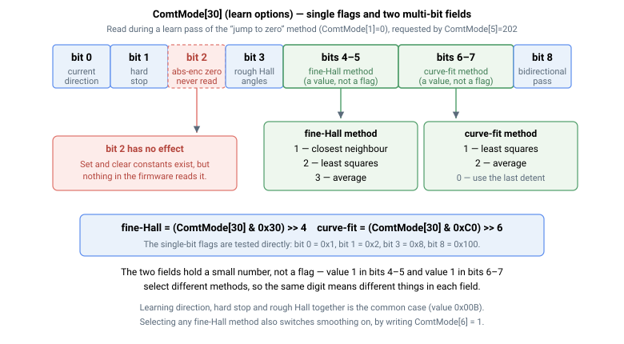

# ComtMode

换相设置数组，配置电机电角度的建立方式。

## 概述

`ComtMode` 是存储轴换相设置的数组。这些设置选择并配置用于查找和维持直流无刷电机电角度的方法，该方法是控制器在运动期间正确驱动相电流所必需的。所得角度由 [ComtAng](ComtAng.md) 报告，换相过程的进度和结果由 [ComtStatus](ComtStatus.md) 报告。

*方法*元素（索引 `[1]`）选择角度的查找方式；根据方法不同，角度可从霍尔传感器（参见 [HallsAngle](HallsAngle.md)、[HallsValue](HallsValue.md)、[HallOnlyFilt](HallOnlyFilt.md)）、编码器读数或绝对式编码器获取。*模式*元素（索引 `[19]`）选择换相过程的运行时机（上电后、电机使能时、两者均触发，或仅手动触发）。由于该关键字为数组、轴作用域且保存至闪存，电机使能或运动中无法更改。

所得电角度由 [ComtAng](ComtAng.md) 报告，进度/结果由 [ComtStatus](ComtStatus.md) 报告。[StatReg](../07-status-and-faults/StatReg.md) 的换相完成位（位 0）控制正常运动的门控：对于霍尔启动切换方法（`ComtMode[1]=3` 或 `4`），一旦建立可用的粗略霍尔角（[ComtStatus](ComtStatus.md) `300`/`400`）即置位，并在精细化到 `100` 的过程中保持置位；否则，换相完成（`100`）或不需要换相（`200`）时置位。仅在尚无可用角度（[ComtStatus](ComtStatus.md) `0`/`1`）或换相失败时，该位保持清零。

## 工作原理

### 数组布局（从 1 开始索引）

| 索引 | 设置 | 值/含义 |
|---|---|---|
| `[1]` | 换相**方法** | `0` 搜索"跳零"；`2` 绝对式编码器；`3` 特殊编码器切换，使用固定内置代码→角度表，不读取 [HallsAngle](HallsAngle.md)（等待索引脉冲进行精细调整）；`4` 霍尔 + 编码器切换（等待霍尔跳变进行精细调整）；`5` 最小跳动搜索；`6` 纯霍尔；`7` 用户定义角度——角度直接取自索引 `[33]`，不搜索、不运动（仅限 Central-i v5） |
| `[2]` | 每步电压增量（搜索方法） | 每次迭代添加的输出电压步长。默认 `1` |
| `[3]` | 步数（搜索方法） | 搜索电压斜坡/施加的步数 |
| `[4]` | 绝对式编码器零点参考 | 电角度零点的存储编码器位置（方法 `2` 完成时由控制器写入；保存至闪存） |
| `[5]` | **重复换相请求** | 写入 `1282` 立即重新运行换相；写入 `202` 带学习过程重新运行。控制器执行后将请求清零回 `0`（仅在电机关闭且轴处于正常运行状态时执行） |
| `[6]` | 平滑电压上升 | `0` 关闭，`1` 开启——斜坡方式施加搜索电压而非阶跃（适用于重力负载/垂直轴） |
| `[7]` | 初始电压上升时间 | 达到初始搜索电压所需时间（ms）。默认 `5` |
| `[8]`–`[17]` | 保留 | 未使用（原为已废弃的搜索方法） |
| `[18]` | 换相精度 | 所需精度，以百分比表示。默认 `10` |
| `[19]` | 换相**模式** | `0` 上电后运行（默认）；`1` 仅手动（从不自动——通过索引 `[5]` 触发）；`2` 电机使能时运行；`3` 上电后及电机使能时均运行 |
| `[20]`–`[24]` | 最小跳动搜索参数 | 方法 `5` 使用的电压增量、步数、位置增量阈值、停止时间和最小范围 |
| `[25]`–`[26]` | 保留 | 未使用——固件不读取这两个元素 |
| `[27]` | 定相**驱动模式** | `0` 电压模式（默认）——定相驱动以相电压 `Va`/`Vb`/`Vc` 形式施加；`1` 电流模式——定相驱动以电流指令形式施加，由电流环驱动各相。仅方法 `0` 读取。既非 `0` 亦非 `1` 的值在写入时及参数恢复时被强制为 `0`。对于配置为外部驱动器的轴，电压模式会被拒绝（[ComtStatus](ComtStatus.md) `-17`）。仅限 Central-i v5 |
| `[28]` | 定相电流峰值 | 当 `[27]=1` 时，方法 `0` 每次跳动所爬升到的电流指令峰值，单位为 mA。电压模式下不读取该元素，此时峰值改为 `[2] × [3]`。不做限幅，且无非零默认值——在电流模式下若保持为 `0`，则不产生任何定相驱动。仅限 Central-i v5 |
| `[29]` | 定相**方向** | 方法 `0` 换相跳动的初始方向：`-1` 或 `+1`。写入时及参数恢复时，任何负值归一化为 `-1`，其余值归一化为 `+1`。硬限位学习和双向定相可能在过程中将其反向。仅限 Central-i v5 |
| `[30]` | **学习**选项 | 位域，选择学习过程（`[5]=202`）针对方法 `0` 学习哪些内容——参见[学习选项](#学习选项-30)。`0` 表示学习全部内容。仅限 Central-i v5 |
| `[31]` | 最大尝试跳动次数 | 方法 `0` 在以 [ComtStatus](ComtStatus.md) `-3` 失败之前允许尝试的跳动次数。写入时及参数恢复时限制在 `3`–`144`；请注意，低于 `3` 的值会被重置为 `12`——即一个完整电气旋转周期所含的 30° 步数——而非重置为 `3`。仅限 Central-i v5 |
| `[32]` | 最小所需成功跳动次数 | 方法 `0` 判定成功所需的连续落在窗口内的跳动次数。写入时及参数恢复时限制在 `3`–`60`。仅限 Central-i v5 |
| `[33]` | **用户定义定相角** | 方法 `7` 使用的电角度，单位为度。在写入时及参数恢复时归一化到 0–359。仅限 Central-i v5 |

> [!note]
> 索引 `[5]=1282` 是*立即重新触发*指令，不是上电后的自动设置。上电后的自动定相由索引 `[19]` 处的**模式**控制（默认 `0` 已在上电后运行换相）。旧式表述"`ComtMode[5]=1282` 以在上电后换相"之所以有效，是因为写入 `1282` 会强制立即重新换相。

### 基于搜索的方法

当使用基于搜索的换相方法（例如"跳零"或最小跳动搜索）时：

1. 位置环暂时闭合，同时施加额外的用户定义非零恒定电流/电压指令，形成换相偏移的附加控制环。
2. 电机仅有轻微运动，直到找到正确的换相偏移，之后电机返回起始位置。
3. 成功后，[StatReg](../07-status-and-faults/StatReg.md) 换相完成位（位 0）置位，[ComtStatus](ComtStatus.md) 读取 `100`；失败时 `ComtStatus` 读取负错误代码。

搜索电压和步数通过 `[2]`（每步电压增量）和 `[3]`（步数）配置，所需精度通过 `[18]` 配置。对于"跳零"方法（`[1]=0`），**连续 3 次**跳动落在可接受范围窗口内后，搜索被判定为成功；连续落在窗口内的跳动次数由 [ComtStatus](ComtStatus.md)`[2]` 报告。当累计跳动超过一个完整电气旋转周期（360°，即十二个 30° 步）而未成功时，搜索以 [ComtStatus](ComtStatus.md) `-3` 失败。

在 Central-i v5 上，"跳零"方法的上述两个限值改为可通过扩展元素设定（参见[下方版本变更](#版本变更)）：当跳动次数超过**最大尝试跳动次数**（`[31]`），或剩余跳动次数无法再达到**最小所需成功跳动次数**（`[32]`）时，搜索以 `-3` 失败；成功要求落在窗口内的跳动次数达到 `[32]` 的最小值，而非上文所述固定的 3 次。最小跳动搜索（`[1]=5`）不读取 `[31]` 或 `[32]`——它由自身位于 `[20]`–`[24]` 的参数限定。

若启用 `[6]` 平滑，搜索电压将斜坡方式达到其最终值（在索引 `[7]` 处的时间内达到），而非阶跃施加，这可防止重力负载轴在换相开始时下落。

### 基于霍尔传感器和编码器的方法

方法 `4` 和 `6` 通过 [HallsValue](HallsValue.md) → [HallsAngle](HallsAngle.md) 映射从霍尔传感器获取粗略角度。方法 `3` 适用于直接报告类霍尔代码的特殊编码器：它使用**固定的内置**代码→角度表（**不**读取 [HallsAngle](HallsAngle.md)），将六个合法代码分别映射到 90、210、150、330、30 和 270 电气度，精度在 ±30° 以内。方法 `3` 和 `4` 从此粗略角度（"粗略"换相，[ComtStatus](ComtStatus.md) `300`/`400`）开始，然后精细化；方法 `6`（纯霍尔）连续使用霍尔角度，可选由 [HallOnlyFilt](HallOnlyFilt.md) 平滑。方法 `2` 读取之前存储的绝对式编码器零点（索引 `[4]`），不需要运动。

精细化工作原理如下：

- **方法 `4`**（状态 `400`，*等待霍尔变化*）：在下一次*相邻*霍尔跳变时——新状态和前一状态的 [HallsAngle](HallsAngle.md) 条目相差小于 90°（即忽略环绕边缘）——偏移被设置为这两个状态 [HallsAngle](HallsAngle.md) 条目的**中点**，[ComtStatus](ComtStatus.md) 推进到 `100`（完成）。
- **方法 `3`**（状态 `300`，*等待索引脉冲*）：检测到编码器索引时，偏移被固定为电角度**零**（索引标志这些特殊编码器的换相角 0），[ComtStatus](ComtStatus.md) 推进到 `100`。

> [!note]
> 由于方法 `3` 读取硬件一次性锁存的特殊编码器代码后即清除锁存，在未经重新上电的情况下执行软件复位或重新换相请求（`[5]`）时，锁存为空，以 [ComtStatus](ComtStatus.md) `-6` 失败（需要驱动器重新上电）。这是唯一一种**不**查询 [HallsAngle](HallsAngle.md) 的方法。

### 用户定义角度

方法 `7` 直接从索引 `[33]` 取得电角度（单位为度），不经搜索直接应用：

```
换相偏移 = 电气周期 × ComtMode[33] / 360
```

不施加驱动，轴不运动——换相在其开始的那个控制周期内即完成，
[ComtStatus](ComtStatus.md) 直接跳到 `100`。这适用于已通过表征或工装确定定相角的轴，
以及基于搜索的方法在建立转矩之前就可能使负载下落的垂直轴或重力负载轴。

该值在每次写入及每次参数恢复时都会归一化到 0–359，因此 `-90` 和 `270`
是同一设置。该角度是换相角本身，而非齿槽角——对于以齿槽位置表征的电机，
应输入齿槽角加 90°。

方法 `7` 与方法 `2`（绝对式编码器）不同，后者同样无需运动即可完成：
方法 `2` 调用的是*控制器*先前测得并存储在索引 `[4]` 中的零点参考，
而方法 `7` 接受的是*用户*提供的数值。两者均不对所给数值进行校验。


### 学习选项（`[30]`）

索引 `[30]` 是**位域**，而非一组互斥选项：多个选项可通过数值相加同时选中。
仅当向索引 `[5]` 写入 `202` 请求学习过程时才会读取该元素，且仅由换相方法 `0`
读取。普通的重新换相（`[5]=1282`）以及由 `[19]` 选择的上电/电机使能自动定相，
无论 `[30]` 为何值，都不进行任何学习。写入 `[30]=0` 后再请求学习过程，
将学习*全部*内容——即位 0、位 1 和位 3 三者（`0x00B`）。



| 位 | 值 | 含义 |
|---|---|---|
| 0 | `0x001` | 学习电流方向。当连续两次跳动距离正确但方向相反时，[CurrDir](../09-current-and-voltage/02-motor-variables/CurrDir.md) 与定相方向同时反向，并重新开始定相 |
| 1 | `0x002` | 学习硬限位。当连续两次跳动距离不足预期距离的一半时，定相角被移离受阻位置（第二次遇到时方向也随之反向），并重新开始定相 |
| 2 | `0x004` | 命名为绝对式编码器零点学习位，但固件中无任何代码读取——参见下方说明 |
| 3 | `0x008` | 学习粗略霍尔角。定相过程中采集的 [HallsValue](HallsValue.md) 读数在结束时被分析，并据此重写 [HallsAngle](HallsAngle.md) 表 |
| 4–5 | 字段 | 精细霍尔角学习方法：`0` 关闭，`1` 最近邻，`2` 最小二乘拟合，`3` 平均法 |
| 6–7 | 字段 | 齿槽曲线拟合方法：`0` 关闭——从最后一次成功的齿槽位置取换相偏移；`1` 最小二乘拟合；`2` 对已记录齿槽位置取平均 |
| 8 | `0x100` | 双向定相。搜索在两个方向各运行一次 |

位 4–5 和位 6–7 存放的是一个小整数而非单个标志位，因此需将方法编号移位到相应位置：
最小二乘精细霍尔学习为 `2 << 4` = `0x020`，最小二乘曲线拟合为 `1 << 6` = `0x040`。
这两个字段彼此独立，也可与各单比特选项组合使用。

选择任一精细霍尔角学习方法（位 4–5 非零）会清除粗略霍尔学习位，因为精细学习已取而代之；
同时会开启 `[6]` 平滑——精细学习需要平滑所产生的连续推进角度，才能确定各次霍尔跳变的时刻。
请注意，这是对 `[6]` 本身的写入，因此学习过程结束后平滑仍保持开启；若该轴应以阶跃电压定相，
需将 `[6]` 重新设为 `0`。

若学习过程更改了任何已存储的参数，换相将以 [ComtStatus](ComtStatus.md) `500`
而非 `100` 结束，以提醒将更改后的参数保存至闪存。

> [!note]
> 位 2（`0x004`）在固件中被定义为绝对式编码器零点学习位，但没有任何固件代码读取它。
> 设置该位不会产生任何效果。

## 示例

```text
AComtMode[1]=6       ; select Hall-only commutation
AComtMode[19]=0      ; run commutation automatically after power-on (default)
AComtMode[5]=1282    ; re-run the commutation process now (motor must be off)
AComtMode[5]=202     ; re-run commutation now, with a learn pass
AComtMode[1]        ; query the configured commutation method
```

## 版本变更

在 Central-i v5 上，数组扩展至 34 个元素（v4/独立版为 25 个）。
新增内容配置的是"跳零"方法（`[1]=0`），而非最小跳动搜索：**定相驱动模式**
（`[27]`）和**定相电流峰值**（`[28]`）选择并设定每次跳动所施加驱动的形式与大小，
**定相方向**（`[29]`）设定跳动的起始方向，**学习选项**（`[30]`）选择学习过程
调整哪些内容，**最大尝试跳动次数**（`[31]`）和**最小所需成功跳动次数**（`[32]`）
则取代 v4 中固定的跳动限值。最后一项新增内容**用户定义定相角**（`[33]`）
由换相方法 `7` 使用。上述核心方法/模式行为不变。

## 另请参阅

- [ComtAng](ComtAng.md) — 所配置方法产生的瞬时换相角
- [ComtStatus](ComtStatus.md) — 报告换相过程状态
- [HallsAngle](HallsAngle.md) — 各霍尔状态对应的电角度
- [HallsValue](HallsValue.md) — 当前霍尔传感器原始状态
- [HallOnlyFilt](HallOnlyFilt.md) — 纯霍尔换相角的滤波器
- [StatReg](../07-status-and-faults/StatReg.md) — 位 0 报告换相完成
