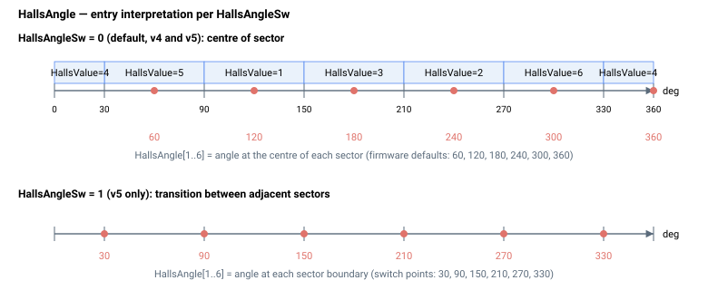

# HallsAngle

将每个霍尔传感器状态映射到换相所用电角度的数组。

## 概述

`HallsAngle` 是一个存储每个霍尔传感器状态所对应换相角的数组。每种有效霍尔状态组合（[HallsValue](HallsValue.md) 上报的六种合法状态）均映射到换相所用的相应电角度。该表使控制器能够直接从霍尔传感器导出电机电角度。在仅霍尔换相模式下运行时（通过 [ComtMode](ComtMode.md) 选择），原始角度可通过 [HallOnlyFilt](HallOnlyFilt.md) 平滑处理，所得角度由 [ComtAng](ComtAng.md) 报告。该参数为数组类型、轴作用域且保存至闪存，在电机使能或运动中不可更改（每元素范围 0–360）。

## 工作原理

该数组为 1-indexed，索引即为 [HallsValue](HallsValue.md) 的读数：元素 `[1]` … `[6]` 保存霍尔状态 1 … 6 的电角度（度）（霍尔值 0 和 7 为非法值，无对应条目）。在基于霍尔的换相过程中，控制器读取当前霍尔状态，在此处查找对应角度，并将其用作电角度。

每个元素的默认值为 `-1`，表示"未配置"。当表保持默认值时，控制器会为标准接线的电机填入标准映射。在 central-i v5 上，存储角度的解释方式由 [HallsAngleSw](HallsAngleSw.md) 选择：

**中点角度映射**（`HallsAngleSw = 0`，默认值，v4/standalone 上的唯一行为）——每个条目为该状态*中点*处的电角度：

| 霍尔值 (CBA) | 默认角度 |
|---|---|
| 5 (101) | 60° |
| 1 (001) | 120° |
| 3 (011) | 180° |
| 2 (010) | 240° |
| 6 (110) | 300° |
| 4 (100) | 360° |

**切换角度映射**（`HallsAngleSw = 1`，仅 central-i v5）——每个条目为相邻状态之间*切换点*处的电角度。默认切换角度：30°、90°、150°、210°、270°、330°。



## 示例

```text
AHallsAngle[1]      ; query the angle mapped to Hall state 1
AHallsAngle[1]=120   ; set the electrical angle (deg) for Hall state 1
```

## 另请参阅

- [HallsValue](HallsValue.md) — 当前原始霍尔传感器状态（索引来源）
- [HallsAngleSw](HallsAngleSw.md) — 选择条目的解释方式（状态中点角度与切换角度）
- [HallOnlyFilt](HallOnlyFilt.md) — 基于霍尔的换相角滤波器
- [ComtMode](ComtMode.md) — 选择换相方法
