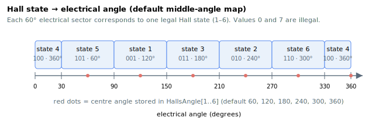

# HallsValue

Read-only raw Hall-sensor state, reported as a 3-bit value (bits CBA).

## Overview

`HallsValue` reports the current raw Hall-sensor state. The three Hall input signals from the motor are combined into a single integer, with the signals occupying bits C, B and A (bit 2 = C, bit 1 = B, bit 0 = A), to indicate the current electrical sector for commutation. The six valid (legal) combinations correspond to the values 1–6; this state is used together with [HallsAngle](HallsAngle.md) to derive the commutation angle in Hall-based commutation, and an illegal combination is flagged by [ComtStatus](ComtStatus.md). It is axis-scope, read-only, and not saved to flash, so it can be read at any time.

## How it works

Over one electrical revolution the three Hall signals produce six legal states, each covering a 60° electrical sector. The controller samples the Hall lines every control cycle and combines them as `value = (C << 2) | (B << 1) | A`, giving one of the values 1–6. In Hall-based commutation methods the value indexes the [HallsAngle](HallsAngle.md) table to obtain the electrical angle reported by [ComtAng](ComtAng.md).

The all-low (`0`, i.e. `000`) and all-high (`7`, i.e. `111`) combinations are never produced by correctly wired sensors and are treated as illegal: when they appear, the controller raises an illegal-Hall commutation error (negative codes in [ComtStatus](ComtStatus.md), such as `-7`).



## Examples

```text
AHallsValue         ; query the current raw Hall state (1-6)
```

## See also

- [HallsAngle](HallsAngle.md) — electrical angle mapped to each Hall state
- [HallOnlyFilt](HallOnlyFilt.md) — filter for the Hall-based commutation angle
- [ComtMode](ComtMode.md) — selects the commutation method
- [ComtStatus](ComtStatus.md) — reports illegal Hall sequence errors
