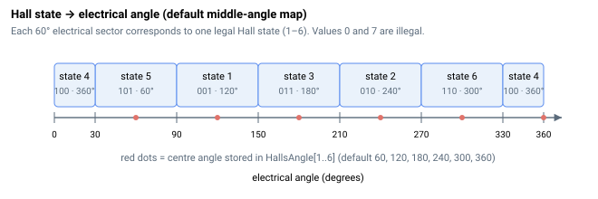

# HallsValue

只读原始霍尔传感器状态，以 3 位值（CBA 位）报告。

## 概述

`HallsValue` 报告当前原始霍尔传感器状态。电机的三路霍尔输入信号合并为一个整数，信号分别占据 C、B、A 位（位 2 = C，位 1 = B，位 0 = A），以指示当前换相的电气扇区。六种合法组合对应值 1–6；该状态与 [HallsAngle](HallsAngle.md) 一起用于在基于霍尔的换相中导出换相角，非法组合由 [ComtStatus](ComtStatus.md) 标记。该参数为轴作用域、只读，且不保存至闪存，可随时读取。

## 工作原理

在一个电气旋转周期内，三路霍尔信号产生六种合法状态，每种状态覆盖 60° 电气扇区。控制器每个控制周期采样霍尔线，并按 `value = (C << 2) | (B << 1) | A` 合并，得到 1–6 中的一个值。在基于霍尔的换相方法中，该值作为 [HallsAngle](HallsAngle.md) 表的索引，获取 [ComtAng](ComtAng.md) 报告的电角度。

全低（`0`，即 `000`）和全高（`7`，即 `111`）组合不会由正确接线的传感器产生，被视为非法：当其出现时，控制器触发非法霍尔换相错误（[ComtStatus](ComtStatus.md) 中的负代码，如 `-7`）。



## 示例

```text
AHallsValue         ; query the current raw Hall state (1-6)
```

## 另请参阅

- [HallsAngle](HallsAngle.md) — 映射到每个霍尔状态的电角度
- [HallOnlyFilt](HallOnlyFilt.md) — 基于霍尔的换相角滤波器
- [ComtMode](ComtMode.md) — 选择换相方法
- [ComtStatus](ComtStatus.md) — 报告非法霍尔序列错误
